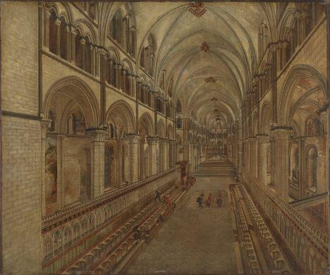

Today I went with a friend to see [Tate Britain's "Art Under Attack" show](http://www.tate.org.uk/whats-on/tate-britain/exhibition/art-under-attack-histories-british-iconoclasm). It's an interesting, if uneven, affair that entertains but doesn't quite succeed in everything it attempts to do. The big word that you learn is iconoclasm: the act of attacking an object believed to represent particular beliefs. The show splits into two parts: ideological acts of iconoclasm committed against works of art in Britain and the work of British artists who embrace iconoclasm as a means for making art. The first half (comprising more than half of the show - because I lump together two of the shows sections "Religion" and "Politics" into this half) is more interesting and successful than the second ("Aesthetics").

Why has Tate Britain created an exhibition about iconoclasm in Britain? It might have something to do with [an incident last year at Tate Modern in which one of the wonderful Rothko Red paintings was "vandalised"](http://www.telegraph.co.uk/culture/art/art-news/9592962/Rothko-painting-vandalised-in-Tate-Modern.html) in the name of some dubious art movement or other (["yellowism" apparently](http://www.thisisyellowism.com)). Sadly that Rothko is not on display in the show and the incident was not mentioned at all, which seems like a shame.

The religious section of the show was captivating, showing just how much fine art and cultural heritage the reformation destroyed. The remains on display are heartbreaking, mere fragments of beautiful sculptures, paintings, and stained glass windows, alongside erasures and excisions from fine illuminated manuscripts. The exhibition takes great pains to explain that this process did not just take place at the orders of Henry VIII, but also later on under Edward IV and under the puritans during the interregnum. The ideology of the reformation held that lavish representations of religious imagery were a form of idolatry, the worship of graven images and such like forbidden by the second commandment. The show displays some of the works of art that replaced the destroyed images, large bodies of text devoted to the scripture that was held to be the true representation of the Christian faith. To this day, these events have ground into us a love of textual messages - witness the "Keep Calm and Carry On" posters that you see everywhere.

The political section of the show is mostly concerned with objects at two ends of the scale size-wise: statues and coins. Generally political acts of iconoclasm have involved the Irish blowing up statues of William III, but also Americans destroying another statue of poor William III, and the rowdy folk of Leicester Square dressing a statue of George III in a dunce's cap and painting his horse white with black polka dots. A replica of a statue of James II dragged into the Tyne by supporters of William III is also on display, which just goes to show that you can be both a winner and a loser in the iconoclasm game. The coins show some lovely works of defacement, complete with some shockingly seditious statements: "Down With Prince Albert", "Queen Victoria likes a shag", etc.

The second room celebrating political acts of iconoclasm is devoted to the suffragette movement, who would often go into galleries and deface artworks in the name of securing votes for women. The works attacked are on display, with very little damage to be seen. Thankfully the suffragettes achieved their aims as the attacks against these works of art are now invisible (at least to my weary eyes), therefore erasing the statements they tried to make with their acts.

After the suffragette room, the show falls off a bit. The works of modern art attacked in Tate galleries are not particularly interesting and though mention is made in the supporting texts about criticism of art in the media inspiring acts of iconoclasm, there is little of this on show. Perhaps it lacks an explicit Tate connection, [but what about the K Foundation awarding the prize for "worst artist" to Rachel Whiteread shortly after she won the Turner Prize?](http://en.wikipedia.org/wiki/K_Foundation_art_award) Isn't that an iconoclasm of sorts? And did they have to only consider incidents in the Tate galleries? Anyway, I think the whole show loses its nerve a bit once it hits the twentieth century, but I'm willing to go back and give it another go (if I can find the time).

Overall, I'd recommend the earlier bits of the show as the religious pieces are worth seeing (some are on display for the first time) and the history is something that we in England need to come to terms with. It was different enough from an ordinary exhibition centred on one artist and if there are too many people seeing Lowry (believe me, there will be!) then this will make for an enjoyable alternative. I saw the Lowry show today as well and will write a post about that later.