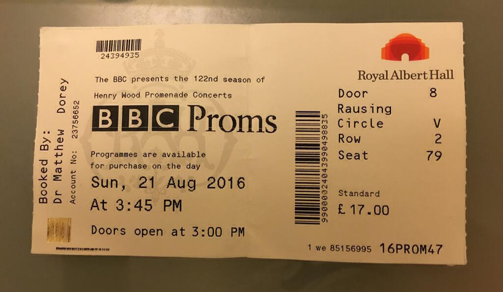
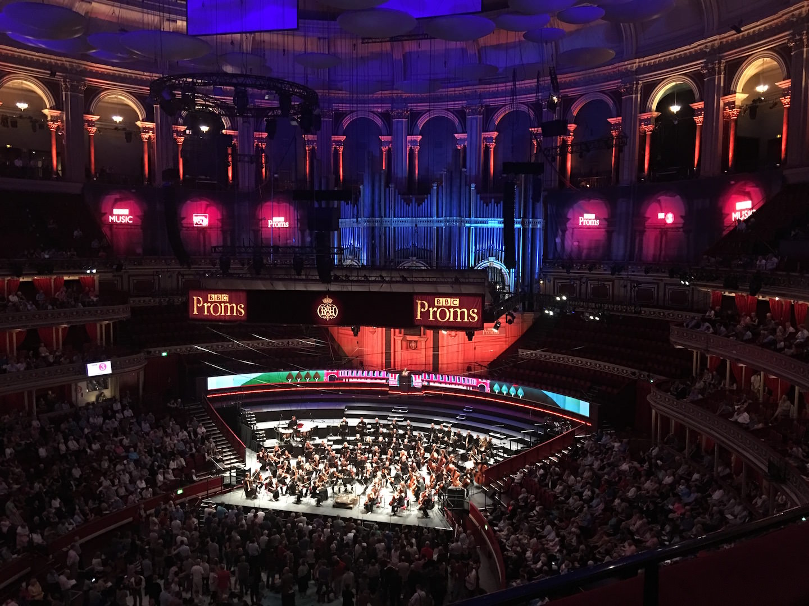
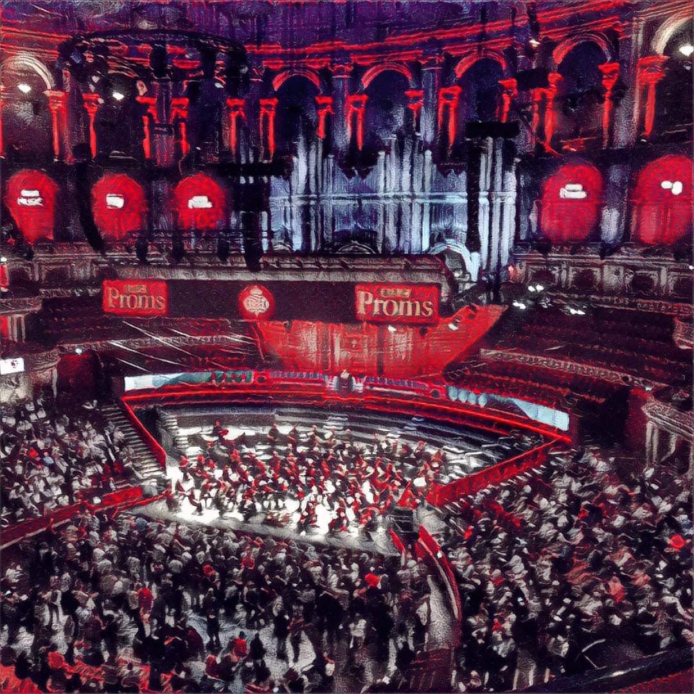

We went to see [Prom 47](http://www.ulsterorchestra.org.uk/events/2016-08-21/), an afternoon prom at the Royal Albert Hall in London. The bill included a brand new work by [Piers Hellawell](http://piershellawell.com), along with a Cello concerto by [Haydn](http://classicalmusic.about.com/od/classicalcomposers/p/haydnprofile.htm) and a symphony by [Tchaikovsky](https://www.britannica.com/biography/Pyotr-Ilyich-Tchaikovsky). These were all performed by the [Ulster Orchestra](http://www.ulsterorchestra.org.uk). The conductor was Rafael Payare. The tickets were an affordable £17 each[^1], which isn't bad at all given that we were sat in the second row of the circle. We had a great view.

I must admit that I did not understand Ingrid's obsession with seeing a prom. I moaned that it would be expensive and that we'd end up having to travel either to or from London at some awkward time of day. However this prom was at a convenient time and the cheap seats had not sold out. How could I say no?

The running order also fit my expectations. I think it's just as important to celebrate new "classical" music as it is to preserve older pieces. A lot of people consider new works for the orchestra to be challenging, but this one - ["Wild Flow" by Piers Hellawell](http://www.qub.ac.uk/sites/StaffGateway/News/QueensProfessorofCompositionatthe2016BBCProms.html) - wasn't in the least. OK so there are a few Ligetti-esque screechy bits near the beginning and it was chock full of showy percussion[^2] but in general it's fairly easy to listen to. At points it sounded a bit like Gershwin and at others it felt like it wanted to morph into a John Williams score. In short, it's very listenable. I've listened to it again a few times on the iPlayer and I've loved it each time.

The rest of the first half was Haydn's Cello Concerto No. 1 in C Major. [This was a lost piece that appeared in Haydn's notes but was not found for almost two hundred years](http://www.yourclassical.org/programs/performance-today/episodes/2016/06/13). It received its modern début in 1965. To my ears it sounded very baroque but I'm a duffer when it comes to the older stuff. Perhaps it's just the cellos that send me to my Vivaldi comparisons. There was a charismatic soloist performing the cadenzas[^3] and he even performed an encore. Let's just say that it went on long enough to confirm both his talent and his ego, but he's young so a little showboating can be forgiven.

After the break came [Tchaikovsky's Symphony No. 5 in E Minor](https://en.wikipedia.org/wiki/Symphony_No._5_(Tchaikovsky)). I thought it had more challenging moments than the modern piece, there were parts where the music didn't quite go where I expected it too. I wasn't too sure about all the interjections of what felt like very martial, almost militaristic music. But there were also some crowd pleasing moments and this piece was better known to the audience than it was to me. There were some lovely parts for the horns and I always admire how well Tchaikovsky writes woodwind parts in his work. For me the woodwind is a rather neglected part of the orchestra. The strings are very demonstrative, all show, but the clarinets and the oboes with their sinuous and insinuating melodies are always much more mysterious to me.

All in all it was a very satisfying afternoon and we got some time in London out of it too. I think we might even go to another one next year.

You can listen to the entirety of [Prom 47 on the BBC website](http://www.bbc.co.uk/events/ebw2mb#b07pdyrh).

[^1]: Cheaper than the train ticket to get there, even _with_ a railcard!

[^2]: More tubular bells please!

[^3]: Virtuoso solo passages inserted into works of music. When you get the role of playing these you get to wear a billowing white shirt and sit on a luxury stool at the front of the orchestra - IT'S THE LAW!