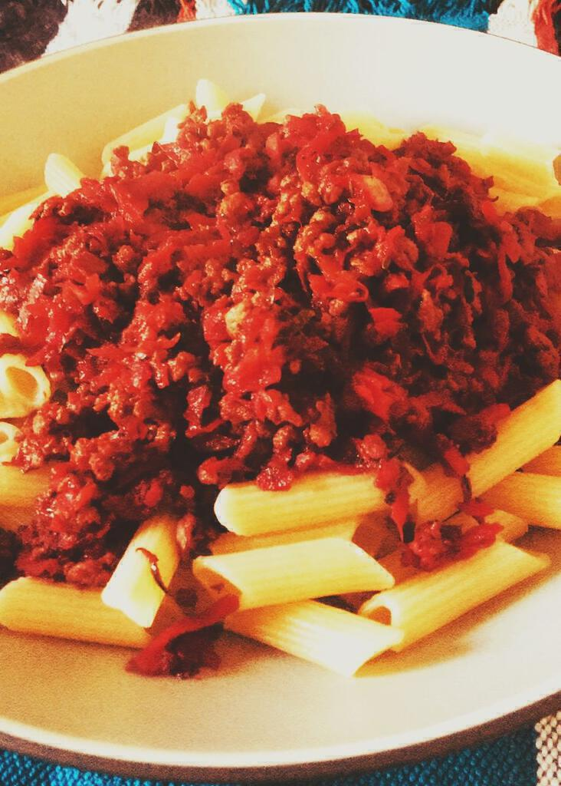

We cook this version of bolognaise with beetroot due to Ingrid's tomato allergy. This recipe is an attempt to capture what we do on the fly. The key to it is using the wine, the Worcestershire sauce and the herbs to even out the sweetness of the beetroot. If you can manage that, it's super tasty. The sauce usually ends up being an unusual but pleasing pink/purple colour, as you will see from the pictures.

### Ingredients: (Serves 4 to 5)
* ~500g turkey/pork/beef mince  
* 3 beetroot, grated  
* 1 carrot, grated  
* 1 courgette, grated  
* At least 3 cloves of garlic, diced or squashed  
* 1 onion, finely chopped  
* A glass of red wine  
* Worcestershire Sauce, to taste  
* Ground black pepper  
* ~2 tsp Italian herb seasoning  
* 2 or 3 bay leaves  
* 2 red chillies, finely diced  

### Method:
1. Fry the onions, chilli and garlic in butter until tender.  
1. Add the meat and fry until browned.  
1. Add the grated ingredients - the beetroot, carrot and courgette - and cook until softened.  
1. Add the liquids. The amount of Worcestershire sauce will depend on your wine. If the wine's full bodied, you'll probably need less Worcestershire sauce.  
1. Now season while everything bubbles. We like Sainsbury's Italian herb seasoning which is a blend of all sorts. In a pinch just oregano will suffice. Grind over lots of black pepper. Throw in a couple of bay leaves.  
1. Cover and allow to bubble away while you cook the pasta, stirring occasionally. Serve topped with Parmesan cheese.  