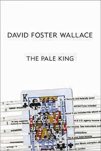

This is a longer form post about artificial intelligence inspired by reading a little bit of "The Pale King" by David Foster Wallace and putting a picture of a "ghost" up on Instagram. This might be the last of these that I'm able to write for a while.

## On Not Reading "The Pale King"

"The Pale King" is the third and final novel by American author [David Foster Wallace](http://www.newsweek.com/david-foster-wallace-appreciation-david-gates-89371). He was working on it when he committed suicide in 2008. It was compiled from incomplete notes and released posthumously in 2011. It deals with several characters around an [IRS](http://en.m.wikipedia.org/wiki/Internal_Revenue_Service) tax office in Peoria, Illinois[^1].

I haven't read all of "The Pale King", just the first few pages. I think it might be too much for me to take on at the moment. This post though is not one about me not reading a book. I was struck by how well written it was, there's an amazing section near the start[^2] relating the thoughts of a character as he sits on a plane and stares at the ground below. The focus of these thoughts is split between revision for a tax certification exam and the memory of something going very wrong in a previous (tax-related) job.

It's very skilful writing[^3]. There is a delicate balance to be struck. It's not just a matter of simply rattling off two trains of thought and letting them collide with one another. It requires profound thought about how and why one thought interrupts one another, the way in which they do, and how a person's internal parliament speaks for their character and experience. It is something that I have attempted, but I wasn't anywhere near successful so I really admire the craft on display in those passages.

Clearly DFW thought a lot about thinking and I really wish I had the time to devote to reading both "The Pale King" and "Infinite Jest" closely and thoroughly. My job hunt has meant spending a lot of time in preparation for interviews and I felt guilty whenever I interrupted that process, especially for the pursuit of pleasure. Having found a job, it will probably sap my time and energy to the extent that I won't be able to lose myself in long novels. I won't mind, going back to work is a relief. I'm sure I will find time for the odd novel somehow.

## The Something That Isn't

So what turned my thoughts back to that excellent writing? I posted the picture below to [my Instagram](http://www.instagram.com/mattischrome) a few weeks back with the caption "A Photo of something that isn't there". Someone asked whether it was a ghost. With Halloween coming up it seems appropriate to revisit it. Yes, I photographed a curtain precisely to play trick and elicit that response, but the unreal thing that I referred to was the sunlight falling upon the curtain. I was inspired by a joke I'd seen earlier that day. "Which of the following mythological creatures casts no shadow?" The answer of course is "none of them". Something that does not exist casts no shadow. Naturally this inspired an attempt to take a picture of something that did not exist, that was not there.

> There are more things in heaven and earth, Horatio, Than are dreamt of in your philosophy (Hamlet, Act 1, Sc 5)

And on settling on the sunlight caressing the curtain (simultaneously realising it was a good way to emphasise some recent good weather), I realised that this is something humans (or rather their brains) do all the time. There is a whole extra layer of information in the world that exists purely as contextualisation, emotion, and metaphor. It is largely intuited and untaught, and it's hard to explain your version of that layer to other people. It is easier if you share some cultural or physical attitudes, but not always. In fact, there are multitudes of such layers. Some layers are unique to our subjective experience and persuading others to understand this layer can be very difficult. Yet sometimes someone completely alien to us can show us an entirely new way of seeing things around us, it is possible to explain and transmit these layers. I think our brains working this way is one of the main reasons why we are the apex species of this planet.

As someone interested in machine learning, I'm interested in the ramifications of this for computers. How do we encode the thought process that tell us there is sunlight on the curtain? That the white material is not a rag or a ghost but a curtain? That there is 'light' of any description in the picture? And that it is specifically sunlight? What makes a human look for a "ghost" when the caption tells us that the picture is of "something that isn't there"?

## So What Next?

And why is it worth thinking about thinking in this way? There is so much about our lives that remains unknown to one another and to computers[^4]. Now that "big data" is upon us, I think the next big revolution will be centred on the cloaking of algorithmic behaviour. Streaming services are now battling to provide "curated content" - this is supposedly one of the reasons why Apple bought Beats Music - and as our interactions with recommendation algorithms become more commonplace, those that feel "most human" will undoubtedly fare the best.

Meanwhile, in the ongoing arms race of cyber crime there will no doubt be advances in disguising the metadata and transaction patterns that currently give cyber-criminals and terrorists away. Increasing detection and interception promotes innovations in camouflage and stealth, necessitating increasingly sophisticated pattern recognition techniques.

As a final example, we are now (mostly) living longer and more comfortably than at any point in human history. In all likelihood we will continue to do so, despite the challenges of climate change and possible overpopulation[^5]. It seems ridiculous to predict that loneliness and depression may be the major public health cosequences of this process, but the UN and the World Health Organisation [have considered this possibility](http://ocw.mit.edu/courses/health-sciences-and-technology/hst-934j-introduction-to-global-medicine-bioscience-technologies-disparities-strategies-spring-2010/readings-and-lectures/MITHST_934JS10_ses1_proj.pdf). Greater understanding of our nuances of thought may prove useful in [identifying potential cases](http://www.nimh.nih.gov/news/science-news/2012/pattern-recognition-technology-may-help-predict-future-mental-illness-in-teens.shtml) or in providing [greater support to those who need it](http://news.medill.northwestern.edu/chicago/news.aspx?id=77173).

I am obviously exposing the merest tip of the iceberg here. There is so much more that we need to learn about how our brains work and so much that we need computers to do with that information. Fiction is testament to how we can develop convincing working models of the mind in specific instances but obviously there is still a long way to go. Despite this, the pace of technological advancement in the last century gives me confidence that a genuine[^6] computational model of the mind will be created in my lifetime.

It is, without doubt, a complicated task; one that can be subdivided into a great fount of unsolved problems. Additional intermediate and incremental steps will be required, as the problem requires us to understand the how and the why of not just the goo, but the underpinning philosophy too. I think we should emulate our own brains first and then make improvements. A genuine mind that encompasses rooms of computers running in concert would be better than, say, a robot that can't write poetry. The more ambitious we are, the greater the reward will be.

[^1]: A place also celebrated in Sufjan Stevens' "Illinoise" album.
[^2]: Or rather, placed near the start by the editor.
[^3]: The non-fiction collection "Both Flesh and Not" and the little that I've read of "The Pale King" reinforces my belief that DFW was a great writer.
[^4]: There is obviously a parallel debate about **how much** we should allow computers (and the people in charge of the computers, while they are still in charge,) know about the content of our thoughts, and how much of ability we should donate to them.
[^5]: Some people are very pessimistic about this subject. I for one believe that the more of us there are, the better our chances of creating the people who will invent the quantum computer, the universal materials generator, or the faster than light drive.
[^6]: Genuine but rudimentary.
