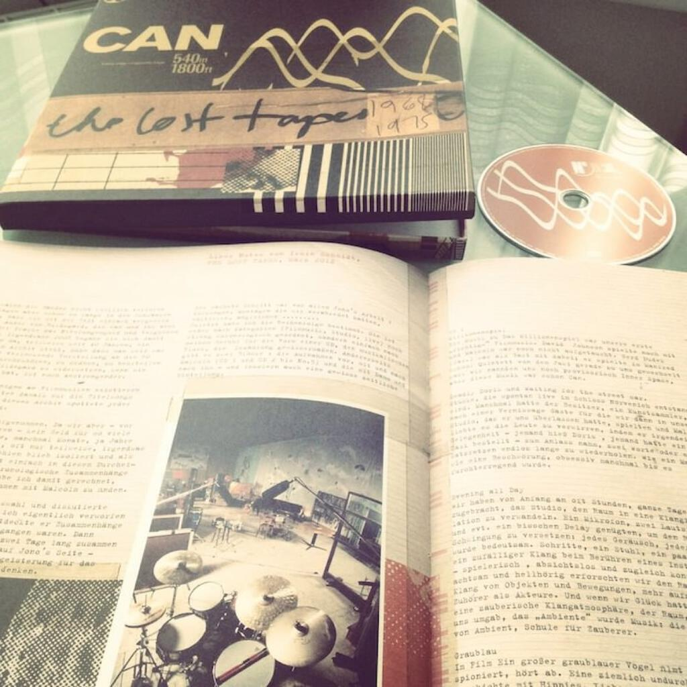

This arrived on Monday and I thought I would give it a post of its own because at over 3 hours of music, I am unlikely to do more than dip into it before writing the album digest next week. It is a far bigger and more enjoyable artefact than I thought it was going to be, so it probably deserves special attention for that reason too.

[CAN](http://en.wikipedia.org/wiki/Can_(band)) are German (“[Krautrock](http://en.wikipedia.org/wiki/Krautrock)”) band that I got into about four years ago after my interest in the genre was initially sparked by the “Neu! 75” album and by the Kraftwerk box set. I have four of their albums and I have thought about which one I should include as an [understated classic](understated-classics). It will probably be “Soon Over Babaluma” because no one really writes about that one. Then again, Portishead’s “Third” probably wouldn’t sound as awesome as it does without the influence of “Ege Bamyasi”, so that might be worth considering too. Everyone writes about “Tago Mago” and “Future Days” but for good reason.

“The Lost Tapes” were more forgotten than lost, they had been left in a cupboard in their studio until its contents were catalogued and moved to the German Rock’n’Pop museum in Gronau. As a result some of the stuff here has a less essential feel and there is less cohesion than on the albums but there is still some lovely stuff. The middle of the second disc is particularly excellent: a live version of “Spoon” and a collage of music for the TV crime movie “Tote Taube in der Beethovenstrasse” entitled “Dead Pigeon Suite” that together run for about twenty-seven minutes.

My other favourites after the first few listens are “Graublau”, “Bubble Rap”, “A Swan Is Born” and “Networks Of Foam”. There are other tracks that I can see myself not listening to that often: these include “Are You Waiting For The Streetcar?” (Key lyrics: “Are you waiting for the streetcar? / Are you waiting for the streetcar? / ARE YOU WAITING FOR THE STREETCAR?!??!?” – for ten (!) minutes) and “Blind Mirror Surf”, which is a patience-testing curl of feedback over more feedback. Some of it is quite challenging but even after just a few listens I am getting more out of it. Of course it’s all stuff that didn’t make it on to the (admittedly excellent) albums but even six out of ten material is worth hearing from a ten out of ten band.

Finally, some words on the box itself. When pre-ordering on Amazon I’ve come to learn that “box set” is often a euphemism for “look we’re giving you extra tracks so don’t push it by asking for decent packaging!”, viz the rather disappointing Orb reissues that came in jewel cases. “The Lost Tapes” though is rather lovely, coming in a sturdy box about the size of a tape can and containing a high quality book that features liner notes in both German and English. There are some interesting photos, artwork and a discography too. Snapping the thing in Instagram is tongue-in-cheek on my part because the aesthetic of the set is one of yellowing tapes and retro recording equipment. It is as much a document about pre-digital recording as it is about CAN’s music.

Finally, a fun fact that links to elsewhere on the blog. The selection and restoration were done by Jono Podmore, who did some engineering work on The Shamen’s [“Arbor Bona, Arbor Mala”](uc6) album!