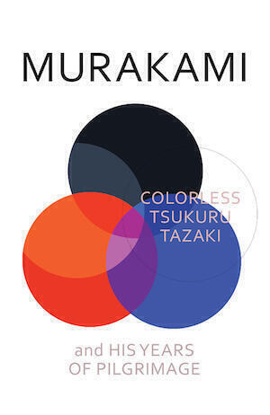

Colorless Tsukuru Tazaki And His Years Of Pilgrimage is the latest novel by Haruki Murakami. [It comes with free stickers](http://www.theguardian.com/books/2014/jun/19/haruki-murakami-marketing-publishers-stickers). Perhaps that tells you everything you need to know about this book, which is slimmer than Murakami's recent efforts. The plot begins with an intriguing premise. Tsukuru is part of a group of close friends and is one day expelled from the group for no reason. Unfortunately, the development of the plot is uncontrolled and by the end  of novel too many holes have developed for it all to hold together.

It is a pleasant read but a familiar one. [You can play Murakami bingo](http://www.incidentalcomics.com/2012/06/haruki-murakami-bingo.html) with Colorless Tsukuru Tazaki. Will there be Jazz or classical music? (Or, potential spoiler, both?) Will the character at the centre of the action make pasta? Or drink [Cutty Sark whisky](https://cutty-sark.com/the-whisky/)? Will they have an infatuation from childhood that will haunt their adult life? Will a strange dream-like world enter into our reality at some point? Will the books that Murakami’s been reading all-too-obviously force their way in to the narrative at some point? Will there be an endearing cat simile?

If you’ve read a lot of Murakami novels, you won’t need to re-read it when you are done, and if you haven’t, well I can suggest at least three better books with similar plots that you will probably enjoy more than Colorless Tsukuru Tazaki.

Murakami’s last novel “1Q84” was so huge that it had to be split into three books. It too was a [shaggy dog story](http://en.wikipedia.org/wiki/Shaggy_dog_story) that became a love story at the end. It even had a happy ending. It also had a variant of almost all the Murakami bingo elements[^1] I mentioned above, but because “1Q84” was longer there was enough space to resolve most of the plot points. In Colorless Tsukuru Tazaki there are plot points that are completely unresolved by the end of the novel. In some ways this mirrors the unresolution of the whole novel but it feels lazy and cynical, unless there is the possibility of a sequel.

If you believe that Murakami should be cut some slack for the ingeniously blank prose that is able to endow the slightest deviation from normality with a shivery strangeness, then there is a little more for you here than for the rest of us. Even so, it still doesn’t come close to the utterly bonkers [“Dance Dance Dance”](http://www.goodreads.com/book/show/17800.Dance_Dance_Dance) or the slow strange unfolding of his masterpiece [“The Wind-up Bird Chronicle”](http://www.nytimes.com/books/97/10/26/daily/bird-book-review.html). In many ways the whole thing feels like two novellas fighting it out to be a novel: one a realistic story about friendship, time, and memory; the other a surreal concoction about spirit colours, demonic jazz pianists, soul murder and how the world connects to the realm of dreams. In my favourite Murakami novel [“Hard-boiled Wonderland and The End Of The World”](http://www.conceptualfiction.com/hardboiled_wonderland.html) he has the same problem and solves it simply by presenting the two stories completely separated from one another and in parallel. “1Q84” just about managed to pull off a fusion of these two styles, but in a tighter framework Murakami just can’t do it this time around.

---

Hero image is [a picture of commuters at Shinjuku station](https://flic.kr/p/ozLekk) taken by [garberus](https://www.flickr.com/photos/garberus/), [(cc-by-nc-sa-2.0)](https://creativecommons.org/licenses/by-sa/2.0/). Shinjuku station features at various points in the novel.

[^1]: For example, a chapter called "The town of the cats" manages to hit peak cat.
