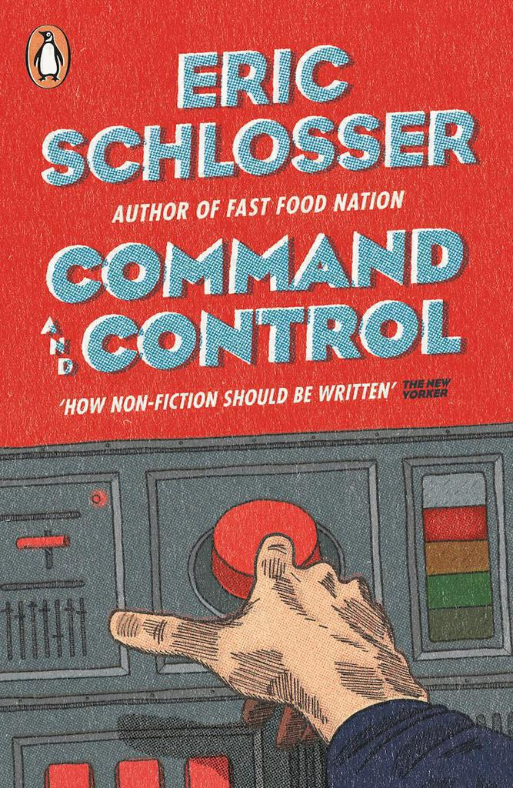
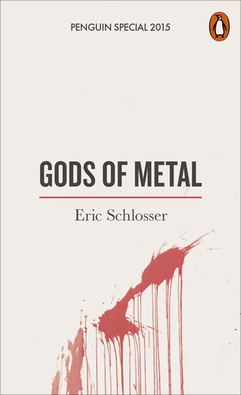

"Command and Control" by Eric Schlosser is about the history of nuclear weapons and their safety. This might not seem like a thrilling subject, but it's absorbing from start to finish. I started it three years ago but only finished it more recently as the subject of nuclear weapons has become more pertinent to current affairs[^1]. There are many people who would stand to gain a great deal from reading this book[^2].

Schlosser manages to make the subject so absorbing by weaving together the history of nuclear weapons, the history of nuclear weapon safety, and the tale of one particular event involving [the explosion of a Titan II missile at a silo in Arkansas in 1980](https://en.wikipedia.org/wiki/1980_Damascus_Titan_missile_explosion). By doing so, he gives the reasons why nuclear weapons were so often unsafe, he gives us examples of how things went wrong, and he shows how on that September day in Damascus, everything that could go wrong did go wrong. It's a story that takes in an incredible range of characters. Some are well known to the reader, such as the various presidents of the USA, Nikita Khrushchev, Henry Kissinger, [Jimmy Stewart (bizarrely)](http://www.airplanesofthepast.com/strategic-air-command-movie.htm) and so on. Others less well known include the scientists at the various laboratories, airmen, top brass at Strategic Air Command. The story also takes in locations all over the United States and around the world, such as Japan, Greenland, and Spain. There are mind-boggling stories of radar systems, advanced computers, and site R, the city-sized nuclear bunker built into Raven Rock mountain in Pennsylvania.

Throughout, despite telling some stories that could only be as strange as they are by virtue of being true, the tone remains measured. Schlosser does not resort to rhetoric and never allows the subject matter to overwhelm the writing. He tells the stories of ordinary airmen in a sympathetic and natural way. The complexity of the weapons is contrasted to the rote nature of the tasks of the maintenance men. He describes the absurdity of the situation with the missile in a detached manner, almost befitting of a sequel to [Dr. Strangelove](http://www.rogerebert.com/reviews/great-movie-dr-strangelove-1964). The way Schlosser describes them, it's hard not to become attached to the men caught at the scene in Damascus. The details of how supposed command and control instead becomes a game of Chinese whispers between men on walkie talkies talking to men on the radio who are talking on a conference call made me gasp. In the descriptions of historical incidents, it's one face-palm incident after another. This quote sums up the scale of things:

> The military now used Native American terminology to categorize nuclear weapon accidents. The loss, theft, or seizure of a weapon was an Empty Quiver. Damage to a weapon, without any harm to the public or risk of a detonation, was a Bent Spear. And an accident that caused the unauthorized launch or jettison of a weapon, a fire, an explosion, a release of radioactivity, or a full-scale detonation was a [Broken Arrow](http://www.imdb.com/title/tt0115759/?ref_=nv_sr_1). The official list of nuclear accidents, compiled by the Department of Defense and the AEC, included thirteen Broken Arrows. Bill Stevens read reports that secretly described a much larger number of unusual events with nuclear weapons. And a study of abnormal environments commissioned by Sandia soon found that **at least 1,200 nuclear weapons had been involved in "significant" incidents and accidents between 1950 and March 1968.** (page 327)

I can also recommend the audio-book, as read by Scott Brick. This helped me get through it a bit faster. I've been snooty about audio-books in the past, but I found it helped me stick to a schedule of reading chapters, usually to re-cap where I fell asleep listening to it at night. It was also good to listen to on the way to and from work in fifteen minute snippets. On one occasion I listened to a section about the US army, the US air force and the US navy all planning to bomb the same targets in Russia many times over. I don't think anything else I've listened to on the way to work has provided so much insight into how the council works!

Finally, I should also re-mention "Gods of Metal". This is a tangent from "Command and Control". [I wrote it about two years ago](gods-of-metal). This picks up on the nuclear protest movement, something that is almost absent from "Command and Control". Presumably it was assembled from material that didn't make it into the original book. Like "Command and Control" it's able to discuss one issue as a subtext for another, highlighting an aspect of weapons safety more pertinent to current events: is it safe for nuclear weapons to be guarded by private contractors who were the lowest bidder? I recommend "Gods of Metal" again too, especially if a 632 page tome on nuclear weapons seems a little too much.

[^1]: Suffice to say that when I bought the book over three years ago, I would not have believed that it would be so relevant by the time I had finished it.
[^2]: The name at the top of the list rhymes with Dump.