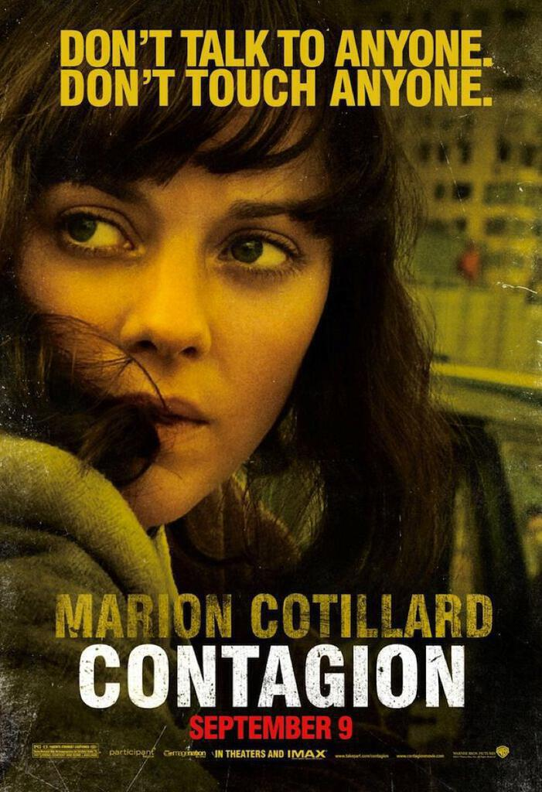

There was much excitement about [Contagion](http://www.imdb.com/title/tt1598778/) at work. Finally a movie that explains  as part of the plot! A bunch of us went to see it, mainly to see whether [a disaster movie about a global pandemic](http://contagionmovie.warnerbros.com/index.html) could hold up as entertainment and to have a bit of a giggle if it couldn’t.

I liked three things in particular about the film. I liked the cinematography, especially the opening sequences with the index cases staggering around. I liked the soundtrack except for when it intruded a bit too much into proceedings. Finally, I liked Marion Cotillard, who in my view is the second most beautiful woman in the world (Imagine my glee when I found the poster with her on!).

Oh and the line “Blogging is not writing. It’s just graffiti with punctuation.” was brilliant too.

However, without giving too many spoilers away, it was a bit flat as a film. The scenes with the scientists and the attempts to keep things under control were good, as were the scenes where they attempted to trace the contacts of the first people infected with the disease.

My problem was that this alone should have provided enough material for the film to be gripping and entertaining. Instead the film includes another plot strand showing the growing social disorder but this did not develop in a sufficiently compelling way. In the time given to this aspect of the plot, they should have done a lot more with their ideas. I have a sneaking suspicion that it would make for a pretty good parallel film.

Overall, I think it was a brave attempt to make “The Day After Tomorrow But Most People Get A Nasty Cough And Have Fits And Some Of Them Die” (Hey, I’m not paid to think of titles for films and I think we now know why). It over-reaches in attempting to cover too many story arcs (the lovely Ms Cotillard is completely forgotten for about an hour!) but it is a noble stab at creating an informative and thought-provoking film around a subject that is both fascinating and often misunderstood in popular media.
