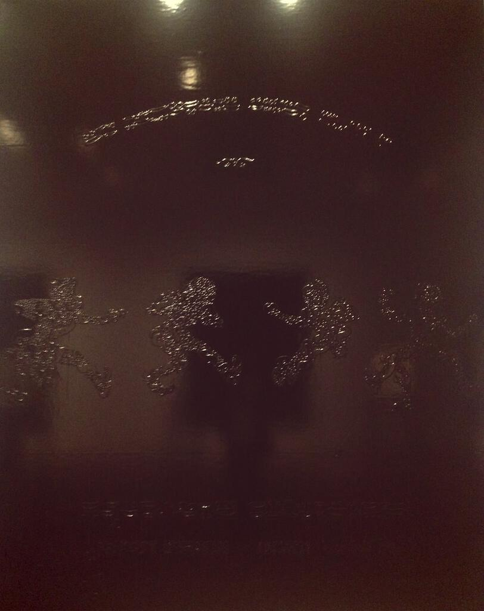
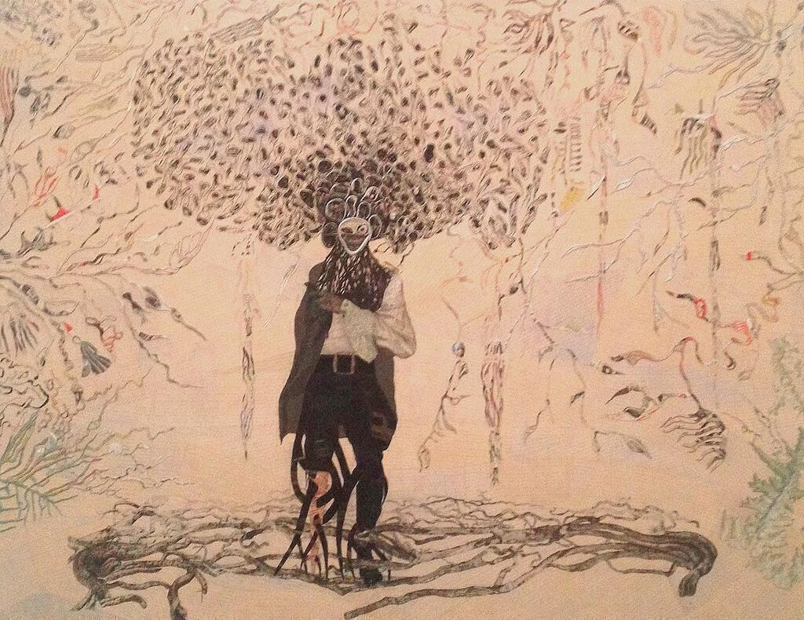
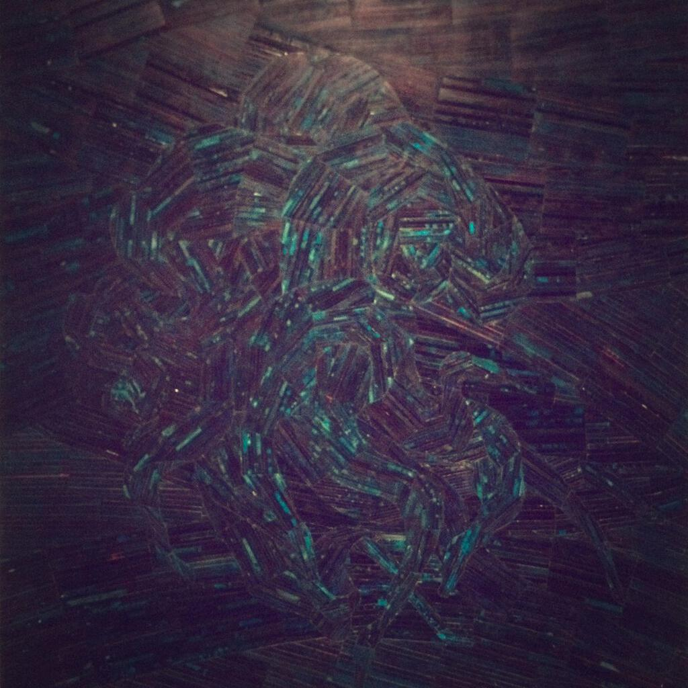

Ellen Gallagher is an American artist and her "AxME" show recently finished at the Tate Modern. I went along a few weeks ago and have only now had a bit of time to write up my thoughts.

My biggest regret is that I didn't go along to it sooner, so that I had a chance to see it more than once. It was certainly a larger show than I was expecting (it was about the size of the [Ibrahim El-salahi](ibrahim-el-salahi-at-tate-modern) and [Saloua Choucair](choucair-at-tate-modern) shows put together) and I hadn't left myself with a lot of time to see everything when I did go.

It was also a lot better than I was expecting. Gallagher's work is funny and provocative, it was certainly nice to go and see modern art that made you chuckle. Generally her pieces are about race, identity, and the appropriation of found materials to produce a new context or meaning for them.

The outstanding pieces ("Double Natural" (2002) and "Afrylic" (2004) dominated the second room) are without doubt the large pieces comprised of small multiples based on adverts from 1950s women's magazines. The men and women beaming out of these ads for hair and beauty products are subverted with large pieces of yellow acrylic and googly eyes, turning them into surreal and comic figures. I assume the intention is to satirise the idea of transforming one's body in the fashion described in the adverts. The repetition of small multiples no doubt representing the mass production of the advertised products, but also to show how a collective obsession, no matter how surreal, lends those engaged in it the very conformity that they seek to avoid.

Elsewhere there were beautiful see-through watercolours painted on transparent paper (like "Morphia" (2008-12)) and mounted on see through panes so that you could see them from both sides, the point being that the images changes when viewed from the other side. These were quite magical in fact, and a large part of the pleasure of viewing them was to ponder upon just how they were constructed.

Construction seems to play a large role in Gallagher's work, or at least those selected for this show. Almost every piece contained not only some overall image but also some riff on how it was made. Typical of this were the shiny black pieces like "Mobb Deep" (1998): at face value you are presented with a canvas that has been painted but then you notice the presence of another work beneath the slick black façade, the presence of the same collage of rubber and paper pieces that make up her other works. In some ways, this is a run-on from the two-sided watercolours, except instead of admiring two views of the same thing that Gallagher has given you, you are trying to bring that second view of the same artwork out of the pitch by black yourself. (In the catalogue for the show these works are reproduced in a way that you can see all the structure quite easily, something that is more difficult in the gallery itself.)

I loved "Bird In Hand" (2006) but what you can't really see in my terrible stealth picture of it is its wonderful texture. It's made from hundreds of paper cutouts and up close it's really beautiful and intricate. The central character is a Cape Verdian pirate and the whole piece is about of the effect of the slave trade in the region.

My favourite piece was "An Experiment of Unusual Opportunity" (2008), a collage of coloured paper partly washed over with indian ink. It's a dark piece but not quite as austere as the black ones, the red at the centre really pops out and the whole thing twists in and around itself, like a figure caught in dark waves. [The title refers to a notorious experiment conducted in the US between 1932 and 1972](http://en.wikipedia.org/wiki/Tuskegee_syphilis_experiment) in which black men with Syphilis were observed rather than treated. A similar piece called "Puppy Chow" (2009) also combines dark inks and paper strips to produce something that looks like a painting but isn't, something tactile and textural that you want to reach out and touch (but you can't because unfortunately it's displayed under glass).

I have to be in the right mood for multimedia installations but "Osedax" (2010) was amazing, the perfect blend of a carved wooden box to sit in, the videos, the projections and the music (and the vibrations from the speakers under the wooden benches). It's ostensibly about dead whales that wash ashore to be consumed by scavengers (according to the show guide) but it seems too pretty for that. I tried to film what it was like inside but the resulting 15 second snippet didn't do it any justice at all.

I rather rushed the final rooms, which were given over to a series called "Watery Ecstatic" and is based on marine biological themes and no small amount of Moby Dick. These pieces were largely white and green, the paintings were a picture of watercolours and etchings made in to the paper itself (so rather than adding strips and layers of paper, the paper is etched into, removed, or distressed to create shapes and textures). Dominating this room was a sculpture called "Preserve" (2001) that I will admit I found baffling; it was like a white climbing frame but embossed over it were motifs similar to those found in the Watery Ecstatic paintings, almost as though the paper layering technique had escaped into the world of metal work.

There is no way that I have done justice to this wonderful show and I hope that it pops up somewhere else soon. I will remember Ellen Gallagher as an artist that I really like and I look forward to seeing more of her work in the future. The hero image is "Double Natural" (2004).
