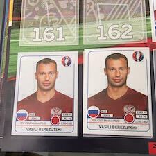
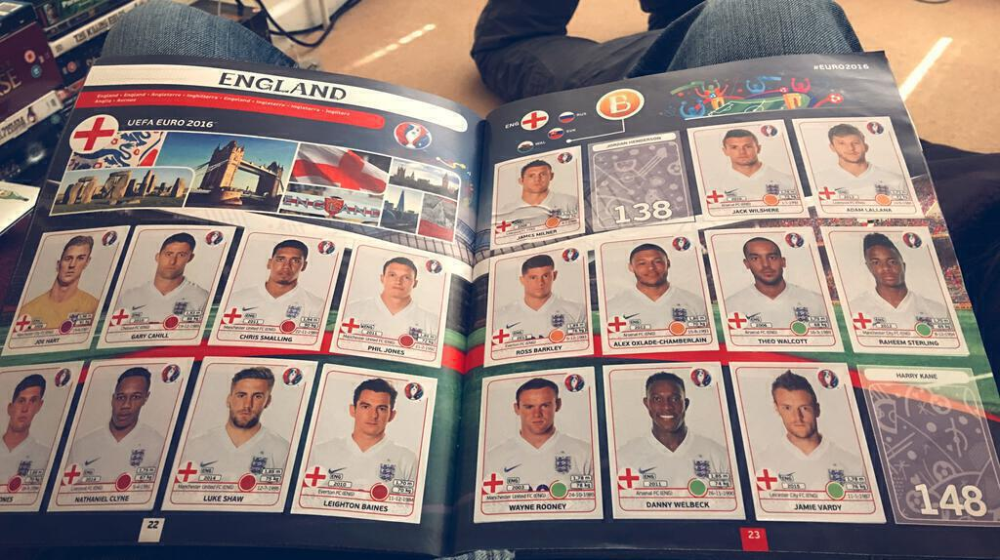
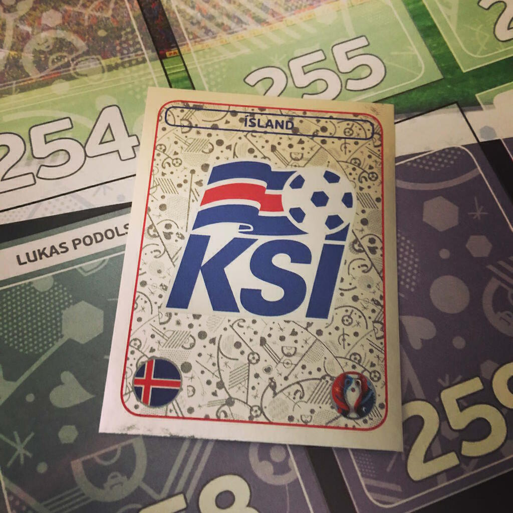
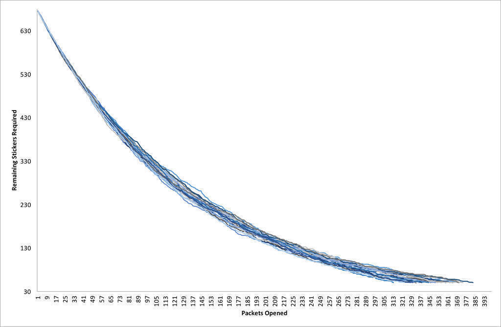
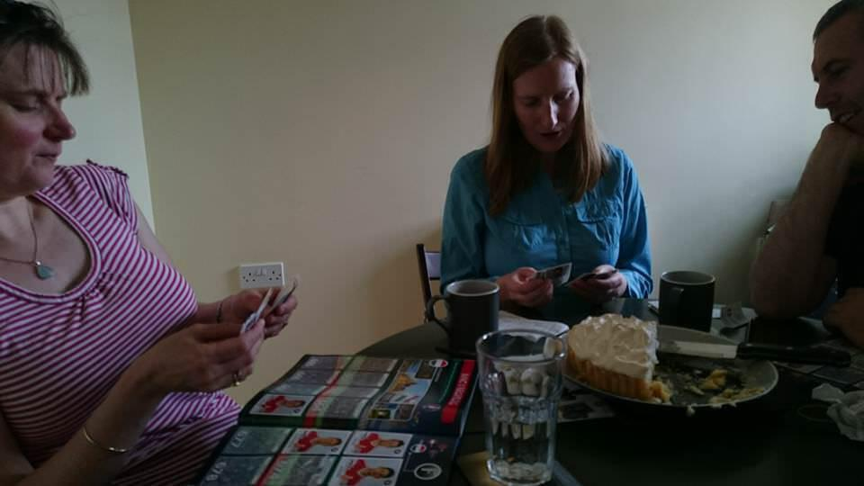

Sound the conspicuous consumption klaxon! &#x1F4E3; I know it's foolish but I decided to collect the Panini stickers for the Euro 2016 tournament this summer. I think it's a more edifying waste of money than a series of group game accumulators that don't come off. If this week's long read in The Guardian is anything to go by, [we really shouldn't be giving any more of our money to betting companies](https://www.theguardian.com/business/2016/may/31/big-gamble-dangerous-british-betting-shops). The album also looks better than any of the official books. Anyway, this post celebrates my inner collector/geek and the beauty of the shiny sticker!

 I find sticking the stickers into the album relaxing. Like the craze for adult colouring books, it takes a nostalgic childhood memory and uses it to escape the pressures of everyday life. I wouldn't say that I'm a perfectionist though, I totally mangled Swedish keeper Andreas Isakson as I stuck him in and I've even stuck down an a-b pair in the wrong order!

The burning question is how many packets of stickers will it take to fill the album? It depends on how many people you are able to swap with and how much money you are prepared to spend on excess stickers. If you have enough friends collecting stickers, you should in theory be able to buy 675 stickers (135 packets at 50p each) because you can then swap all your duplicates with your mates. eBay wasn't a thing when I was ten (the last time I collected stickers for the 1990 World Cup) but it is now. You can resort to all sorts of shenanigans there. In the real world and such "cheating" aside, it's likely that you will need more than 135 packets.

### The Hypergeometric distribution, stickers-induced bankruptcy and you

How many swaps are you likely to generate? We can calculate the probability of getting N out of 5 new unseen stickers in each packet. We use hypergeometric distribution for just this sort of thing: taking small samples from a larger population without replacement and calculating the probability of N successes in that sample. In Excel the formula <code>=HYPERGEOM.DIST(NUM_GOT,5,NUM_NEED,TOTAL_NUM,0)</code> generates these probabilities. The names I gave the variables should explain each parameter. As mentioned you get five stickers in each pack, so this is the number of draws each time. The fifth parameter takes the value 1 or 0 depending on whether you want cumulative values or not. Cumulative values helped me build the Markov chain I used later on.

If we play around in Excel we see that the probability of generating swaps increases quickly as you begin to accumulate more stickers. In the following table I compare a situation near to the start of collecting, somewhere about halfway through, and somewhere near to the end:

| **Number of unseen stickers (Out of 5)** | **With 600 stickers still to collect** | **With 300 stickers still to collect** | **With 50 stickers still to collect** |
|:--|:------|:------|:------|
| 5 | 53.4% |  1.6% |  0%   |
| 4 | 35.8% | 10.5% |  0%   |
| 3 |  9.5% | 26.9% |  0.3% |
| 2 |  1.2% | 34.1% |  4.3% |
| 1 |  0.1% | 21.5% | 27.2% |
| 0 |  0%   |  5.4% | 68.2% |

Even with most of the album still to fill, you have a just over 50% chance of putting all your new stickers into the album. Happily you also have a minuscule chance of getting five stickers that you already have. Once you get beyond the halfway point, you're most likely to be adding between one and three new stickers to your album with each new packet - and you still have three hundred to go! It's a good job that Panini allows you to send in a list for your final 50 stickers as by then you have a greater than 2 in 3 chance of not getting any new stickers in each packet! That is only one new sticker on average in every three packets! This is why having a large pool of friends to swap with is so important!

### The shiny situation

Of course this assumes that all the stickers are of equal rarity. You can understand why there might be more Gareth Bales or Anthony Martials about than there are Florin Andones or [Taulant Xhakas](http://www.uefa.com/uefaeuro/season=2016/teams/player=1905362/index.html), at least in the UK. It might help Panini to sell more stickers to casual collectors if you can track down the famous faces quickly. Nevertheless, I think that the table above goes a long way towards explaining the perceived rarity of stickers: the more you have, the rarer the ones you don't have seem to be.

To explore this, we can use the shiny stickers as an example. These are the Panini equivalent of finding Willy Wonka's golden ticket. They make getting the Icelandic team badge the best thing to happen all week. I estimate that there are 50 shiny stickers in the album. There is one for each team badge and one for each team photo, and the pictures of the trophy at the start of the album are also shiny. We can again use the hypergeometric distribution to estimate the probability of getting one shiny sticker in your packet of five stickers. If you have no shiny stickers yet the chance is about 27% (and also 4.0% of the time you might get two in one packet: this has happened to me). However, if you already have ten shiny stickers the chance of getting another in your packet (that you don't already have) drops to 22%. Particular stickers just seem rarer because it's more difficult to find new stickers once you possess a certain number of stickers. Once you start looking for one sticker in particular, it will seem very rare indeed.

### Simulations

I will finish with the results of a simulation. Using a [Markov chain](https://en.m.wikipedia.org/wiki/Markov_chain) with transition probabilities determined by the hypergeometric distribution, I simulate a single collector’s progress. I ran it a 1000 times until a cutoff of 50 stickers (when you can send your final list to Panini). This assumes that all stickers are equally rare and that the collector never makes any swaps. The graph below shows 25 of the 1000 runs and how the number of stickers remaining changes as the collector opens more packets.

Under these conditions my collector has to buy an average of 355 packets over the 1000 runs. This means that on average they spend £184.50p to fill the album (including the £7 spent on buying 50 final stickers at 15p each from Panini). In 1000 runs, the minimum number of packets needed was 306 (for a total cost of £160) and the maximum number of packets needed was 418 (for a total cost of £216). The median was 354 packets and the interquartile range was 344 to 365 packets.

It's worth thinking about this in terms of the price paid for each unique sticker. If you're the lucky person who gets all the stickers inside 306 packets you'll pay 24p per sticker. The unlucky person who has to buy 418 packets ends up paying a whopping 32p per sticker! If you don't swap any stickers then on average you'll end spending 27p per sticker. This is nearly three times their initial cost and almost twice the price per sticker that Panini charges for completing the final fifty of the collection.

### How to save money

There are two ways to save money. The first is to find some friends to swap with. In theory this allows you to keep the cost of every sticker at 10p. If I have time, a follow-up post will explore what happens to a group of collectors who agree to exhange doubles after each batch of packets bought. I'd like to write a simulator that helps answer questions like "How many friends do you need?" and "What batch size between swap sessions is best?". I'd also like to explore what happens when the assumption of equally rare stickers no longer holds.

If your friends are too sensible to get in on this sticker collecting lark, the second thing you could do is persuade each friend to buy you fifty stickers direct from Panini. This is probably as effective as swapping (because swapping is unlikely to be 100% efficient) but you would miss the thrill of opening packets and the social interaction that comes with swapping.

I've swapped with friends at work who are collecting and I have also taken to the internet to make swaps with strangers. So far I've added at least 100 stickers to my collection this way, with at least 40 (so far) arriving in the post from people I've never met. The [stickerswapping.com](http://www.stickerswapping.com/index.php) website is useful both for organising your collection and for setting up trades with fellow collectors. It relies on your ability to trust strangers from the internet but people have little to gain from ripping you off. Nevertheless it's a good idea not to accept trades that appear too good to be true.

Finally, the sticker swapping site allows you to see how many people have a particular sticker to swap. Is one sticker rarer than the others? You bet. [The shiny of the Belgian team badge!](http://thumbs.ebaystatic.com/images/g/gF8AAOSwVcFXO2c0/s-l140.jpg) I'll trade you three Romanian strikers if you have one going spare!