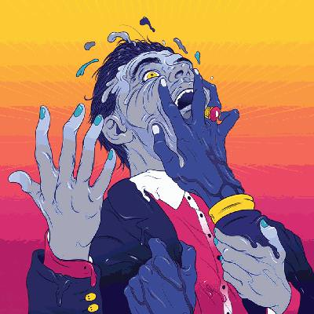

It's difficult to write honestly about your feelings. It's difficult to write about your feelings consistently, for a living on a regular basis. It's difficult to write about your feelings when the world constantly intrudes with inanity, insanity and hatred. It's difficult to write under those conditions without seeming frayed, without coming loose at the edges.

"Get To Heaven", the third album by [Everything Everything](http://www.everything-everything.co.uk), was forged under these stresses and pressures. For most of its running time it sounds like either a bomb ticking down to explode or like a clock inexorably counting up missed opportunities and stolen moments. It sounds for all the world as though it is trapped between fight and flight, paused between action and apathy. Yet it also subjects the listener to the yammerings of a culture that has driven itself mad. Depth and surface, glass and steel, truth and lies.

Everything Everything's previous album "Arc" found their songcraft in a similarly precarious state of affairs. Ideas about love and existence were crammed into miniature epics that twisted and thrashed around like a handcuffed escape artist suspended high above some watery peril. For the most part - as on singles "Cough Cough" and "Duet" - the escapist act was not there to be seen: it was only the thrashing that mattered. A song of theirs would fishtail between subjects, between id and ego, between triumph and disaster. Only on "Undrowned" was the danger truly glimpsed ("There's so much to talk about / that we don't talk about"). A glum lullaby set in ice, the modern media merry-go-round cast into the very depths of Dante's inferno - the winter chill of traitors, no flames here. It was, in retrospect, the marker lain for future trails.

"Get To Heaven" reveals the shark and its teeth rather than the plastic fin above the water. The stakes are raised and the danger is real. There's no pretending that the world has not become darker and more dangerous in the years since "Arc" - but of course there's that title, the lurid neon colours of the artwork, the ravey chords underpinning "Distant Past": there's optimism to be had here. It's the joy that comes from persisting in spite of it all, the calm that comes from setting yourself aside from the madness around you.

This must have been a difficult album to write. To take all that imagery of war and destruction, to take the ever-pervasive sense that those in power are screwing us all over, to take all the existential doubts that can exist within one person and how those doubts derail friendships and loves. To take it all and throw it into what initially sounds like the grimmest rave ever, and to shape it into something worth believing in. That must have been difficult.

I can't say that "Get To Heaven" is the best album that I've heard this year (not yet) but it's certainly one of the more ambitious and interesting. Compared to how dull Foals have become (more on which soon) and [just how much Everything Everything sounded like a second-rate Longpigs at points on "Arc"](/album-digest-january-2013/), it's amazing that they've done this well. The production is sharp and bright, meaning that it contrasts with my go-to record for dark times - Radiohead's "Amnesiac" - but then again it was always going to.

You'll notice that I've not described many of the songs. I'm not sure that I can write about them effectively this close to hearing them for the first time, not when they've affected me the way that they have. I urge you to check them out for yourself instead. As always, stay away from the bonus track version - nothing was ever gained by sticking six extra tracks that didn't make the cut to your album playlist.

The subject matter is probably among the darkest that pop music ever deals with, and yet somehow it still flickers to life and makes you feel invigorated and alive. That's a very peculiar trick. You can't expect an album to explain why bad things happen, but you can expect one to get you dancing regardless and "Get To Heaven" does just that.
