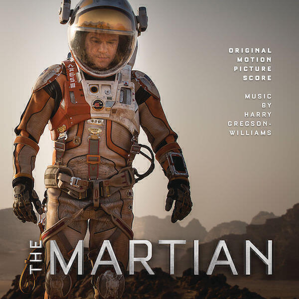
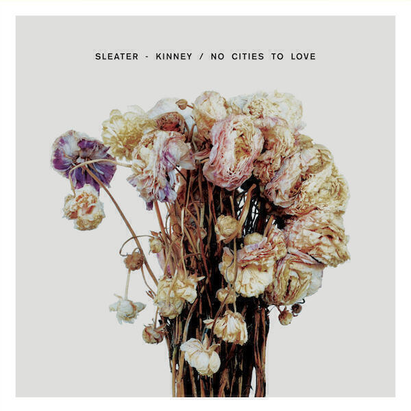
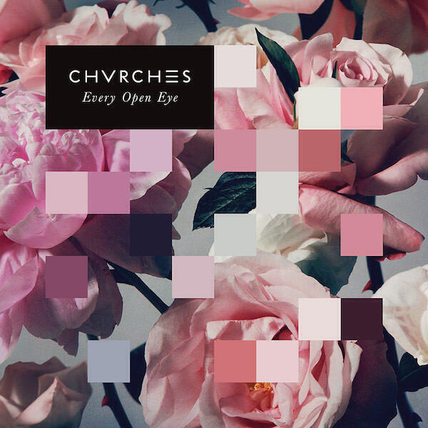
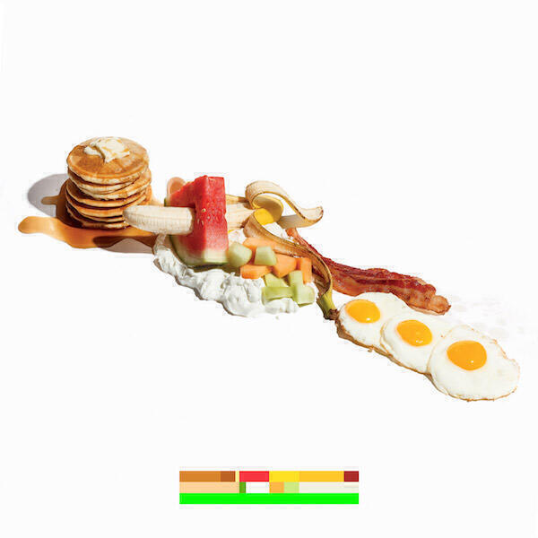
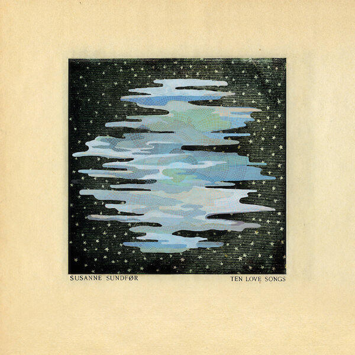
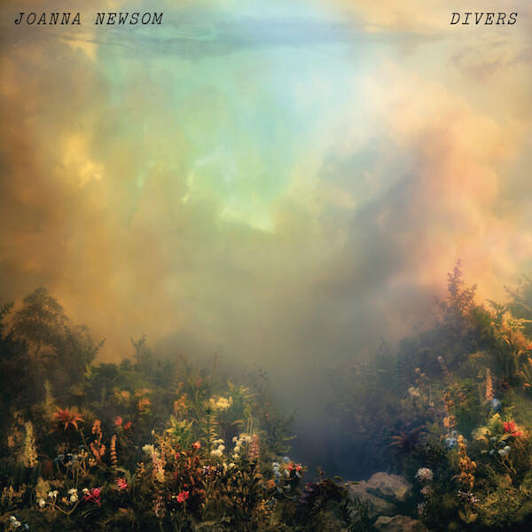
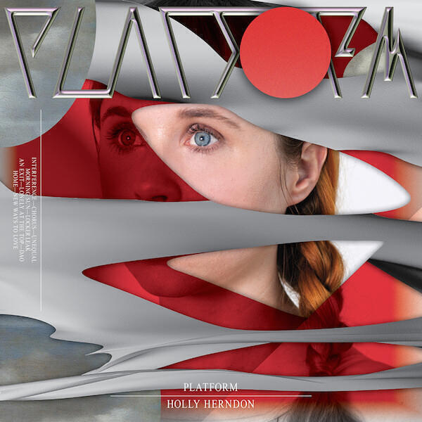
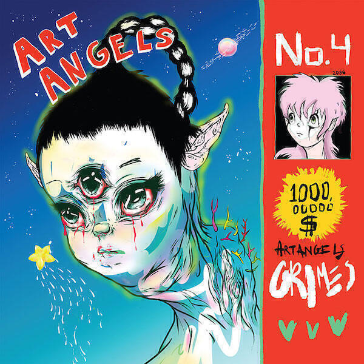

Given that I gave up on writing album digests for a bit this year, I thought I would at least do a proper top ten list of my favourite albums. There are quite a few albums that I did not have room for and I might try to revisit those later. In the mean time, let's crack on. (To save time, I have in some instances pasted my original review from the appropriate album digest.)

## 10. The Magic Whip by Blur

I bought this album on the day that I got my new job. What better way to celebrate becoming an economist than by buying an album you've already listened to on Spotify? Besides, it has a nice looking cover so why not?

I was never that much of a Blur fan. Aside from the singles the first few albums passed me by. After "The Great Escape" I paid more attention, but even then I usually caught up with their albums long after the fact (the one exception being "13", which I mooned around to in my first year at university). I like "Blur" and "Think Tank" a lot and have considered both of them for inclusion in the understated classics.

I found "The Magic Whip" to be a good summary of their past records delivered in the form of new songs. That those songs happened to be by various turns cute, sorrowful, apposite and fun was an added bonus. A couple sound like Gorillaz offcuts but the rest is indisputably Blur. There is Parklife and Great Escape aping thrash-along "I Broadcast", the Blur-the-album-esque "Go Out" and songs like "There Are Too Many Of Us" and "New World Towers" would nestle nicely on "Think Tank".

Overall, the album is a solid collection of Blur songs that add to their already impressive back catalogue. If you get to see them live you won't mind them slipping the best of these into the set. It is rare for comebacks to be this easy and in Blur's case, they capture themselves both as they were and as they are - not an easy feat.

## 9. The Martian Original Score by Harry Gregson-Williams

This is [my review of the movie version of "The Martian"](/the-martian-a-short-review/) and this is [my review of the book](/the-martian-by-andy-weir/).

This is my favourite soundtrack of the year. I don't have a great deal to say about it except that for a film as tense as "The Martian", its soundtrack is surprisingly chilled out. Even the music meant to evoke dust storms is fairly calm, perhaps because its job in the film is to focus you on the astronauts' actions in response to the storm. It's more of a soundtrack to an orderly attempt to evacuate than a raging storm. Elsewhere, the score does more work in scenes where Watney totes around Mars looking at pretty red landscapes.

Fun fact: when I get pissed off because my train is late, I put "Sprouting Potatoes" on repeat one. It's a beautiful little piece and I can't stay mad when I think of those little green shoots poking up through the soil.

## 8. No Cities To Love by Sleater-Kinney

I had heard of Sleater-Kinney before their boxed set “Start Together” was released in 2014 but had not ever listened to them. I was quite impressed that they curated their own Spotify playlist with the contents of the box. I added it and even downloaded the songs for offline listening but didn’t get around to much more than a cursory play of a few tracks.

The great thing about Spotify playlists is that any additions get pushed out to you. In fact you even get little notifications pushed to your phone. So when S-K released “No Cities To Love” they added it to the “Start Together” playlist and this reminded me to check them out. For now I have just stuck to the new record because it’s good enough to hold my attention.

I love a bit of shouty punky guitar music so "No Cities To Love" is perfect for me. It's really well produced and the songs are beautifully constructed with thoughtful lyrics. Now that I have a walk to work each morning once more, it's nice to find something amazing to listen to. My favourite songs are the title track (I start my morning walk with it and put the rest of the album on shuffle), "Fangless", and "Bury Our Friends". Magnificent stuff!

(This review first appeared in [January's Album Digest](/album-digest-january-2015/).)

## 7. Every Open Eye by Chvrches

I like Chvrches but I overplayed their debut album "The Bones of What You Believe". After a while its relentless assault of precision-tooled electro-pop began to grate a little. I swore that if I were to maintain my interest than their second album would have to be more varied.

I got my wish. The four songs trailed ahead of "Every Open Eye" were each different, the best among them being the pseudo title track "Clearest Blue". The album opens with "Never-ending Circles" which has this monstrous repeating riff that propels the song along, rising and falling like the steps that run atop the impossible building in Escher's "Belvedere" print. Lead single "Leave A Trace" sees Chvrches adding a little dirt and distortion to their perfect sound. The closer "Afterglow" is beautiful and emotional in a way that no other Chvrches track has been.

Small evolutions like this are what make "Every Open Eye" into a coherent whole. They can write amazing pop songs and have a better grasp of the variation needed to sustain the listener's interest over a whole album. Their third album is going to be one to look out for.

## 6. La Di Da Di by Battles

Most years "La Di Da Di" by Battles would be much nearer to the top of this list. Mainly because I love Battles. In fact this year most of my Battles love manifested in playing Apple Music's "Intro to Battles" playlist over and over ahead of the release of the new album. By the time my copy arrived, I was almost at peak Battles.

"La Di Da Di" is a good album that builds on the ground made with "Gloss Drop" despite abandoning the guests that contributed accessibility as well as vocals to Battles' second album. However, from opener "The Yabba" onward it's clear that the instrumental-only focus has concentrated Battles' on making sure that the songs speak for themselves. "La Di Da Di" - as its title suggests - is crammed full of hooks.

Throughout the album these hooks get deployed in different ways. On "The Yabba" we get a slow build (side note: check out the totally trippy video for this track), while on "Dot Net" they get straight to their shuffle and keep it going long enough but not too long. Battles' reputation for tightness and efficiency isn't just because of their playing, but also how long they play for. They aren't afraid to play with a simple idea for a little while and then toss it aside. In fact, these shorter and simpler tracks help pace the album with their direct interludes.

"FF Bada" has a pretty straightforward structure, it's my favourite track on the album because it's direct and fun. The playing on it is immense and it's great fun to listen to. The way that a little march forms towards the end is fantastic. I bet that if there's another remix album whoever gets "FF Bada" will have a field day.

It's true that some tracks like "Summer Simmer" take a while to get going but they're worth your patience. These tracks often build slowly into something frenetic and compelling. I imagine that they're even crazier live. In fact, "Summer Simmer" ends up slowly pealing into a sunset and the following track "Calcio e Pepe" reflects it with its slow opening lines of lyrical feedback. Guest vocalists faced with inventing lyrics for backing tracks like this often come up with something abstract and here without that to be worried about Battles manage to build an emotional connection through their tracks.

Admittedly some tracks like "Non-Violence" and "Tyne Wear" come over as slightly generic, and perhaps "Tricentennial" sails a bit too close to previous glories, namely "Atlas". However, elsewhere there are yet more innovations: on "Dot Com" Battles manage to sound like a thrilling modern take on Neu!. In fact, "La Di Da Di" is probably Battles' most overt acknowledgment of the debt their sound owes to krautrock. I also love the way that the intro to "Megatouch" channels "Uptown Top Ranking" before turning into what sounds like the weirdest sixties cop show theme ever. Finally on "Luu Le" we get Battles deconstructing a jam and turning into a song right before our eyes: it's beautiful.

In the end, "La Di Da Di" is enjoyable but it did leave me hankering for the more immediate zaniness of "Gloss Drop" or "Mirrored". This is another album on which Battles stake out their own terms and create a lot of accessible music from what seem like very inaccessible elements. That alone is a triumph. We also need to acknowledge that this album wins best cover art of the year by quite a long chalk.

## 5. Ten Love Songs by Susanne Sundfør

I found this album on Spotify’s new releases page and recognised her name. She featured on “Running To The Sea”, one of the best songs on Royksopp's “The Inevitable End”. As a result I decided to give "Ten Love Songs" a go. I listened to the first minute of the first song “Darlings”, thought “OK this is weird, a bit like an album of Christian show-tunes”, and paused it there and then because it was late.

I started again the following morning as I walked to work, partly because I didn’t have the time to change to anything else. In that fifteen minute walk I listened to the sequence of the first four songs and was blown away.

First off “Darlings” swells into a wonderful bittersweet song (the first line is “So it’s definite then? / … everything must come to an end”) that really could be in a musical and then “Accelerate” lurches into your ears, which sounds like ABBA on bad acid: detached Nordic vocals over squelchy bass and a crazy “Phantom of the Opera”-style organ break. And later on in the song, both. At the same time. After that “Fade Away” manages to sound like regular ABBA, which as everyone knows is no bad thing and very hard to pull off. Finally “Silencer” pulls off a wonderful film noir storyline with minimal string backdrop - key lyric: “…no one heard you but the stars / Through the rain of the sprinklers, a bullet pierced your heart”.

From there the quality remains high, even if the lyrical conceit of “Kamikaze” is a little gauche: you get everything you need to know about the song from the title. Following that, “Memorial” is a ten minute miniature masterpiece of murder and loss in collaboration with M83 (they previously collaborated on M83’s soundtrack to “Oblivion” - [the movie where Tom Cruise takes on aliens WHO BLEW UP THE MOON](/oblivion-a-short-review/)). The best bit is when it takes about six minutes off in the middle to explore a miniature classical piece. Throughout the whole album every element of each song sounds amazing and was, apart from three songs, produced by Susanne on her own. “Ten Love Songs” is the work of a major talent.

“Delirious” and “Slowly” are both amazing pop songs. The first begins slowly, perhaps attempting to follow “Memorial” somehow, before it bursts into a playful double-entendre lyric about BDSM. Meanwhile “Slowly” revisits the same territory as “Fade Away” with an 80s vibe that one won’t make you cringe - her vocals are a hair’s breadth of those of Nina Persson on this song, bringing back memories of [The Cardigans’ excellent “Long Gone Before Daylight” album](/understated-classics-25-long-gone-before-daylight-cardigans/).

The last two of the ten love songs are “Trust Me” - a slow burning torch song that makes you want to do anything but trust its narrator - and “Insects”, a song in which a swarm of synths tries to overwhelm a lyric about keeping a clandestine sexual relationship a secret. The two combine to create a creepy end to the album, in particular the way that “Trust Me” slows things right down only for “Insects” to pick up the pace again and end the album on the wrong foot. It makes you want to play it all over again. I have done this. Repeatedly.

The only bad thing about “Ten Love Songs” is that there are only ten. It’s one of those rare albums where an artists throws everything on to tape and it all manages to stick and congeal into something fascinating.

(This review first appeared in [February's Album Digest](/album-digest-february-2015/).)

## 4. Music Complete by New Order

The opener "Restless" sounds like a crap Electronic song at first, even if its lyric is a laudable deconstruction of middle class greed. The fact that it's so surly and lazy is pretty subversive, there can be few occasions when Bernard Sumner has sounded be jaded and less enthusiastic. It's certainly a bold gambit to open with such a downbeat song, but toward the end it begins to morph into something more optimistic: "it's not hopeless / if you take less".

Things really take off with "Singularity". Bass line that shows you don't miss Hooky. Check. Synth line straight off "Power, Corruption, and Lies". Check. One of the Chemical Brothers. Check. A chorus straight off "Republic". Check. Suddenly all that (deliberate, constructed) unease created by "Restless" seems like something of the past. The lyrics are important too, referencing Ian Curtis and Tony Wilson (and probably Peter Hook too, among others). It's a really muscular song, there hasn't been this much heft to a New Order track since "Technique".

"Plastic" takes the Balearic sound that New Order perfected around "Republic" and pushes it on another notch. (Actually it doesn't sound a million miles from "Dark Angel", which is head-and-shoulders the best track on Electronic's second album "Raise The Pressure".) There's a nice Donna Summer vibe to it too. The best bit of all though is the coda, where the cool detached lyric suddenly and briefly becomes intensely personal.

"Tutti Frutti" is my favourite song of the year. It starts off like a sleazy threesome between "Relax" by Frankie Goes To Hollywood, "The Model" by Kraftwerk, and New Order's own "Fine Time". Somehow it manages to morph into one of their most poppy songs since "True Faith" or, dare I say it, "World In Motion". It's the first of several tracks that are lifted by the presence of Elly Jackson (aka La Roux). I often stomp through Chichester miming to this song, I must look pretty scary.

Completing a glorious five song opening run is "People on the High Line" which is chock full of housy piano and is strongly reminiscent of their Arthur Baker period. It certainly stands alongside "Touched By The Hand Of God" and the like. The one criticism of it is that it, like "Restless", might be just a shade too long. Mind you, that extended musical outro sounds a lot like something off "Technique" - a great source of happiness for me.

From there, the album dips a bit. "Stray Dog" is a spoken word track narrated by Iggy Pop, which is pretty weird. The worst aspect of it is not that Iggy Pop has nothing on Tom Waits for this kind of thing, but that the instrumental track behind the words is very pretty and probably warrants being heard on its own. "Academic" is too long and too much like something off the previous two albums, though it is saved somewhat by its earnest chorus. "Nothing But A Fool" is also too long, though if you were to isolate the opening ninety seconds as a separate instrumental track, I probably wouldn't notice. The song itself is nothing to write home about though, especially compared to the first five on the album.

Things improve with "Unlearn This Hatred" which features the most modern sounding keyboard sounds on the album. It's also a lyric crammed with typical New Order lyrics ("Help me win this human race" etc) but as usual it's done with such giddy abandon that you can't help but give in to its charms. In fact, I also like "The Game" for pretty much the same reasons.

Finally, we have "Superheated" which features Brandon Flowers of The Killers. I refuse to listen to their "Mr. Brightside" because it always takes me right back to a difficult time in my life. And when I heard this song with him on, it reminded me of those same events and how much time has passed since then. It made me think about how great closure is and how important it is to let water go under the bridge. It's a sweet and earnest end to this album too.

There are many way that this album could have been awful (viz "Waiting For The Sirens' Call") and while "Music Complete" doesn't quite deliver on its title it comes pretty darn close. That opening run of five tracks (or four if you skip straight to "Singularity") is almost as good as putting on their singles compilation, though of course that is a twenty-odd song run. It almost makes you eager for more!

## 3. Divers by Joanna Newsom

The top three albums in this list are - as with most "best of" lists - interchangeable. To shade one album from another in this ranking I've used their accessibility. I tend to elevate fun and accessible albums over others. In the case of "Divers" by Joanna Newsom this isn't fair. Its knotty depths and tangles are chief among its many pleasures. Even so, a list is a list, "Divers" is an album of the year, and no matter how we cut things we have to compare it to the other albums.

Newsom's voice, her reliance on the harp as instrument of choice and her general abandonment of verse-chorus-verse structures are features that we can bemoan as well as celebrate. Let us celebrate them here. Let us celebrate that there is still an artist making music that demands that we listen to it. There is no way that a single song on "Divers" you can allow to skate over you. As background music it fails. But if you sit down with the lyric booklet in hand, the hour of your time that it demands will fly by.

The main draw is the lyrics. Few songs are stories now, so an album full of songs-as-stories feels like a glut. You need to make time and settle down with them.

It's not easy to describe the opening song "Anecdotes". I think it is about a child recounting a dream, though it's only the final, italicised, eight lines of the lyric that lead me to this conclusion.

The next song is a little more obvious, at least if you have the lyrics (and Wikipedia) to hand. "Sapokanikan" is the Lenape name for the area of Manhattan now known as the Meatpacking District. The song is about how the citizens of the modern city now forget and obscure the ruins and memory of Sapokanikan. Newsom connects Tamanent (Chief of the Lenape tribe) to Ozymandias (aka Rameses II) via Shelley's sonnet of the same name, interpolating the famous line "look on my works, ye Mighty, and despair!" into the lyrics. The irony is that we know more (in a cultural sense) about Ozymandias' kingdom than we do about the Lenape native americans. You need the lyric booklet to discern all this though.

(It is no surprise to see Newsom acting in Paul Thomas Anderson's recent adaptation of ["Inherent Vice"](/inherent-vice-a-short-review/). Thomas Pynchon's novels are famous for sprawling over many hundreds of pages stuffed with arcane references and counterfactual histories. [I love them](/on-pynchon/). Each of his novels have wikis that are almost as rewarding to read as the novels themselves. Newsom's albums might benefit from something similar, collated from the many contributions about her songs to the various song meaning websites out there on t'internet.)

I am aware that I have not discussed the music. With just the lyrics in front of you, it would be difficult to set them to a tune in your head. Newsom contorts her lyrics around the music. Sometimes the phrasing of a line in the booklet can break in "odd" places compared to the music. The lines in the lyrics don't always correspond with bars in the music in the ways you might expect in pop songs. This makes it tricky to remember the songs for quite a few listens. This is another reason why paying attention is important while listening to "Divers". Because the lyric doesn't always go the way that the music leads, it is easy to get lost.

I guess there are no more than two choruses on the whole album. Perhaps there are more if you expand your definition of a chorus to "revisiting the same musical phrase with the same or slightly different words". None of this is a complaint. It's just difficult to write about this album's many joys without banging on for ages. It's also why I will round out my discussion of it having mentioned just two of the eleven songs.

I'd urge you to discover the rest of "Divers" for yourself. It's not on any of the streaming services so you'll have to pony up the dough for a physical copy. It'll be worth it. Do what I wish I'd done and get the vinyl! Like many others on this list, "Divers" is a meticulous album that rewards the attention that you give it.

## 2. Platform by Holly Herndon

This is an album that could teach robots to love. It's excellent. It features pretty much every element I love about dance music and presents it to your with fresh ears. If you bother to listen to just one of my recommendations, make it this one.

Holly is a musician and sound artist, and her compositions on "Platform" skip along that boundary between recognisable music and something other, something we might instead choose to call art.

At points it makes me think of [Laurie Spiegel's experiments in how to create electronic music in the first place](/album-digest-october-2012/), the experiments of Glass, Reich, and others in making a modern classical music, and then the simple visceral pleasures of techno's throbs and thuds.

Elsewhere there are tracks that make me think of Prince, James Blake, Grimes, and [Laurie Andersen](https://en.wikipedia.org/wiki/Laurie_Anderson). Most of it though just sounds utterly unique: all those comparisons are just me clutching at straws.

Take "Chorus", it's propelled along by a throbbing beat and yet dominated by sampled voices. It's so precise and full of so many small detailed elements that it is impossible to describe in its totality. Of course its idiosyncrasy and defiance of description does not detract one iota from the very real pleasure of listening to it.

And the thing is things just get weirder and weirder from there. "Unequal" takes what sounds a bit like a medieval plainsong and then wraps it around a barely there beat, before folding in the sounds of running water, bird wings, and samples of poetry. For some people it's not going to make any sense at all but for the open minded it is genuinely mind expanding.

"Morning Sun" uses a similar formula and is perhaps the most recognisable pop song on the record. It also has a cool video of her walking around on Mars alone, evoking "The Martian". And again, it's not just the fact that it sounds so incredible as a whole (and _like a pop song_ despite of everything that's in there) but that there is so much internal detail. Not only that, but that it can sound logical despite all the tangents and interruptions.

My favourite though is "Locker Leak", which is part sung, part spoken, and all crazy. It's full of tongue twisters, puns, and advertising slogans. There's also a killer beat underpinning it all. I think it says a lot about the crazy mixed up world we live in: a maelstrom of small snippets that make sense on their own but sound surreal (and a little frightening) when all whipped together.

Seriously. Even if you end up hating it, you need to check out this album at least once on your preferred streaming service. (It might be better if you give it more than one try, it takes some getting used to but it's worth the effort.)

(This review first appeared in [June's Album Digest](/album-digest-june-2015/).)

## 1. Art Angels by Grimes

Things that haven’t changed since Grimes’ last album:
  * A scary near-severed alien head on the cover
  * Big chunky pop songs that make you glad to be alive
  * A smattering of references to old dance records that aren’t cool but are fun
  * Titles that are too weird for the pop charts (but do those really exist or matter anymore?)
  * Huge choruses (“REALiTi”) that are sometimes unintelligible (“Kill V. Maim”)

Things that are new:
  * Ooooh guitars, all over the place
  * Whether it gets noticed or acknowledged by the wider world or not, it is clear that Grimes is a unique talent capable of dictating the cultural zeitgeist (Who do you think is responsible for all that pastel hair dye?)
  * A collaboration with Taiwanese rapper Aristophanes (yes, really) that seems to imply that the Taiwanese for “motherfucker” is… “motherfucker”
  * A collaboration with Janelle Monáe that shows that Grimes is one of those artists who simultaneously improves and is improved by her collaborators
  * Absolute genuine pop bangers: “California”, “Butterfly”, “Flesh Without Blood”, “Artangels”

I suppose there isn’t much more to say than that. Grimes is the real deal and “Art Angels” shows that. I read a post that she put on her Tumblr about a year ago where she wrote about her battles with Tinnitus and her fears that she might have to stop making music. “Art Angels” shows what a tragedy it would be if she couldn’t.