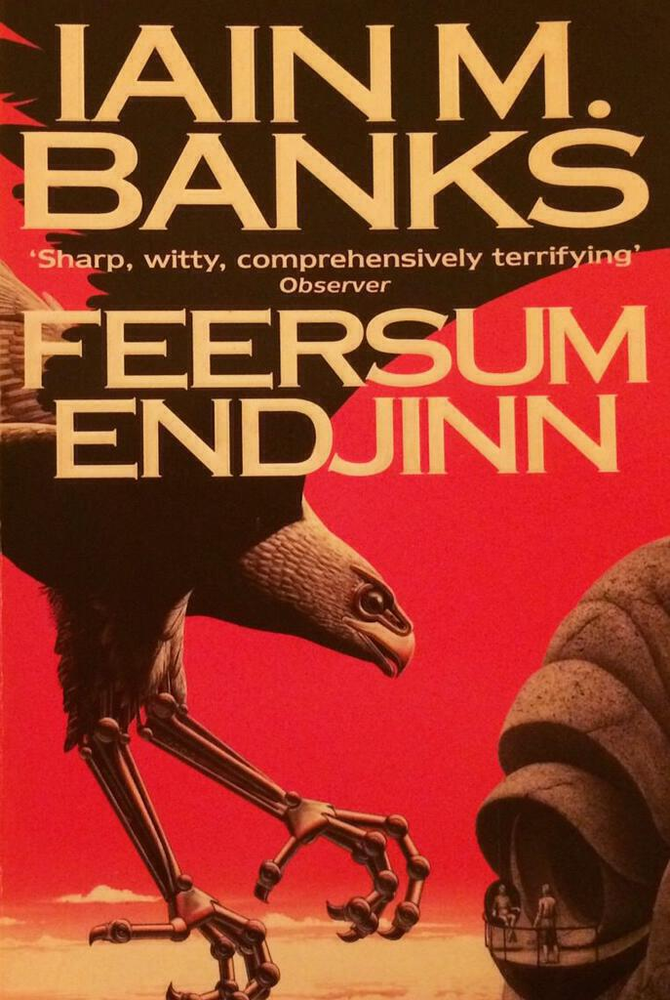

Feersum Endjinn is one of Iain Banks' few non-Culture sci-fi novels. Like the Culture novels, an existential crisis drives the plot: in this case the action takes place on Earth in the far future and the sun has aged to a point where it will grow and swallow the earth. This is referred to as the Encroachment. The characters are divided between the good guys who seek to find a solution for the greater good and bad guys who use the Encroachment to consolidate their power and influence.

While the experimental construction makes Feersum Endjinn feel like one of Banks' weaker novels, it also serves as a reminder that few authors write from multiple points of view as well as Banks did. In fact, the entire novel is a game of points of view. Each chapter is split between four factions representing different plot elements and character not only hop in and out of one another's heads, but they also meet different representations of themselves. One strand of the narrative is written as a stream of consciousness: ravver weerd spellin lik this iz yoosed, mayb Banx wus reedin erly drafs ov Tranespottin? As with my experience of reading [Hawksmoor](/hawksmoor/), it's surprising how quickly you adapt to it.

The other standout feature of Feersum Endjinn is the compelling setting of the Serehfa Fastness - an enormous building that houses an entire state. Once the base of a space elevator, it is now home to the humans who stayed behind after the rest left for the stars. It's never explicitly stated but going by the clan structures and feudal society described, you get the impression that society has regressed. Superstructures abound in the Culture novels written after Feersum Endjinn, though orbital habitats feature heavily in [Consider Phlebas](/consider-phlebas-a-picaresque-in-space/). The Fastness is perhaps the oddest and most compelling character in the novel. In fact, even in the Culture novels the only other superstructures that come close are the shell worlds so vividly described in Matter.

I think Feersum Endjinn would make for a decent film or mini-series. If it were made as a film, I'd try to compress each of its forty sections into roughly four minute pieces - though that would leave you with a near to three hour film that chops between four main strands which might be a bit difficult to follow. Certainly there's nothing in the novel that can't be rendered with CGI and there's enough intrigue and action for it to be exciting.

To conclude, Feersum Endjinn is an enjoyable and uncomplicated sci-fi novel. If the idea of that appeals and you're put off the Culture novels for whatever reason, you could do worse than give this one a go. For more thrills and spills try [Against A Dark Background](/against-a-dark-background/) (Feersum Endjinn is the better novel overall though). However, the best of Banks' non-Culture novels is "The Algebraist" and I'll write about that in the near future.

Don't just take my word for it, here are some additional reviews:

  1. [Sing, Muses!](http://singmuses.wordpress.com/2013/06/21/feersum-endjinn-by-iain-m-banks/)
  2. [Overwatering](http://overwatering.org/blog/2007/08/feersum-endjinn/)
  3. [sff.net](http://www.sff.net/people/richard.horton/endjinn.htm)
  4. [Challenging Destiny](http://www.challengingdestiny.com/reviews/feersumendjinn.htm)