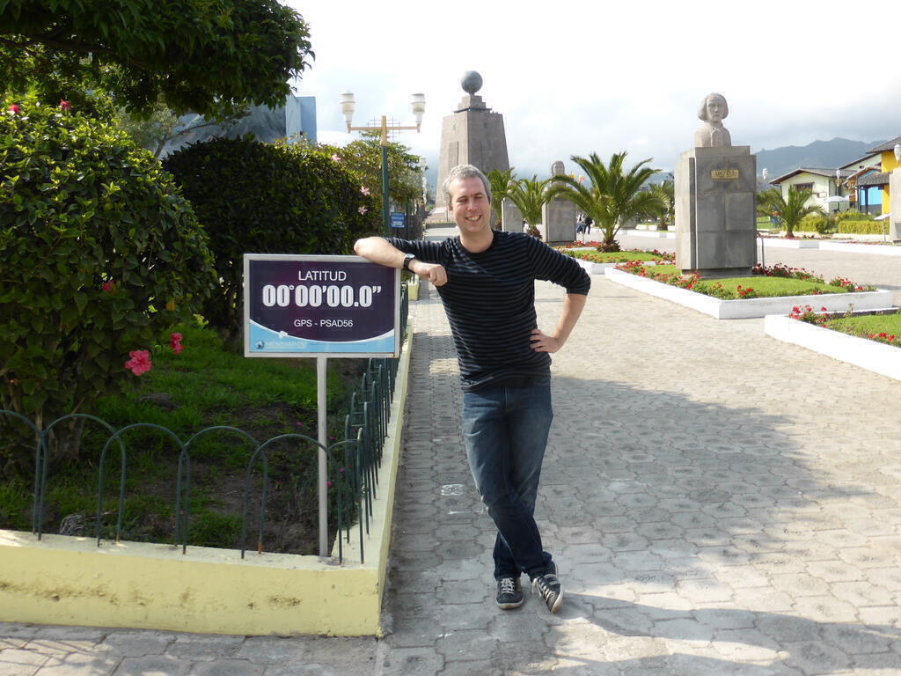

Five years ago I set out at 3am for Heathrow airport to catch the early morning flight to Madrid. There I connected with a flight to Quito in Ecuador. The previous days and weeks had been fraught with worry about whether I was doing the right thing. Did I get the right vaccinations? Would I have enough money? Would I cope with all that travel? Was I coming back? What was I going to do with all my stuff?

Looking back, I am not sure I had answered all those questions. I know I had a lot of vaccinations. I crammed as much as possible into a bag I had no locks for. I dumped most of my possessions into black sacks and slung them in the attic, despite not knowing when I would be back.

I lay awake that night. When my taxi arrived, I staggered down to the door with my bags. So much, and yet, in the most exciting way, so little for six months of travel. For the first time in a long time, I didn't know what would happen next. And suddenly, I *was* ready.

I sat in gaudy Terminal 5, realising that London is strange in a way you don't notice until you're no longer living there. Inside, I rejoiced. On the flight to Madrid, I slept on a short-haul flight for the first and only time.

Things went a little wrong in Madrid. Someone rammed my foot with a baggage trolley and split open my hiking shoes - but at least they didn't break my foot. I'd find out later that my bag didn't make it on to the Quito flight. Fortunately I had a snap I'd put on Instagram to show the helpful people from the airline. 

The flight to Ecuador was great. I chatted to my neighbours, all natives of Quito, and tried to explain why I was making my trip. The map of the route around South America was explanation enough. The landing itself, a daredevil scooch over mountains that poked out of the pink clouds, as menacing as sharks circling in a pool. Everyone clapped once we were down.

Later, a crazy taxi driver wound me down through Quito's hills and mad traffic with reggaeton blasting away. I stared out of the window, grinning. I must have looked like a total rube. No wonder he didn't have quite enough change for my shiny gringo dollar bills. Oh well, canniness would have to come later. The hotel had holes in the walls and my room looked... let's say average. But I was there for adventure, not to write reviews on Trip Advisor.

Without a bag to unpack, I decided I couldn't sleep until I'd investigated the hotel bar. It was closed. But I heard English voices (well Welsh ones actually), and met up Mim and Lee who would also be on the tour. With plans made for exploring the city the next day, and the growing realisation I'd been awake almost 24 hours, I went to bed happy.

Five years is an arbitrary length of time. It seems like ancient history and yesterday, all in one. Would I do it again? In a heartbeat. Could I do it again? Not now, not really. The pleasing thing is that I don't need to. When I think of how muddled and unhappy I was, I am glad I did it. Sure, my planning could and should have been better, but, come to think of it, who in their right mind *plans* an adventure?

