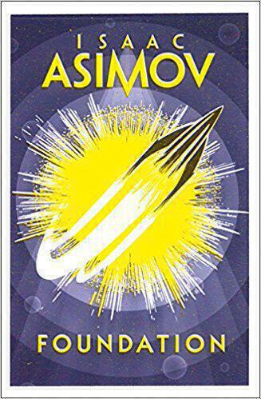

For our [first anniversary](the-same-but-different) we decided to exhange books. What better way to [celebrate a paper anniversary](https://ideas.hallmark.com/articles/anniversary-ideas/anniversary-gifts-by-year/)? Ingrid bought me the entire Foundation saga, most of which were [reissued in fancy new paperback designs by Mike Topping](https://abcoverd.co.uk/archive/designers/topping-mike) in 2016. All save for 1993's [Forward The Foundation](https://www.reddit.com/r/books/comments/7lueju/asimovs_forward_the_foundation_published_in_2016/) that is, but Ingrid got me a copy anyway. Hence, here is a new series of blog posts!

The Foundation novels detail a galactic empire in decline. A mathematician named Hari Seldon, using a novel science called psychohistory, realises that this is happening and formulates a plan for humanity, one that will reduce the time between empires. This, he reasons, will minimise human suffering and prevent an extended period of barbarism.

I discovered this sequence of novels when I was 12, drawn to them in the school library by their cool covers. I also enjoyed the entries of the Encyclopaedia Galactica that began several chapters. I think this format influenced other great sci-fi novels, like ["Dune"](dune) and "The Hitch-hiker's Guide to the Galaxy". I read these voraciously and the rest of the stories... less so.

With [a TV series on the way](https://www.tvweek.com/tvbizwire/2018/08/one-of-the-most-important-sci-fi-works-of-all-time-to-become-tv-series/), I threw myself into re-reading ["Foundation"](https://en.wikipedia.org/wiki/Foundation_(Asimov_novel)). Some of it I remembered and other parts were like finding new rooms in an old house. The novel comprises five short stories that Asimov wrote for Amazing Science Fiction. They hang together well, perhaps better than a series of short stories has any right to. Some fun lies in turning over the bits that happen between the stories. I like how Seldon appears for a short time in the first story despite having a massive influence over the remaining novels. (Asimov couldn't resist revisiting Seldon in later prequels, more on those in later posts...)

What appealed to the younger me was psycho-history, the notion that historical events could happen according to a predictable plan. As I turned away from religious ideas, I sought comfort in these theories that are a sort of hybrid: scientific theories made dogma. Re-reading now, I marvel at how psychohistory is the epitome of what people who don't understand economics think economics is. But that aside, the writing is good. There's a directness and economy to the story that propels it along, even if some episodes don't ring true. This is also true of the other books, so I will discuss this further in later posts.

Next up is "Foundation and Empire", my favourite of the original trilogy. I realise that this is a short introductory post, but as with the novels themselves, the real meat of these posts is still to come. Bear with me!