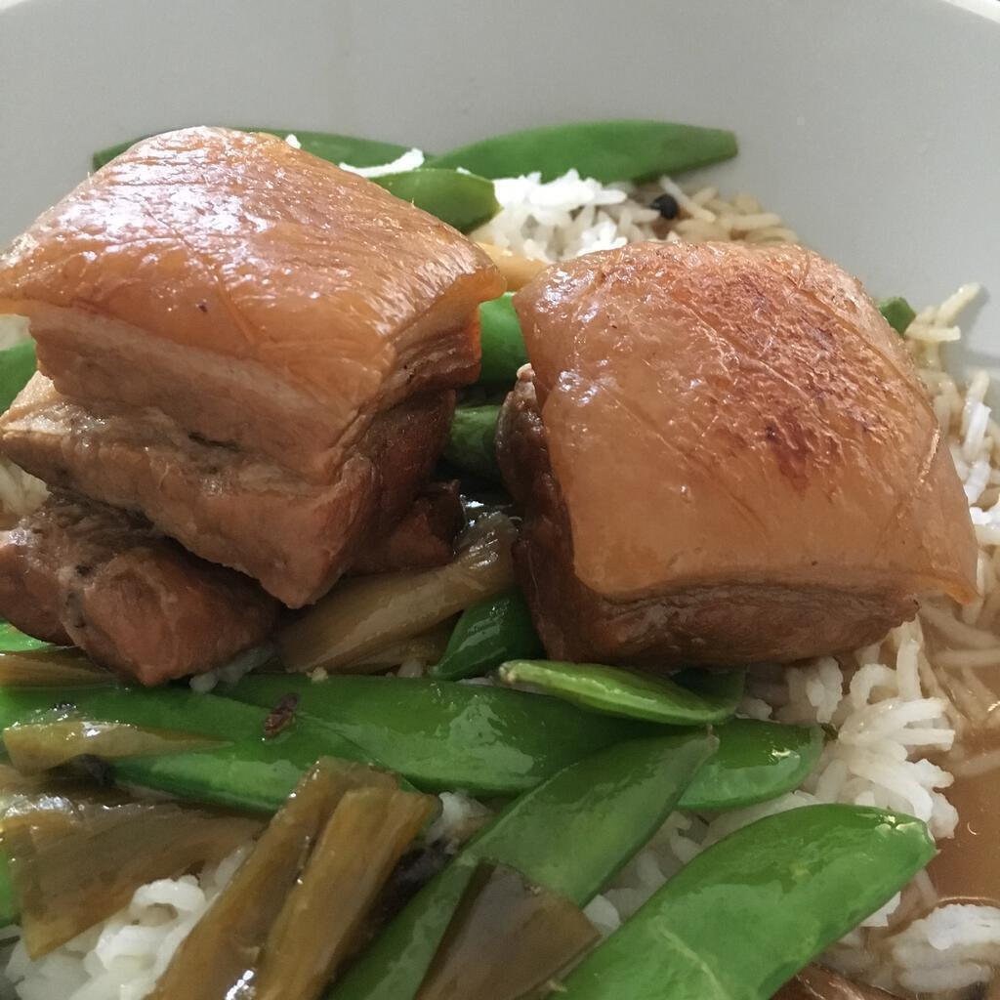
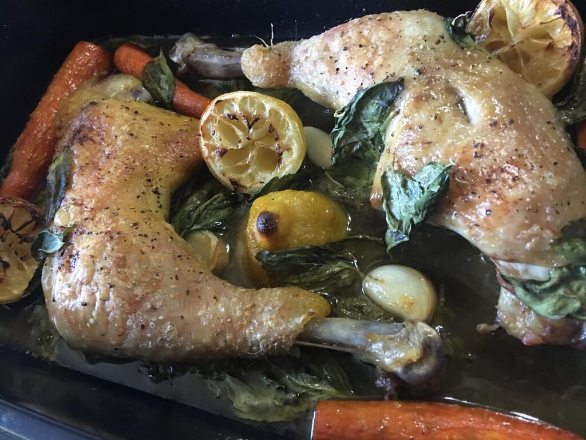
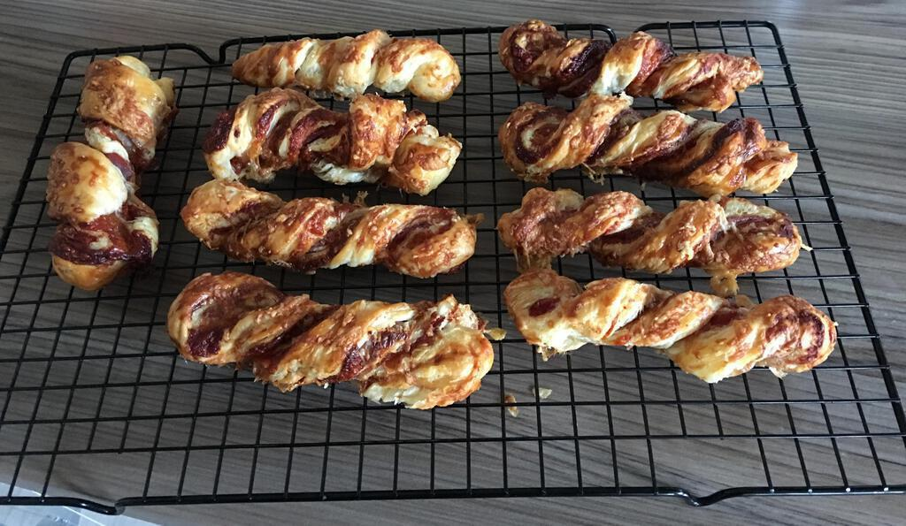

## The A-Z of Cooking by Felicity Cloake
This book is for more luxurious and experimental recipes. There are 26 chapters, one for an ingredient beginning with each letter of the alphabet, but you probably guessed that already. Ingrid and I have been (very) slowly working our way through the chapters, making a couple of recipes from each one - we’re currently up to G for Garlic.

My favourite so far has been the bread dumplings in parmesan broth because it gives us a use for our many many parmesan rinds. Mind you, the red spiced pork belly that we made over Easter has come pretty close.

## Real Food by Nigel Slater
For more practical yet still somewhat decadent recipes I often turn to this gem by Nigel Slater. When I realised I’d given my copy away before going to South America I bought another one: Real Food is so good that I bought it twice!

As with The A-Z of Cooking the chapters are gathered around particular ingredients. The many different chicken recipes are very delicious, particularly the lemon and thyme roast chicken legs. Nigel can always be relied on to produce a recipe for something boozy and garlicky, great for entertaining on Sunday lunchtimes.

Another great recipe is the Chocolate Espresso Cake, which [I’ve copied out on this blog before](/chocolate-cake-recipe). We regularly make this as a gluten free cake because it’s very tolerant of gluten free flour, probably on account of all the eggs, butter and chocolate that make up the bulk of the ingredients. We even used this recipe for our wedding cake.

## Foolproof Cooking by Mary Berry
Another book that does exactly what it says on the cover. Most of the recipes in here are tasty and many of them are easy to make as well. In particular, from this book we’ve learned how to make barbecue chicken wings without using tomatoes and an amazing sausage cassoulet that you can live on through the winter (watch your waist though!).

The giant cheese and parma ham straws recipe is useful too, especially now that you can get gluten free ready-made puff pastry. If ever a bank holiday looks like it’s going to be especially gloomy weather-wise, we just knock out a tray of these and bunker down. I find a tasty variation is to use Marmite instead of mustard (Ingrid prefers Vegemite!).

## Salt Fat Acid Heat by Samin Nosrat
This book is a little bit different to the others as [it’s more of a complete cookery course](https://www.saltfatacidheat.com).  You can read it like a book rather than simply as a set of recipes. Samin Nosrat writes about how the four titular elements of salt, fat, acid, and heat are the key elements of flavour, and how you can bring them together in different ways depending on the meal you want to create. It’s fascinating stuff and would be much easier to read if it didn’t make me quite so hungry!

You may have seen [the Netflix show](https://www.netflix.com/gb/TITLE/80198288), which is also great. Samin is a really enthusiastic presenter and I spent the show just saying “yum” while wishing I had the time to cook everything she did. And visit that parmesan factory. And eat all the parmesan.

Her chocolate cake recipe looks even more indulgent than Nigel Slater’s, though the price of that indulgence seems to be fiddliness. I’ll report back when we’ve had a go at making it. Meanwhile, I can recommend the roast Brussels sprouts with butternut squash and macerated onions. We made that over new year and it was delicious: a wonderful new set of flavours wrought out of familiar ingredients, which is what this book is all about. 