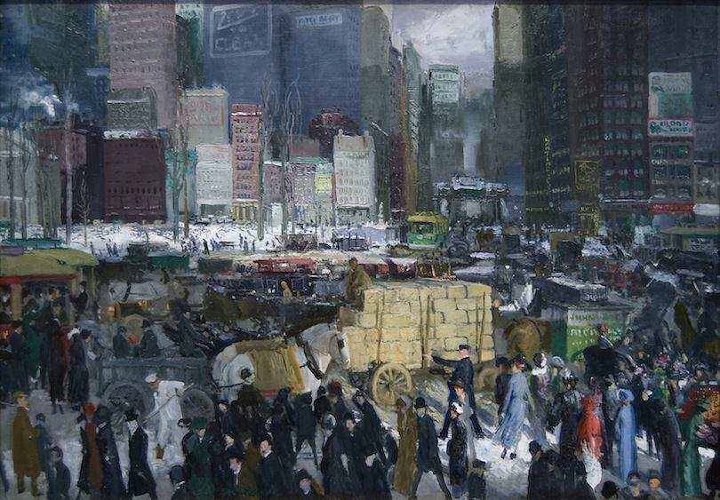
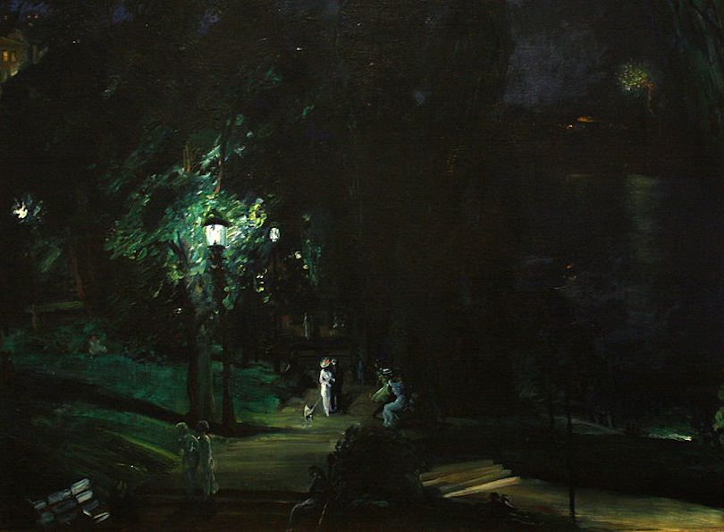
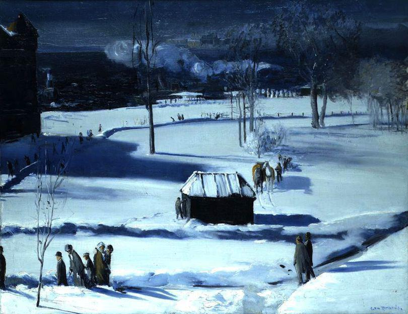
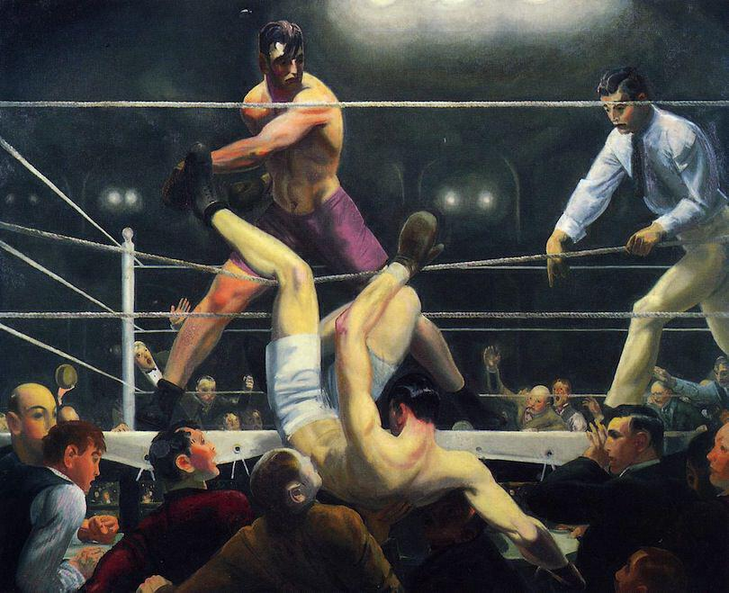

Today I went to see "George Bellows 1882-1925 Modern American Life" [at the Royal Academy of Arts](http://www.royalacademy.org.uk/exhibitions/george-bellows/). It's the first time I've been to the RA but I was emboldened by my art pass and the fact that Bellows was a contemporary of Edward Hopper, a painter whom I admire greatly. This is the first major retrospective of Bellows' work in the UK and taking in his wonderful paintings this afternoon, I felt a little embarrassed that I hadn't seen anything of his before.

Bellows gained notoriety for his boxing paintings. In the hero image above, which shows the advert for the show, the painting [_A Stag At Sharkey's_](https://www.artfinder.com/story/george-bellows-stag-at-sharkeys-1909/) (1909) has been incorporated. It's a great painting that simultaneously captures the raw energy of the fight and the seedy atmosphere of what would then have been illegal boxing venues. I will return to the boxing pictures again later.

_New York_ (1911, above) does feel like a familiar iconic painting though, so maybe this one had crept into my consciousness somehow. It is an invented scene however, this square does not actually exist. Like many paintings it has qualities that simply don't appear in its jpg facsimile, namely a bustling energy. The painting itself is an intriguing window into life in cities prior to the revolution that would be caused by the impending automobile -- we can see a bustle of people and horses and carts, I think I can make out trams too. It's almost strange to see a picture of New York without a yellow taxi anywhere.

Meanwhile in another picture called [_The Snow Dumpers_](http://commons.wikimedia.org/wiki/File:George_Wesley_Bellows_-_Snow_Dumpers_(1911).jpg) (also 1911), Bellows depicts men dumping snow that has been cleared from New York streets into the Hudson River after they have loaded it on to carts. It's a strange window into another world and proof that the show's subtitle "Modern American Life" is rather tongue in cheek!

One of my favourite paintings in the show - one that I lingered over - is _Summer Night Riverside Drive_ (1911, above), a night scene illuminated by lots of different light sources. It is a dark painting dominated by the impressionistic leaves that blur behind the shining gas lamp. By contrast, [_A Day In June_](http://www.dia.org/object-info/82f9be1b-4e32-4e2e-83c7-4da046833463.aspx) (1913) is a bright summery scene set in Central Park filled with women wearing white carrying flowers and parasols. In the show these two paintings are hung close to one another, inviting these comparisons.

I also really enjoyed looking at _Blue Snow The Battery_ (1910, above), there is a real spookiness to the blue shadows being cast over the blue snow. Many of the paintings in the show are quite varied in their use of colour (look back at _New York_) but this is one is quite restrained.

_Dempsey and Firpo_ (1924, above) is one of the last paintings that Bellows completed before he died of peritonitis aged 42. It harks a return to the earlier boxing paintings (he continued to make images of boxing throughout the intervening years, particularly in his lithograph work). Boxing was legal by then and you can see it in the painting: the action now takes place under bright lights and you can see the fighters' colours. The action remains as dramatic as ever with the eventual champion Dempsey having just been put through the ropes by Firpo.

I really enjoyed this exhibition and as parochial as this might sound, it was really great to see some paintings that weren't completely abstract and actually gave an insight into the past. It was certainly interesting to get up close to some great big oil paintings and admire the technique involved. The exhibition ends with the following quote and I shall do the same with my review:

> Try everything that can be done. Be deliberate, be spontaneous. Be thoughtful and painstaking. Be abandoned and impulsive. Learn your own possibilities.

George Bellows, 1920