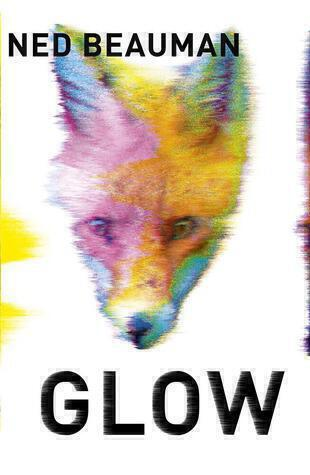

Glow is about a guy called Raf, a Londoner whose life is going nowhere in particular; a state of affairs not helped by “Non-24 Hour Sleep/Wake Syndrome”. One night while experimenting with a new ecstacy-like drug that’s apparently derived from a social anxiety medication for dogs, Raf meets a beautiful girl and then loses her to the crowd in a blink-and-you-miss-it moment. From there a conspiracy evolves involving the titular dog-medication-derived drug, Burmese dissidents, corporate espionage, pirate radio stations, and urban foxes.

Here are the opening lines:

> When he first sees her, Raf is sitting on a washing machine about to swallow an eighth of a gram of what is apparently a mixture of speed, monosodium glutamate, and an experimental social anxiety disorder medicine for dogs.

You can tell from this that the tone is irreverent from the outset. This helps when the plot unravels toward the end: it peters out when it could have gone further. Instead you get a shaggy dog story with some sparkling comic writing thrown in, the jokes come thick and fast and had me laughing aloud. The quirky descriptions of modern life in London and the folksy homages to neuroscience (or perhaps, "near"-o-science) keep proceedings belting along at a good pace even if the plot fails to serve up the thriller-like tension you might expect from the same story in the hands of a genre writer. 

It reminds me of Thomas Pynchon’s Inherent Vice, another superbly written tranche of comic set pieces trawling through a conspiracy theory all served up in a druggy haze. Beauman’s writing sometimes seems a little too arch and self-conscious compared to Pynchon. Pynchon always holds his nerve, even with silly character names and when dispensing with any sort of plot altogether.

The other thing that linka Glow to Inherent Vice is its strong evocation of a particular time and place. Inherent Vice is set at the end of the sixties, just as people are starting to realise that flower power is no kind of power at all. There's a strong sense of the hippy dream beginning to sour. Glow is set in 2010 and most of the novel occurs within two weeks, save for two codas. Perhaps we will look back on this time as another when dreams turned sour. This time maybe the idea that our smart phones and the internet have freed us to pursue pleasure. Or perhaps even the notion that scientists would imminently solve the puzzle of the brain.

Glow is chock full of social media and postmodern ideas but conspicuously free of what you might call “proper politics”, dealing instead with nebulous ideas about corporations, surveillance, and personal freedom - there are no Syrians or North Koreans or the like. No one runs amok on these streets. While Inherent Vice’s take on the past feels like “telling it like it is”, Glow feels a little short in this sense. 

At the end of the day Glow is a well-written boy meets girl story with a bit of silly drug stuff wrapped around it. I enjoyed it and read it quickly, a voracious rush of giddy excitement followed by a slight comedown afterwards. A bit like the mythical glow. I will check out Ned’s other novels (Glow is his third) and I look forward to reading what he tries in the future.

#### Notes

1. The featured image is Benjamin McMahon’s fox motif from the cover remixed. I actually produced some more bizarre versions but decided on this variant to keep things simple.
2. Talking of Inherent Vice, I haven’t seen the film yet. I just missed it at the cinema, so I eagerly await the DVD.
3. The next book on my pile is Andy Weir’s “The Martian”.