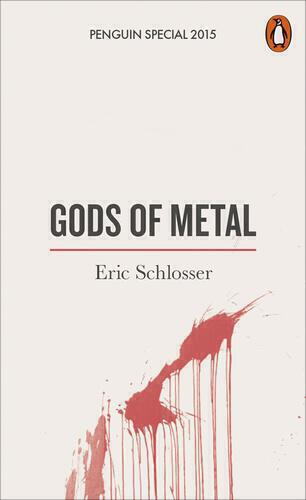

Y-12 is the United States' most secure weapons-grade Uranium storage facility. It is known as the "Fort Knox of Uranium". In 2012 it was infiltrated by three elderly peace protesters, sparking a major scandal about the safety of US nuclear sites. "Gods of Metal" by Eric Schlosser tells the story of that break-in alongside a history of both the anti-nuclear movement (in particular [the Plowshares movement](https://en.wikipedia.org/wiki/Plowshares_Movement)) and nuclear security in the United States.

A revision of an article that originally appeared in the New Yorker as ["Break-In at Y-12"](http://www.newyorker.com/magazine/2015/03/09/break-in-at-y-12), "Gods of Metal" is a small short-form book (a "Penguin Special") of about 120 pages that you can read in one or two sittings. It is also a companion to Schlosser's most recent book "Command and Control", which is a history of nuclear safety in the United States.

The title "Gods of Metal" refers to the Plowshares movement's belief that nuclear weapons are revered idolatrously in the blind faith that they keep us safe.
I found "Gods of Metal" illuminating from three perspectives.

First, the issue of security surrounding nuclear material is paramount. This book is terrifying. The ease with which the group, including an 82 year old nun with a heart condition, gains access to Y-12 is frightening. As Schlosser explains, the danger is not the theft of weapons or bombs but of highly radioactive material. The thought of rogue states or terrorists acquiring such material is the stuff of nightmares. The thought of them doing so by walking into a supposedly secure facility unchallenged is even worse.

Of all mankind's existential threats, nuclear weapons remain the second greatest after an asteroid strike. (Second greatest because, if we wanted to, human beings could eliminate the threat of nuclear weapons to their existence by adopting universal disarmament.) Although this book focusses mainly on the break-in at the Tennessee facility, Schlosser also draws attention to the frightening implications of current instabilities in Pakistan and Russia for the security of nuclear weapons stock in those countries. [This year in the UK, a Royal Navy employee blew the whistle on lax security procedures at the Trident nuclear submarine base in Faslane, Scotland.](http://www.theguardian.com/uk-news/2015/may/18/fallon-urged-act-whistleblowers-claims-trident-nuclear-subs) It seems that while these weapons and the materials to build them exist, we will always have this [sword of Damocles](https://en.wikipedia.org/wiki/Damocles) hanging over our head.

Second, this book makes a strong case against private sector involvement in the affairs of government. I'm aware that it's a little different in the states because Federal government is one thing and State law is another, and there's weirdness about how the two interact. Nevertheless a long list of failings is laid down at the door of private contractors and makes for stark reading for even the most ardent of neoliberals. It will be a source of some amusement to British readers that the corporation G4S is involved in this mesh of private contractors. G4S is the poster-child for the ill-effects of private-public partnerships. Their shadowy influence, malign incompetence, and dangerous cost-cutting reaches into all walks of life all over the world. And while it's easy enough to single out G4S, we should be uneasy about all situations in which private companies are asked to provide a critical service of quality while under market pressures.

Third, it seems to me that protest movements are more important now than they have ever been. If an 82 year old nun breaking in to a site handling weapons-grade uranium unchallenged seems pretty surreal, that's because it is. We may feel that the arguments over nuclear weapons are won. The cold war is over (kind of) and nuclear weapons played an important role in bringing that about. But if people like Sister Megan Rice did not continue to protest nuclear weapons then the first break-in to one of these bases would have been by terrorists. Who will take up this mantle when people like her are gone? What are we giving away when we allow legislation that erodes our right to protest? Moreover, Schlosser writes tenderly about the origins of the anti-nuclear protest movement, noting how it began within deeply religious Catholic communities and he takes care to emphasise the human stories at the centre of the break-ins he writes about. He humanises people that are often dismissed as nuts or crazies, and shows how their concerns should be the concern of all of us.

As I wrote at the start of this post, "Gods of Metal" is a thrilling read. Schlosser expertly weaves the narrative of the Y-12 interlopers into his potted history of nuclear weapons protests. It is taut, well-paced and informative.

I have had a copy of "Command and Control" for a year but haven't had time to read more than the first chapter: that too reads like a thriller. Naturally I'll write a review of that when I'm done reading it. 

In the meantime "Gods of Metal" is a perfect, if slightly chilling, read for your next train journey. At £1.99, it'd be cheap at twice the price.

Cover image is ["DANGER! DANGER! DANGER!"](https://flic.kr/p/7GRddd) by [Ben Sanborn](https://www.flickr.com/people/bensanborn/), [creative commons license](https://creativecommons.org/licenses/by-sa/2.0/). It's of the last unarmed Titan missiles that is on display at a Silo in Arizona. Titan missiles feature heavily in "Command and Control", I'm looking forward to reading about them.