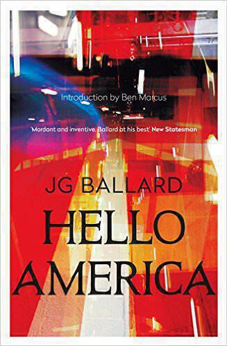

I had low expectations for "Hello America", the next in [the series of Ballard novels](j-g-ballard) that I started reading over seven years ago. However, it turned out to be a hoot. A couple of years ago, this novel would have been a wig-out bit of standard Ballard weirdness (a bit like ["The Drowned World"](the-drowned-world) or ["The Crystal World"](the-crystal-world)) but given recent events "Hello America" is starting to take on an eerie prescience.

"Hello America" (1981) is set a hundred years from now in an alternate time-line where oil production peaked in the late sixties. Without a viable energy supply the North American continent depopulates and the Russians dam the Bering strait in order to turn Siberia into farmland to feed the American refugees. Meanwhile, the continental United States turns into a desert wasteland due to the resulting climate change. The 44th president (President Brown) was the last before America depopulated entirely.

The novel opens with an expedition arriving in New York. Believing stories of a new gold rush, the crew are initially excited by the golden shimmer from the shoreline. However when their captain, the inscrutable Steiner, runs them aground (having hit the submerged Statue of Liberty on the way in) there is disillusionment when they discover that it's all just sand and that New York is just a wasteland. 

On horseback and with a water purification trailer, the team head inland, discovering tribes of new American natives: nomadic peoples who never left the states. The landscape is one of cars submerged in sands, towering cacti and drained swimming pools (so many drained swimming pools). The story combines the landscape transformation elements of ["The Drought"](the-drought), the weird-leader-with-hidden-agenda from "The Drowned World"[^1], and the themes of urban abandonment explored in ["Crash"](crash), ["Concrete Island"](concrete-island) and ["High-Rise"](high-rise). Ballard's trick here is his usual one: end the world and make people live with it. There's a reason for this, rooted in the novel he'd write next, but we'll save discussing that for next time.

Meanwhile, the story is told through the eyes of Wayne - a young man who stowed away with the expedition in search of his long-lost American father. Wayne is in rapture to ancient copies of Time magazine and completely in thrall to the idealised yet long-lost space-age vision of America. Much of the story centres on Wayne grappling with the American dream and what it has become. 

Eventually, the expedition nearly dies out in the middle of the desert before the 'Indians' rescue them and take them to Las Vegas in a coal-powered car. As they cross the Rockies they find that the Amazon jungle has spread northwards. Arriving at Las Vegas, they discover that the lights are on and a new American nation is germinating in the mangroves. This enterprise is led by a charismatic but sinister madman - President Manson - who is obsessed with nuclear weapons[^2], is [a self-confessed 'germophobe'](https://www.cnbc.com/2017/01/11/donald-trump-says-hes-a-germaphobe-as-he-dismisses-salacious-allegations.html) and, I kid you not, wants to make America "great again". You can see now why "Hello America" held my attention. Ballard has Manson, who we later find out is named for Charles Manson, as the 45th president of his fictional United States. 

The climactic chapters of the novel involve battles in the streets of Las Vegas, which is also made spookier by recent events. Needless to say, there's plenty here to chew on. When I started reading this series of novels I imagined that "Hello America" would just be 'the one after ["The Unlimited Dream Company"](unlimited-dream-company)' with a crazy plot that didn't make sense[^3]. While the writing is not Ballard's best, there are many points that are repetitive while other parts of the plot are inconsistent or don't make sense. It's focussed on an outsider's vision of the US in such a way that I doubt it made much sense even at the time it was written, let alone now. That said, it barrels along with short chapters and plenty of action. In many ways it's more like an idea for a short story stretched too thin over the length of a novel. I read a chapter aloud to Ingrid each evening. She didn't tell me to stop (though she did regularly fall asleep).

Still, at least real life events give us a reason to go back and re-read "Hello America". [You might also be able to watch an adaptation on Netflix soon](http://deadline.com/2017/05/netflix-jg-ballard-hello-america-ridley-scott-sci-fi-novel-1202095982/). Updated and given a modern twist, it might prove to be provocative but entertaining viewing.

Next up is Ballard's true masterpiece, the novel that all the previous ones lead to: "Empire of the Sun".    

[^1]: Who am I kidding? It's a motif in pretty much all of Ballard's novels.
[^2]: Reading this at the same time as I was finishing [\"Command and Control\"](command-and-control) was also a bit weird.
[^3]: Which is really saying something after the "The Unlimited Dream Company".
