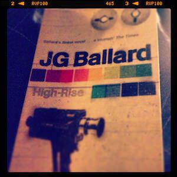

 After a few false starts I managed to finish "High-Rise", the next in [my collection of JG Ballard novels](j-g-ballard). For a book that I had trouble getting into, it turned out to be a pretty good read - even if it was also a pretty unpleasant one. Published in 1975, "High-Rise" is perhaps ahead of its time in exploring the effects of social breakdown in stylised and artificial situations where people are in close contact. You might think the plot, about a luxury high-rise that goes to hell, is in some way political or sociological but it really isn't. It's just a big playground in which Ballard throws around some of his most twisted ideas, all the while remarking on the very artifice of the situation.

Nearly forty years on, Ballard has not succeeded in producing a vision of how we live now but rather how we are entertained. "High-Rise" summons no chill about modern life but rather one about the vapidity and viciousness of so-called reality TV and the cult of the minor celebrity. This novel is the ultimate tale of the reality TV pressure cooker setup left to simmer and explode in spectacular fashion. Here "reality" is only as real as the one on TV.

The novel also bites hard at the consumerist society that has continued to build since it was written:

> "The building was a monument to good taste, to the well-designed kitchen, to sophisticated utensils and fabrics, to elegant and never ostentatious furnishings -- in short, to that whole aesthetic sensibility which these well educated professional people had inherited from all the schools of industrial design, all the award-winning schemes of interior decoration institutionalised by the last quarter of the 20th century... In a sense, these people were the vanguard of a well-to-do and well-educated proletariat of the future, boxed up in these expensive apartments with their elegant furniture and intelligent sensibilities, and no possibility of escape."

Spot on.

Better yet, it is the Ballard novel that I have enjoyed the most. I don't know if it is because I have adjusted to his style or if it's one of his best books (we'll see). It might even be that I have more knowledge now of what it is like to live in a block of flats than I did when I first attempted to read this one.

Needless to say it has the best opening lines of all his novels so far, better than most novels in fact:

>"Later, as he sat on the balcony eating the dog, Dr Robert Laing reflected on the unusual events that had taken place within this huge apartment building during the previous three months. Now that everything had returned to normal, he was surprised that there had been no obvious beginning, no point beyond which their lives had moved into a clearly more sinister dimension."

Notice the appearance of the phrases "eating the dog" and "everything had returned to normal" in consecutive sentences. Ballard does a neat trick of giving you the end of the story in the first chapter and then flashing back through the rest - a relatively straightforward version of a trick that he'll use again more showily in his next novel "The Unlimited Dream Company" - which helps set you up for the end of the story to just be "this is where we came in". More on that in a bit.

It strikes me that by this point -- into his stride on a hot streak of novels -- Ballard had worked out the perversities of his readership and part of the reason why "High-Rise" is such a good read is because it is basically a game of chicken between reader and author. The main question is "how dark can you handle?" Acts of violence are described methodically and without sensation, with little thought and explanation of motive given. As with all violence, the dissection of its motive is a luxury afforded only to those at a remove from its effects -- in this case the reader.

How dark does it get? Very, though Ballard often draws a discreet curtain over the worst if it. The terrible fate of the swimming pool, the sculpture garden covered in blood, the "game" of Flight School conducted on the balcony of the fortieth floor: all of these are discussed with enough detail to chill, without lingering long enough to deaden the impact. The result is a mad descent into darkness (in clever contrast to the characters' compulsion to ascend toward the top of the high-rise) that is both moral and physical in nature, a bizarre menagerie of characters who take to their latent barbarism with all too much ease.

As you read on, covering your eyes at points, it becomes clear that Ballard is relishing this tale. In some sense it is a retread of the same themes as ["Crash"](crash) and ["Concrete Island"](concrete-island), that the mask of civilisation that we all wear is rather fragile and will drop from our faces with the merest nudge, and so perhaps this time around Ballard is grandstanding like the raconteur at the bar, giving his story some real welly. There are lots of little nuggets of language, far too many for me to keep a track of them all. The one that stuck in my mind (because it is near the end) was "her tired eyes drifted about in her head like lost fish" - the perfect image of someone driven to complete distraction by stress and lack of sleep. I underlined so many passages as I went through that at one point I thought this post might just be a list of those.

I'll leave you with two passages as a way of summing up. The first is about how the building's architect Anthony Royal imagines the high-rise is seen by the outside world:

> "Far below him, a car drove along the access road to the nearby high-rise, it's three occupants looking up at the hundreds of crowded balconies. Anyone seeing this ship of lights would take for granted that the two thousand people on board lived together in a state of corporate euphoria."

However, by the end of the novel it is revealed that the psychosis of its inhabitants is in fact a contagion (or a simple act of human nature):

> "Laing looked out of the high-rise 400 yards away. A temporary power failure had occurred, and on the seventh floor all the lights were out. Already torch-beams were moving about in the darkness, as the residents made their first confused attempts to discover where they were. Laing watch them contentedly, ready to welcome them to their new world."

And because it is (potentially) all starting over again, this is where we came in...

---

Next up, it's the madness of birds as Shepperton becomes a utopian sex aviary (yes, really!) in "The Unlimited Dream Company".

--- 
Photo by [Anna Armstrong](http://www.flickr.com/photos/french-disko/5598347145/).
