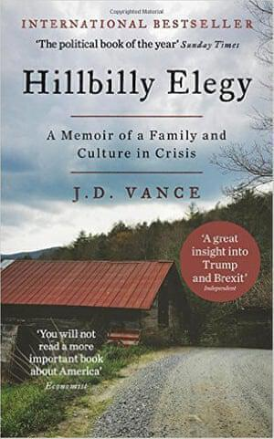

["Hillbilly Elegy"](https://www.goodreads.com/book/show/27161156-hillbilly-elegy) is the autobiography of JD Vance, a self-professed hillbilly made good who graduated from Yale Law School. I read it because reviews touted it as illustrating the economic conditions leading to Brexit and the implausible election of Donald Trump. As [I wrote in an earlier post](space-between-this-and-that), I'm keen to learn about why Brexit happened. However, I think this book fails to provide an explanation. 

Nevertheless, I enjoyed the book. It gave me plenty to think about. The story Vance tells is entertaining, but falls short of presenting a meaningful social and economic analysis of the plight of the white working classes.

To be fair, Vance does not claim to explain Trump's rise. I'm not sure he'd be happy for anyone to describe his book as the "why of Trump", beyond the extra attention and sales! He points out that working-class people who vote Republican do so for many, often complex, reasons.

The book doesn't seem to propose many solutions for the disadvantaged white populations of America's heartland. He explains how the current hardships in Appalachia originate in the people who colonised the region. These were people inclined by poverty and hard labour toward alcohol and tough living. Vance believes people should work hard and try to drive themselves upward. He also thinks that the state should step aside and allow people to derive value from the [social capital](https://en.wikipedia.org/wiki/Social_capital) within their community. It's clear that his experiences inform this world view.

According to Vance, Appalachian communities have stagnated because they were aspirational. He blames parents who wanted their children not to have to work in factories for making them aim too high. He blames those same children for not wanting the jobs that Reagan, Bush and Clinton "gave away" to overseas companies. He may be right that social security systems can make it seem easier to sit at home rather than get a job. I feel that stronger workers' rights and fewer limits on health care options would be better drivers to employment. Vance does not even consider that it may be the lack of these things that make jobs in factories and delivery warehouses unattractive to the current generation. 

Privilege is also woven through the story. Many times the police show up and take a sympathetic stance on his family's dysfunction. For black Americans similar situations could have ended in the swift incarceration of a parent, or their death by a police officer's firearm. The narrative arc of hillbilly made good is heart-warming and entertaining, but survival bias curdles it. [The film will do great business, no doubt.](https://variety.com/2017/film/news/ron-howard-hillbilly-elegy-movie-1202027659/)

To summarise, "Hillbilly Elegy" is a fascinating memoir but perhaps lacks in social and economic depth. It's filled with striking arguments about the broken social contract in Appalachia (and the wider US) but offers few solutions beyond blaming its victims. If Vance is anything to go by, solutions include joining the marines and allowing police officers to a lenient view on domestic abuse. The book does not offer a salve to explain Trump's disastrous election. Instead, it shows that a megalomaniac dilettante in the White House is more likely compound the problems of Appalachian communities rather than solve them. 