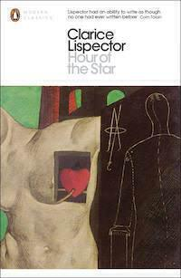

[*Hour of the Star*](http://www.penguin.co.uk/nf/Book/BookDisplay/0,,9780141392035,00.html?strSrchSql=hour+of+the+star/Hour_of_the_Star_Clarice_Lispector) is a short novel by [Clarice Lispector](http://en.wikipedia.org/wiki/Clarice_Lispector), a Ukrainian-born Brazilian author with an interesting life story. This is her last novel and is a remarkable book: inventive, funny, and sad, all at once. I found it in a special selection at the local library dedicated to Brazil because of the World Cup.

First some biography. Born Chaya Lispector in Chechelnyk, Ukraine, in 1920, her family escaped the pogroms and emigrated to Brazil in 1922. She was given the new name Clarice as the family settled in [Maceió in north-eastern Brazil](http://www.lonelyplanet.com/brazil/the-northeast/maceio). Later she and her family moved to Rio de Janeiro[^1] and she started law school there in 1937. Her first published short story appeared around 5 years later. 

She later married a diplomat and travelled the world as he conducted various foreign missions. Up until her death at the age of 57, she wrote nine novels. Eight were published in her lifetime and Hour of the Star is the eighth of these. It was published shortly before her death and is the most popular of her novels. 

*Hour of the Star* is a slip of a book, coming to a total of barely 70 pages. In fact, the edition I borrowed from the library was padded out with a long introduction ([which is the same as this article from the Guardian in February](http://www.theguardian.com/books/2014/jan/18/clarice-lispector-hour-of-the-star)) and a translator’s note at the end.

The novel tells the story of Macabéa, a poor woman from the northeast who has had a difficult life and moves to Rio. It would be quite a simple story but the narrator also becomes a character in the story. He keeps interjecting and talking about what is happening, and how useless she is as a character and how much he hates her. Yet somehow by the end of the novel he has lost control of his creation (because she is not his creation but Lispector’s) and all he can do is ponder the nature of existence.

*Hour of the Star* is a very strange read, an almost intoxicating maelstrom of ideas churning forth on every page. Despite its tiny size, you have to read quickly to get the full effect. It reminded me a lot of a late novel[^2] by Jack Kerouac called [“Vanity of Duluoz”](http://www.goodreads.com/book/show/57902.Vanity_of_Duluoz) but also of the album [“In The Aeroplane Over The Sea” by Neutral Milk Hotel](http://pitchfork.com/reviews/albums/5758-in-the-aeroplane-over-the-sea/) in the sense that in those songs there is a similar tension between the narrator and the subject.

But what sets *Hour of the Star* apart is that despite the apparent artificiality of how it is written, it manages to be very successful as writing about poverty, which is the true subject of the novel. The narrator represensts the tendency of those who talk about poverty to create examples of poverty rather than to engage sympathetically with actual instances of poverty. The whole novel is permeated with the narrator’s misguided belief that as a poor, tragic girl Macabéa must somehow want more than she has. The delight of this book is that Lispector manages to show its readers their complicity in the delusions of its narrator.

I think it is a fantastic book and the end-pieces are interesting too. I look forward to reading more of her work if I can. Of particular interest to me is *The Passion According to G.H.* because [the synopsis](http://www.penguin.co.uk/nf/Book/BookDisplay/0,,9780141197357,00.html?strSrchSql=hour+of+the+star/Passion_According_to_G.H_Clarice_Lispector) suggests a wry take on organised religion. I will also read Clarice Lispector’s biography [*Why This World*](http://www.amazon.com/Why-This-World-Biography-Lispector/dp/0199895821) if I can get it at/via the library. 

[^1]:	I’ve been there, it’s great, you should totally go too.

[^2]:	I should definitely return to this at some point: I wrote a whole “album” of song lyrics based on one page of this novel. I think it was page 63, though of course editions change. I’ve lost those lyrics now but it might be fun to find the passage and write some more.