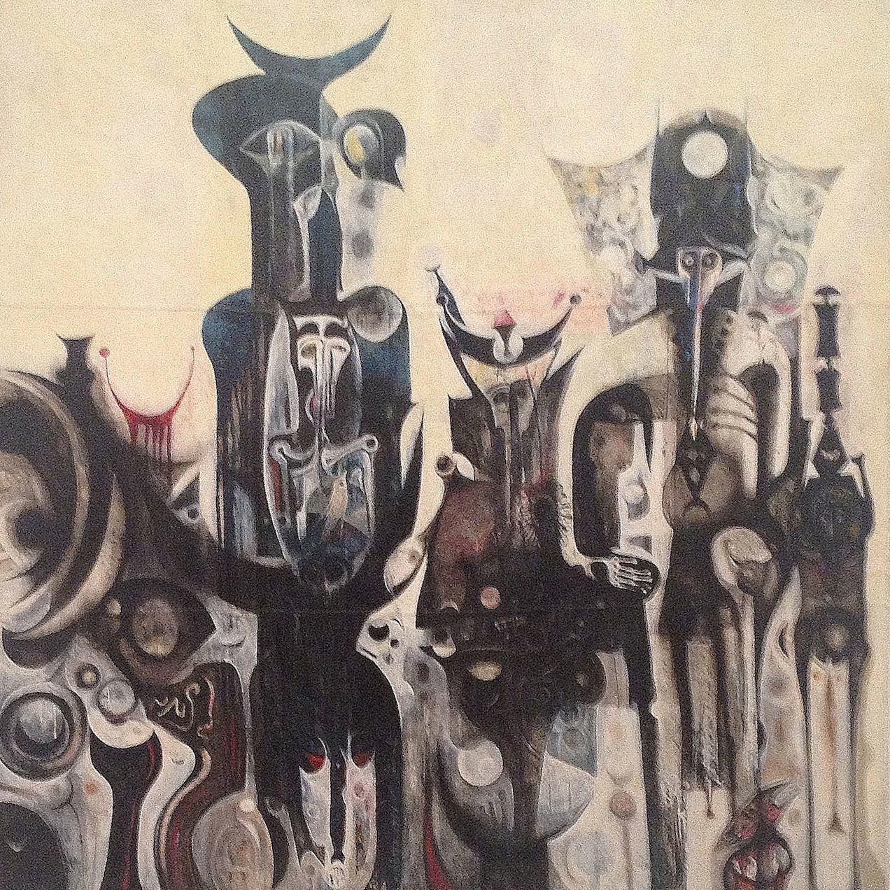

Ibrahim El-Salahi is a modernist artist from Sudan. I believe this exhibition is a first for an African artist at the Tate Modern. Much like [the Choucair show](choucair-at-tate-modern) (which is still on everyone!), it's an engaging but too short introduction to an interesting artist that you have probably never heard of.

The pieces are roughly divided between large blank and white ink drawings that are mounted on multiple panels and oil paintings in earthy colours that depict abstract scenes. There are one or two pieces that buck this trend, such as "Portrait of Mrs. McKelvey" and a couple of other portraits toward the beginning of the exhibition. Frustratingly, pictures of his work are rather hard to come by online and the only two works that I was able to surreptitiously snap while at the show were the mesmeric "Reborn Sounds of Childhood Dreams I" that you can see below and the mirage-like "They Always Appear" that is the hero image for this post.

"Reborn..." is a stunning painting and it alone was worth the visit (if you are a member that is, but don't worry there are plenty of other works that will justify the cost of your ticket if you're paying to get in!). It is a dreamy collection of figures who contain other figures. It has a lot of the detail of his drawn works too, so it bridges the worlds of his paintings and his drawings very well.

In his early years as an artist El-Salahi travelled widely and you can see from the first paintings in the show how he gradually absorbed elements of western art in to his painting. The islamic calligraphy never leaves his work though, the crescent moon is usually present somewhere and much like much of Choucair's work, there is a balance that comes from using the shapes and compositional forms that are taken from the calligraphic tradition. One arresting piece is composed from Arabic letters, the forms dissolving in to abstraction at the periphery of the frame.

Later works are also influenced by his travels: the first room is dominated by three large drawings made in 2012. They were inspired by a recent trip to the Alhambra in Spain and they are quite a contrast to the works that opened [the Lichtenstein show](lichtenstein-at-tate-modern) in the very same room, the paintings in which Lichtenstein mocked the Abstract Expressionists with his Benday dots. Sadly, some of the works are also influenced by El-Salahi's time as a political prisoner in Sudan and the works from the subsequent period in exile in Qatar are quite mournful. Consider the fact that "Reborn Sounds of Childhood Dreams II" from the mid 1980s is a black and white drawing filled with gaunt and haunting figures rather than the coloured and mystical figures of the earlier painting.

A large number of the pieces in show are labelled as "from the collection of the artist". In fact, it's the first time that I have noticed it at all at a show. It made me think about what side of El-Salahi's work we are getting to see. Is it the experimental side? One piece was an interesting experiment in which the canvas was smeared with oil paint and then covered with another quick drying titanium paint, allowing him to manipulate the still wet paint under the dry layer. Or are we seeing an under-appreciated side? Most of the pieces provided by the artist seemed to be the newer ones. There are also some wonderful works that appeared on book covers and I cannot remember what time period they were from but they certainly add to the collection. There are also magazine articles about his appearance as an actor in a film. These book covers and magazine articles are where the painter's own collection is very useful in explaining his or her cultural impact.

The catalogue lists a great many more works, some of which are completely different to those on show and it would have been nice to see some of those in the flesh (like "One Ramadan a Scorpion Stung My Little Nephew"). Nevertheless there are some great pieces here and I appreciated the Tate Modern introducing me to another interesting artist that I would otherwise not have encountered.