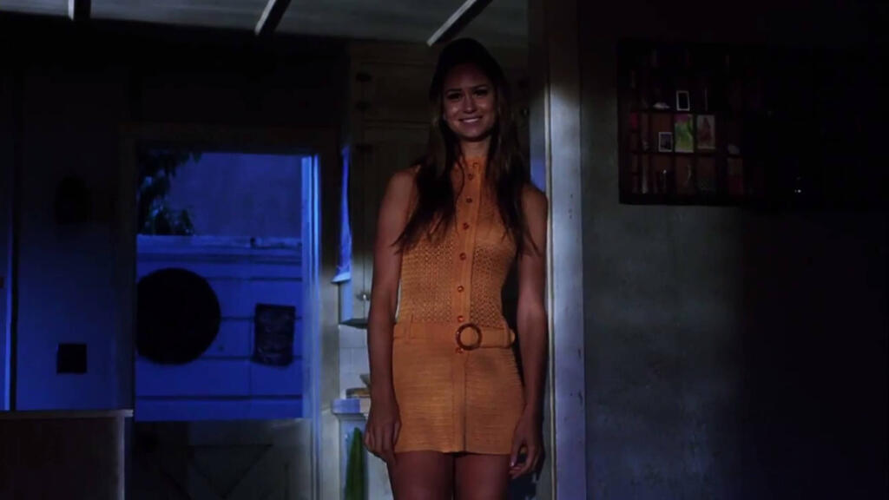
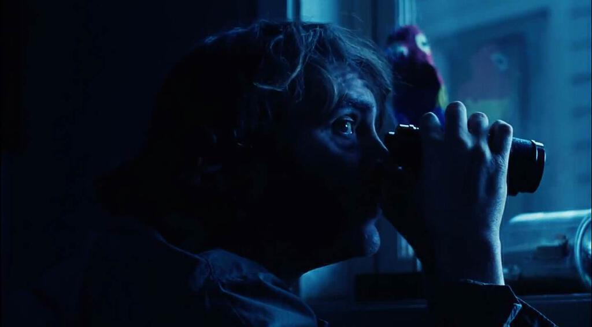
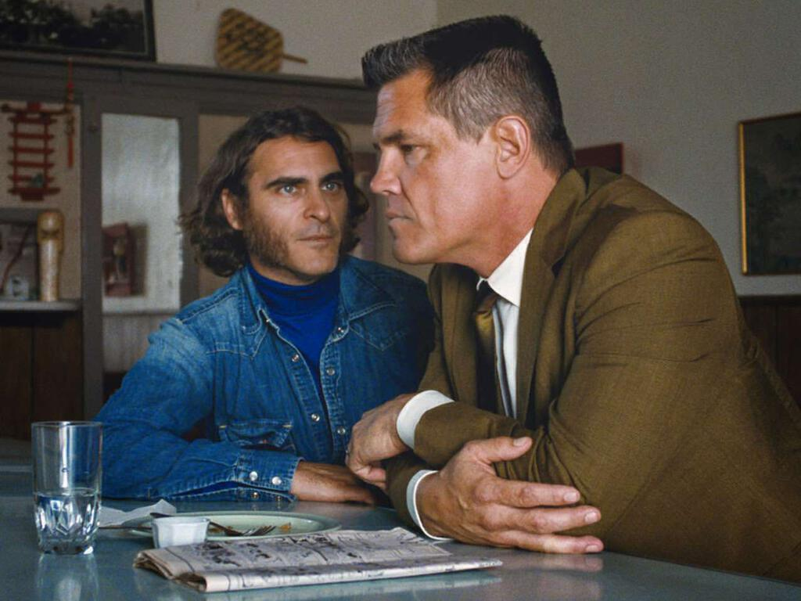

Tonight I finally caught up with [Inherent Vice](https://en.wikipedia.org/wiki/Inherent_Vice_(film)), Paul Thomas Anderson's adaptation of [Thomas Pynchon's novel](http://www.amazon.co.uk/Inherent-Vice-Thomas-Pynchon/dp/0099542161/ref=sr_1_4?ie=UTF8&qid=1437860132&sr=8-4&keywords=inherent+vice). It stars [Joaquin Phoenix](http://www.imdb.com/name/nm0001618/) as Larry 'Doc' Sportello who's put on to a case of possible kidnapping by his "ex-old lady" Shasta, played by [Katherine Waterston](http://www.theguardian.com/film/2015/jun/16/katherine-waterston-jk-rowlings-fantastic-beasts-harry-potter).

There's no point attempting to tell much more you of the plot of Inherent Vice: it's rather convoluted and self-digesting. At least this means there's very little chance of stumbling into inadvertent spoilers. However, most of the plot strands do fall into place by the end, much more than I'd imagined they would half way through.

Inherent Vice has a lot in common with other films that [Paul Thomas Anderson](http://www.rottentomatoes.com/celebrity/paul_thomas_anderson/) has directed that I've seen. In essence it's about the failure of the American dream as much as There Will Be Blood is. Set in 1970, it plays out as the counterculture finds itself sold out, exploited and infiltrated by the very people that it set itself against. It's as much about the difficulties in doing right by other human beings as Magnolia is. You get the impression that Doc is very much still in love with Shasta but that there are all manner of other complexities to his relationship. I imagine there are a fair few parallels with [The Master](http://www.rogerebert.com/reviews/the-master-2012) and [Boogie Nights](http://www.metacritic.com/movie/boogie-nights) too, but they're both still on my To Watch list. I picked Inherent Vice because I fancied something a bit lighter to watch.

I thought it was the first Paul Thomas Anderson movie that I found very funny. I think this all comes through from the Pynchon source, his novels are incredibly funny. Even though you might be completely lost after a few pages, it's almost a given that those pages will make you laugh somehow. In Inherent Vice almost every character is comic and almost every situation is farcical.

Not only is it funny, Inherent Vice is also a beautiful movie. I'm not one of those people who can spot those odd mistakes like the wrong lamp-posts in a particular shot, but I was fooled the whole way through. And there's something about the way it's shot that really appeals to me. Part of it is that when people are having a conversation, a lot of the time (except when the plot requires it) the underlying shot is that of two people talking to one another. A nice example of where this really works is a scene where Doc chats to his lawyer (Sauncho Smilax - played by Benicio del Toro - very much channeling Fear and Loathing five years on) in a diner - when the waitress comes over Doc abruptly hushes Smilax almost as she comes into frame, heightening the tension and mood.

I also really liked the soundtrack. If you're going to play Can over the opening credits, then I'm always going to be a big fan. As with "There Will Be Blood" the score is by Radiohead's Jonny Greenwood but in fact the majority of the delights come from period pieces. There's little doubt in my mind that the musical vignettes are also enhanced by the aforementioned superb cinematography.

Joaquin Phoenix is brilliant. I must admit he's not how I'd imagined Doc when I read the novel but his mannerisms and speech are pretty much perfect. It's a perfectly timed comic performance that really gets to heart of someone who knows everyone but knows nothing about what they're doing. He does turn out to be a good detective and he does the right thing by the end. I think his performance is so good that I'll probably get more out of re-reading the novel because of it.

Apart from Joaquin Phoenix, there are also great performances from Owen Wilson as Coy Harlingen and from Josh Brolin as the police inspector 'Bigfoot' Bjornsen. The latter is great as a scenery chewing 'straight' cop with a weird home life. I also really enjoyed seeing Joanna Newsom as Sortilège, the sort of proto-narrator who also appears as a character. She gives a lovely sing-song cadence to her lines (understandable given that she's a singer) and she does all the important work of pulling the movie together. (As in common with Pynchon, her name is a pun - Sortilege is the act of divination by lots, though her narration is mostly given in the form of astrological mumbo jumbo... another of Pynchon's wonderful feints.)

It's not an easy movie to understand but its pleasures are many, provided you can sit down and really watch it. I started while eating my dinner but ending up pausing it until I'd finished because it is hard at points to hear what the characters are saying, and with a plot this loopy it can problem if you miss something. That said I think the film is more lucid than the book, if only because it drives through the plot in its two hours twenty minutes. Sometimes a book, which takes longer to read, can unravel irrevocably given the chance - Anderson's adaptation is quite disciplined and does not allow the plot too many opportunities to get away from the viewer. With the novel, lots of Pynchon's asides and in-jokes draw attention away from the matter in hand - and some of them are visual, so they're better served by the film.

As ever, read the book the first. If you enjoyed the book, you'll love this. And even if you didn't, you might still like this if you love Magnolia (a little less harebrained) or There Will Be Blood (though this is mostly lighter). Failing that, go dig out the soundtrack - you'll thank me for that at least.

Previous appearances:
* [Thomas Pynchon](/on-pynchon/)
* [CAN](/can-the-lost-tapes/)

Trivia: Inherent Vice is a legal term for something contains its own source of destruction, like eggs breaking. It's used particularly in situations of high risk, often something cannot be insured because of it.

Photos used throughout are screen caps from the movie found using Google Images. I claim fair use.