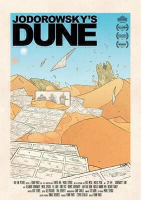

[Jodorowsky's Dune](http://www.imdb.com/title/tt1935156/?ref_=fn_al_tt_1) is a documentary about outlandish Chilean director [Alejandro Jodorosky's](http://en.wikipedia.org/wiki/Alejandro_Jodorowsky) attempt at a film adaptation of [Frank Herbert's Dune](/dune/) in the 1970s. As a big fan of the novel and of science fiction in general, I was very interested in this film. It does not disappoint. It gives a great insight into the mind of a little known (if slightly batty) director and shows even an artistic failure can lead to shock waves that can be felt in later work by others.

 Alejandro Jodorowsky had made two internationally acclaimed films prior to his recruitment to develop the film version of "Dune". "[El Topo](http://www.badmovies.org/movies/eltopo/)" is often described as an "acid western" - I've not seen it but the trailer looks disturbing and bloody. I'm too scared to embed it here.

Meanwhile "[The Holy Mountain](https://www.quora.com/What-was-the-movie-The-Holy-Mountain-by-Alejandro-Jodorowsky-about)" is a surrealistic satire of religious belief. You can (for now) watch the entire film on YouTube. Be warned as it is not safe for work and it is not suitable for people who are offended by religious or disturbing imagery. I've only watched twenty minutes so far (at the time of writing) but I will make time to watch the rest; it's bizarre but compelling viewing.

Jodorowsky's Dune allows Alejandro the chance to talk about his vision for Dune - and it's a vision that brought together some incredibly talented people. Had he made the film with the actors and musicians who he says agreed to work on it, it truly would have been a cultural reference point that we would all be aware of - for better or worse.

First off, Jodorowsky recruited French bons dessins artist [Mœbius](https://en.wikipedia.org/wiki/Jean_Giraud) to sketch out a story board based on Jodorowsky's vision for Dune. This resulted in a book the size of a telephone directory that Alejandro regularly hoists on to a coffee table throughout the documentary - a tombstone to mark an unmade film.

Later there are interviews with [Chris Foss](http://www.chrisfossart.com) (who I now realise drew the covers of some of my favourite sci-fi novels - like the Asimov robot novels), [Dan O'Bannon](http://www.imdb.com/name/nm0639321/), and [HR Giger](https://giger.com/gigerframeset.php). These last two would collaborate later on Alien - to terrifying and ground breaking effect (More on Alien to come...). Some of the music was to be performed by [Pink Floyd](http://www.pinkfloyd.com). However, it's telling that no evidence of their contributions is offered - not even so much as interview with Dave Gilmour or Roger Waters. All we can know is that it would have been better than Toto's dreck for the 1984 film (more on which later). The documentary is full of Moebius, Foss, and Giger's creative contributions to the pre-production design, but it appears that the sound design was never entered into, at least not by Pink Floyd.

Jodorowsky also claims to have recruited [Orson Welles](http://www.traileraddict.com/jodorowskys-dune/orson-welles), Mick Jagger, and Salvador Dali (!) to various roles. Orson Welles is dead so can't comment and Jagger is conspicuously absent, so I guess we have to take Alejandro's word for it. Meanwhile the tale of Dali's recruitment to play the Emporer of the Universe is so bizarre it must be true. It is also confirmed by Dali's muse of the time, who was also offered a role (it was one of Dali's conditions - along with being paid more than any other actor ever at the time, something that Jodorowsky got around by restricting Dali's screen time to three minutes).

I think Jodorowsky's Dune offers a tantalising glimpse at what could have been a great film. The conceptual art looks great even today - the success that O'Bannon and Giger had with Alien goes a long way to upholding this and speaks volumes to how Jodorowsky's treatment for Dune has influenced the science fiction aesthetic that prevails to this day.

The version of Dune that _did_ get made also influences the documentary. It's objectively terrible - to the point that some cuts are credited to Alan Smithee rather than the usually competent David Lynch. One of the best moments of Jodorowsky's Dune is where Alejandro describes being dragged to a screening of the Lynch version: "I was really happy when I saw it... I didn't want to see it... but IT WAS TERRIBLE!". His laughter quickly becomes rueful, the Schadenfreude of someone who knows that they are right.

This documentary is a great little film, particularly if you like Dune or are interested in how films are made. The introduction to Jodorowsky himself is a bonus. His wit and enthusiasm throughout show that if you dream big, you can't really ever fail.

---

The featured image is an example of Chris Foss's artwork for the film, only homage is meant by its use.