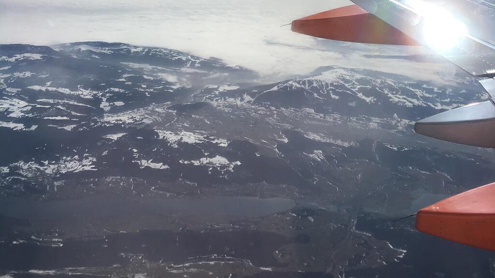
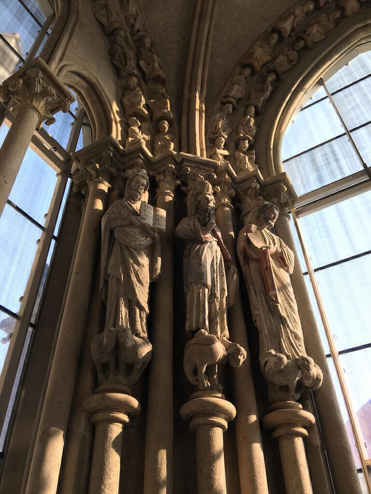
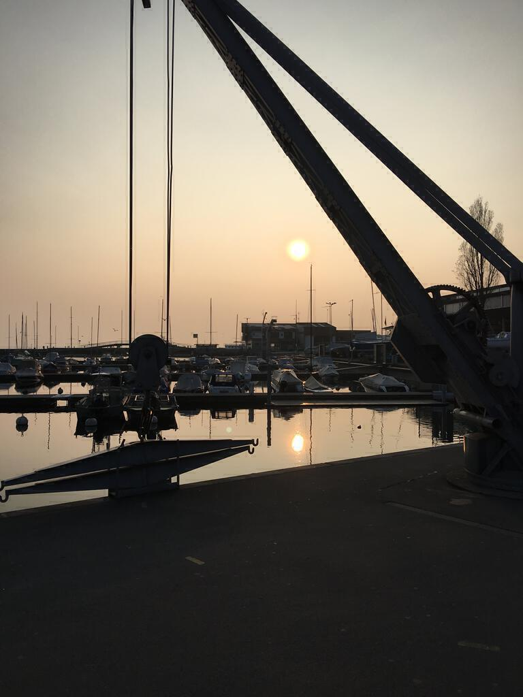
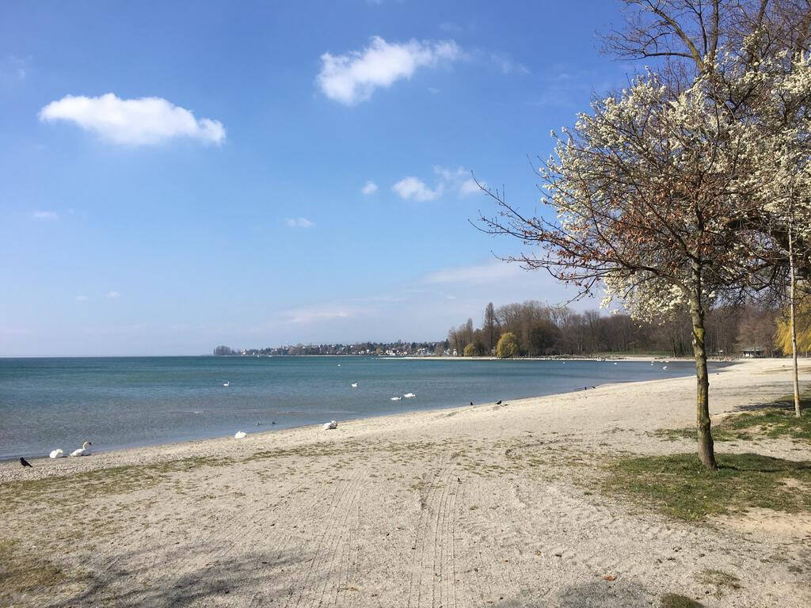
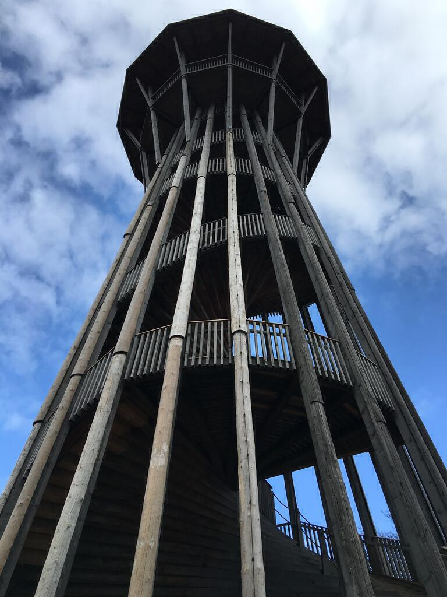

Just before Easter Ingrid and I went to Lausanne in Switzerland for a few days. It was a much-needed break and my first trip out of the UK since I got back from South America.

We caught an early train to Gatwick. It took a strange route along the coast via Worthing and Hove, which was annoying because we could have left later if a more direct train were available at that time of day. At least it wasn&#39;t late, which for Southern is really rare.

Bleary-eyed we got the monorail to the North terminal and fumbled our way through customs. As usual I forgot to take off my belt. We had a reasonable breakfast and people-watched as young men ordered cocktails at 7am in the morning: makes you proud to be British.

The flight to Geneva was serene, extended a little by a strike by French air traffic control that meant we had to fly over Germany instead. The alpine scenery below us was beautiful, I love landing in new places on sunny days.

Soon enough we were flashing our passports at yawn-stifling guys and walking through arrivals to the train platform. We could have bought our tickets from the machine but (in what would become a theme for the week) we were incredulous of the prices. Soon enough (11.03 English time, we&#39;d left my flat at 4.45) we were out into the sunshine and peering out Lake Geneva in the hazy sunshine. Our bottle of mineral water cost about £4.50. Ouch.

Our hotel was easy to find, about 15 minutes from the station. After checking in, we had a little rest and then went out again to explore Lausanne. Much warmer than we&#39;d anticipated and sunny, it was perfect exploring weather. Lausanne tumbles down from the hills to the shore of lake Geneva, bracing itself with bridges on the way down. Views stack on top of more views.

We made it through most of the shops up to the cathedral and a château nearby undergoing renovation. The cathedral is as impressive as all cathedrals in major cities, perhaps distinguished by some especially colourful stained glass windows and a beautiful side chapel with windows on all three protruding sides. When we were there it let in the late afternoon sun, making the statues shine. Around the cathedral there&#39;s a quiet arty district of narrow streets lined with architecture practices, web design studios and antique book stores, and supporting a restful stillness.

Leaving the cathedral we stumbled down steep steps and people-watch some more. It&#39;s always fun to be on holiday and watch strangers in a strange town as they go about their business unaware that anyone observes them. However, we tired of shops (encountering the third Starbucks of the day generated a particular frustration and ennui) and rode the crammed metro a few stops to get closer to the lake. We found somewhere to eat dinner but to fill the hour and a half before the place opened we walked down to the shore and took in some more of Lausanne.

We quickly found the marina (and the hotel where we&#39;d have dinner the following night) and snapped pictures of boats in the evening sun - in part a response to an ongoing request from Ingrid&#39;s mum. All sorts of sculptures line the shore and it&#39;s fun to snap them. Teenagers hung out with bluetooth speakers and skateboards, reminding me of Montevideo. Meanwhile, observing that inland they replace seagulls, we watched crows sit atop a play area squawking: the definitive sound of a murder.

We have a reasonable Italian meal and walk back to the hotel. Shattered, we realise that the hotel room&#39;s TV and the hour&#39;s time difference allow us to tune in for our usual Monday fix of University Challenge. The comforts of home.

Tiredness ensures we sleep in on Tuesday morning. We walk to the Musee de Lycee for the Werner Bischof photography exhibition. I will write a separate post about it later. Afterwards we walk in the grounds of the museum and soon realise we&#39;ve wandered into the grounds of the neighbouring Olympic museum. We decide to check out the café for lunch and it turns out to provide good food that Ingrid can eat. It&#39;s also good value, at least for Switzerland.

Somewhat taken by the olympic museum, we decide that Tuesday has become museum day and stay on to visit the whole thing. It's as hagiographic as you might expect it to be, but it&#39;s still fun nevertheless. It demonstrates how much the olympic games involves itself into far more than just sport, though there probably could be more sporting footage throughout. The most interesting bit was to walk around the artefacts from previous games. It spoke to how the technology that supports athletes has changed over the hundred-or-so years of the modern games. I was particularly enamoured of the old school Swiss bob-sled.

After leaving the museum on the end of closing time, we walked down to the shore (via the Olympic flame) and this time headed east until we came across the Thai Pavillion. Then we turned west for dinner and had a lovely meal in the hotel we&#39;d discovered the day before. I had a delicious chicken and white asparagus risotto, while Ingrid had a handsome lamb salad.

Back at the hotel we decided to look at the tourist guides we were given on arrival and work out what we hadn&#39;t seen for our last full day. We also had cards giving us free public transport that we had not yet used, so we figured we could at least get on a bus at some point.

The next day we had breakfast at the hotel and acquired a packed lunch from the assorted offerings. We walked westward along the shore of the lake to the neighbouring village of Saint-Sulpice, taking in the roman ruins on the way. After three hours we tired and walked to a bus stop, catching a bus to the metro station at the university. We took the metro into the centre of town and another bus out to the north of the city.

Unfortunately the lake we intended to visit is currently drained and the facilities around it are being renovated. We didn&#39;t visit a lake so much as a puddle with a couple of diggers and some puzzled looking ducks. There&#39;s also a tower nearby made entirely from wood to a double-helix design conceived by Leonardo da Vinci. It looked abandoned and scary. We made a pretty walk down to the Hermitage museum and visited an exhibition of paintings by Paul Signac. I&#39;ll write about that exhibition in another post.

After the exhibition we walked down the steep hills back into the city and had dinner in a burger bar - well you have to do that at least once in every country don&#39;t you? We bought snacks from the station and headed back to the hotel to pack. Our feet sore: the sign of a good day!

The next morning we had breakfast and once again pilfered some lunch. After we checked out we tried to visit the botanical gardens but it wasn&#39;t the easiest place to walk around with our wheelie bag, so we took the train to Geneva and had a little walk around there to whittle down the hours before our check-in. Our last day in Switzerland was pretty sedate and sunny, and we also bought lots of chocolate for Easter back in the UK.

Our flight home left late and we were sat in the row ahead of a baby that bawled almost the entire time (still better than being on the same flight as drunk people though!). Then we stood in the cold and rain while our train from Gatwick was delayed. Talk about Britain being quick to remind us that we were back!

