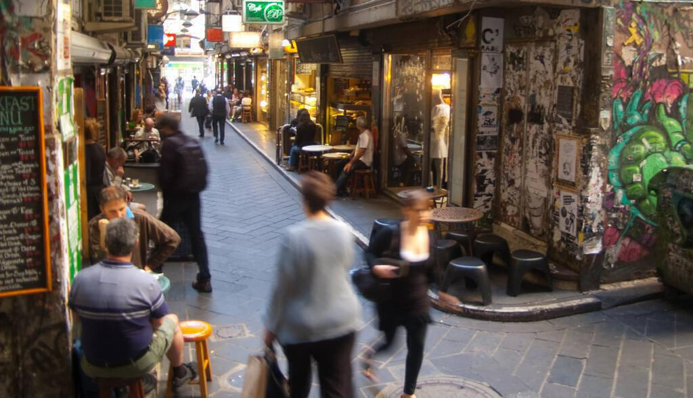
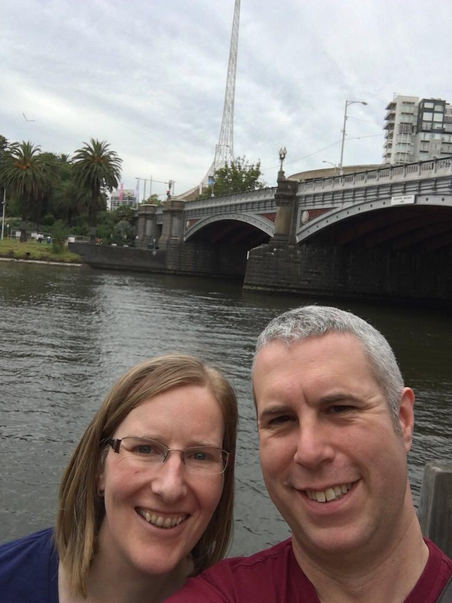

On our second full day in Australia we went shopping in central Melbourne, before Ingrid's mum Maria and her husband Gary picked us up ahead of our trip along the Great Ocean Road.

We took the metro into the city. I always love watching the fabric of cities knit itself together around train lines and Melbourne is no exception. Along the way, Ingrid had plenty of stories to tell about the various places she had lived.

The Melbourne metro map is interesting. The line from Moonee Ponds loops around a central circuit before heading back out again. All the other lines do this as well, some go clockwise around the loop and others head anti-clockwise. The direction changes at midday or something.

We got off at Melbourne Central, touching out our Myki cards and emerging into an enormous shopping centre. I blinked a lot, all of a sudden among bright lights and many shoppers. Out of the daylight and in the permanent evening of mall time, I think my circadian rhythm buckled a bit.

Thankfully we soon found ourselves in daylight, staring up at the huge shot tower in the middle of the shopping centre. Bullets for old muskets were manufactured by dropping lead shot from a great height, from the top of the tower to the bottom.

The more mundane Telstra store we were looking for faced on to the tower. I examined paper lanterns in the deal displays for Chinese New Year while Ingrid got her old Australian mobile contract reactivated. The lady helping us suggested a nice coffee shop in the laneways and so went there, via a good number of additional shops, buskers, tea rooms, and more of Ingrid's family history.

The laneways bristle with graffiti and small restaurants and cafes. At lunchtime they bustle with people grabbing a bite to eat: locals and tourists alike. We found our recommendation, ordered some coffee then settled on tempura cauliflower and chorizo on a bed of kale. I should have instagrammed it. Interesting dance music played, I longed to know what it was. Next to us a pile of second hand books lined the shelves below the till. Through a tiny porthole I could see the Japanese chef turning out each small order in double-quick time. A fish swam, disinterested, in an aquarium on a shelf next to the kitchen door.

We left the bustle of the lanes and took ourselves down to Flinders Street. We examined tourist tat in a shop dedicated to tourist tat. I yearned for an "outback dunny" fridge magnet, but we bought postcards instead. Sometimes we're too sensible.

We crossed the road and ate an ice cream in Fed Square. School kids slouched around. My eyes took in the zany architecture and we walked down to the river, taking selfies under what we called the Miss Fisher Bridge. Then we looped back into Flinders Street station and found the platform for the train back to Moonee Ponds. And as beautiful as the unseen spaces between stations are, this time I people-watched: I probably stared at the other passengers as I wondered about their lives.

Back in Moonee Ponds we packed bags for the next few days and waited for Maria and Gary to pick us up. They drove us over to their house in Lara, a pleasant town outside Melbourne. Or was it yet another suburb? Or a suburb of the neighbouring city of Geelong? It all kind of sprawls, but in the nicest possible way. Lara itself could almost be the imaginary Erinsborough of all those episodes of Neighbours watched just before dinner in my youth: pretty houses arranged into suburban drives, community pools, utes, etc.

We ate tea and cake with Maria and Gary. We talked about the journey, past events, family history. We were shown our room which is usually rented out for Airbnb guests (It's very popular with travellers flying into Avalon airport, so if you ever need somewhere to stay after a late flight or before an early one...).

That evening Ingrid's sister Tamsin, her partner Tom and their children Mickey and Maddie came by for another tasty barbecue. The kids asked if I could chase them and not wishing to disappoint them, I duly obliged. I've never been very good at chasing people and I think I was just the right level of incompetent for them! It was great fun though! Apparently that night Mickey and Maddie talked excitedly about "the giant who couldn't catch anyone". Well, at least they thought I was tall? 
