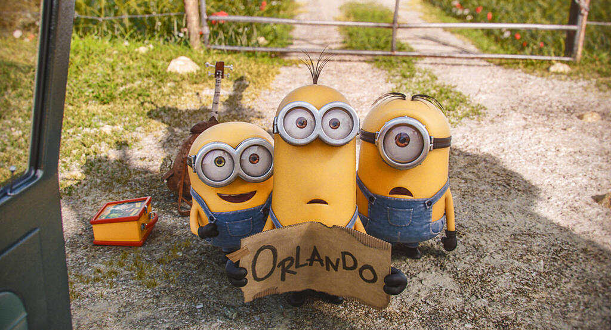

The Minions got their own movie, just as I predicted in [my review of Despicable Me 2](/despicable-me-2-a-short-review/). I went to see it this week and I enjoyed it a lot. Here's a short review. Don't worry, there are no spoilers here that aren't in the trailer.

It's very funny. Right from the opening credits you get the minions and their anarchic fun-loving slapstick humour. There's always been something delightful about they way in which they innocently bumble around. Their penchant for evil bosses is inexplicable but incredibly amusing.

There's nothing deeply philosophical about a minion. They just enjoy being part of the herd and live joyously in the moment. I guess we should all try to be like them, at least from the happiness point of view.

The plot is serviceable enough. Like the trailer, the film is narrated throughout which helps to shape things. I love the fact that for large sections the minions just babble away in their own language (a sort of bowdlerised French to my ears) and you're effectively watching a foreign film without the subtitles.

There are no big twists just hilarious moments of deus ex machina that are heavily signposted, often to comic effect. This is fine for a fairly silly film that slips in outrageous ideas at every opportunity. I think I gasped with laughter at a couple of bits just because it was so silly.

Unfortunately Minions can't quite keep up with itself. Very few of the non-minion characters stand out, which is understandable but also a little disappointing. I think the Despicable Me films are better than Minions because there are other strong characters like Gru and the girls. All minions all the time does seem to be too much of a good thing.

Another problem is that slapstick cannot sustain an entire movie so there are moments when Minions has to slow down just to let something else happen on-screen. Yet there are also other moments where there isn't enough slapstick, that the movie plays it too safe. I won't tell you what those are, as spoilers would be involved.

It really strains against its U certificate. In the trailer you see the minions working for Dracula and in the cinema I heard a young child ask his parents "Who's that?" How do you explain who [Count Dracula](https://en.wikipedia.org/wiki/Count_Dracula) is to a four-year old?

There are chase sequences that go to extraordinary lengths to avoid the level of violence you'd probably see in "normal" movies. They end up funnier as result, but there are also moments that gloss over extreme violence involving guns, axes, knives and explosions.

I was also uncomfortable with a scene involving a torture chamber, in particular a noose. Call me a prude if you like but I don't think a gallows has any place in a U certificate movie. A PG certificate would hardly be a disaster anyway, it's a nice minion-friendly yellow. [The BBFC judgement](http://www.bbfc.co.uk/releases/minions-film-0#bbfcinsight) states "There is a comic scene in which a man threatens to torture the minions in his medieval style torture chamber. The minions are stretched on a rack and hung on a noose but neither of these things harm the minions at all." Well that's alright then...

I could be wrong though. After all, I didn't mind that I'd spotted an Alien reference in Despicable Me 2.

To conclude, I enjoyed Minions a lot but I think I liked Despicable Me 2 a bit more. I might benefit from seeing it again (I did miss the scene after the end of the credits after all). The good news is that there is going to be a third Despicable Me movie and I expect that the minions will make it into a few other movies too.

All images sourced through Google image search. I'm claiming fair use so if you nick them as well don't give me any money.
