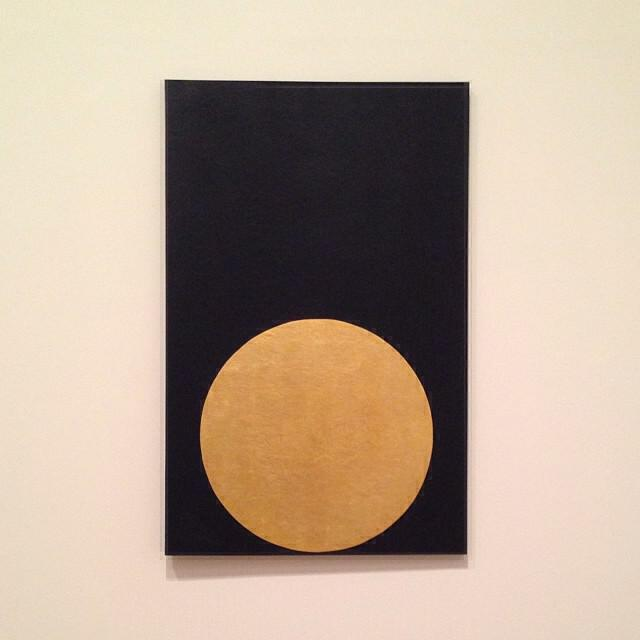
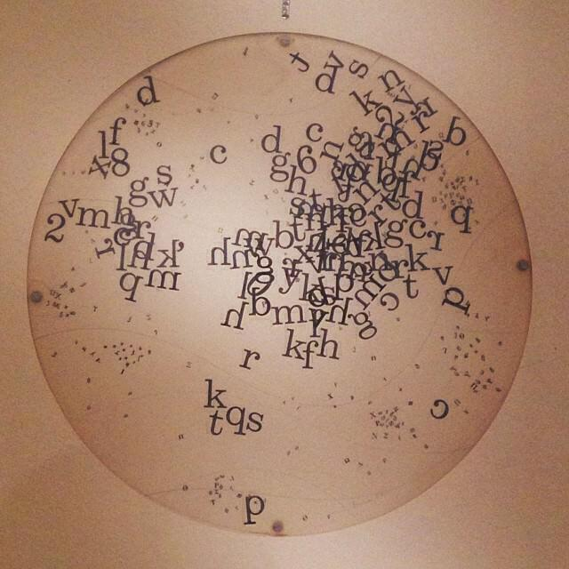
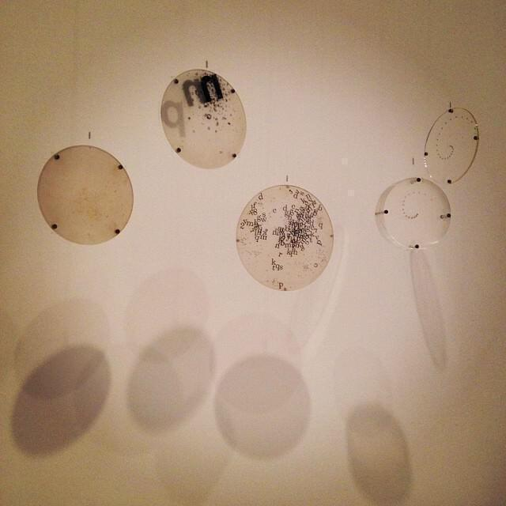
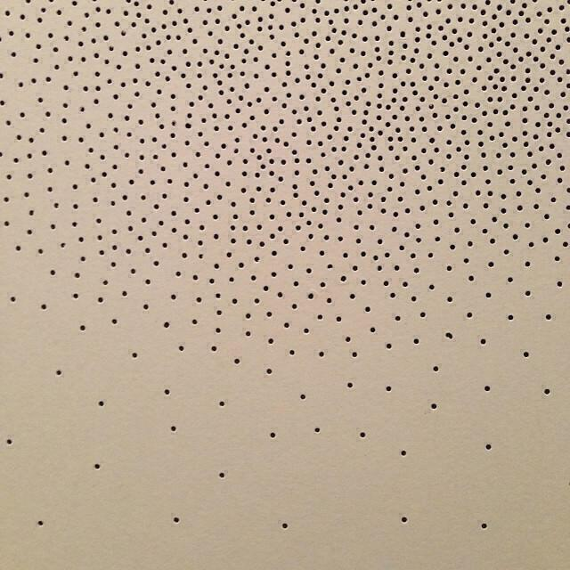
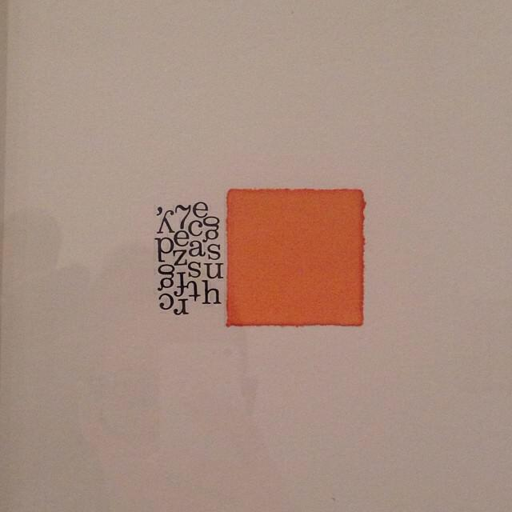
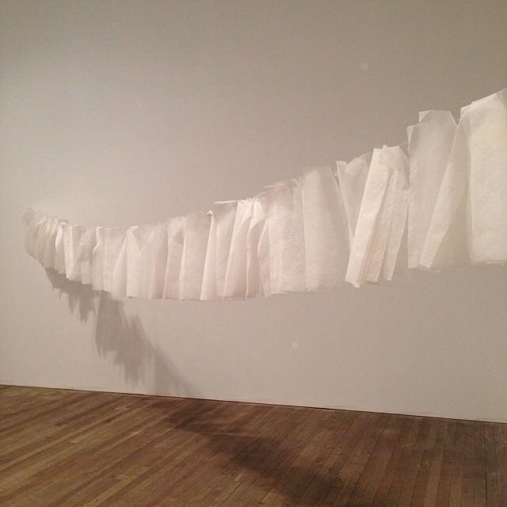
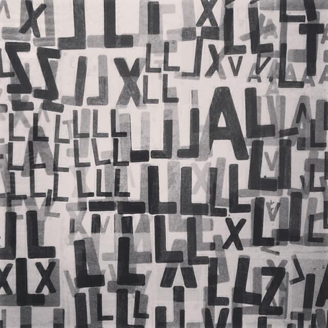

 [Mira Schendel](https://www.theguardian.com/artanddesign/2013/sep/29/mira-schendel-tate-modern-review) was a Brazilian artist who was active throughout the middle to late twentieth century. She is considered to be one of South America's best artists. Known mostly for her abstract paintings, she also experimented with sculptures and installations. Many of her works use text and semiotics to explore and define possible meanings for more abstract works.

I saw this exhibition during its run in the Tate Modern in the Autumn of 2013. I didn't feel like writing about it at the time. In fact I may not have had any time because it was quite close to my departure for South America.

I may not have written about them but I remember the pieces vividly. I also remember that the exhibition was rather heavily policed with helpers that intervened often to prevent people from taking pictures. Some helpers are less proactive, so photos always get through eventually! With this in mind I set up an IFTTT recipe that collected pictures tagged #miraschendel on Instagram and put them in my Dropbox. The intention was to use them when I eventually wrote about the exhibition.

Fast forward three years and I found 250 odd pictures in my Dropbox. The time has come! I can't really say much more about the exhibition now but it's good to share the photos. They're a sort of time capsule with a Mira Schendel theme. I whittled them down to thirty-four pictures that don't include any portraits or reflected portraits. I tried to avoid the weirder frames and filters where possible. The artwork "Still Waves of Probability" - consisting of a roomful of translucent fibres hanging from the ceiling - proved very popular for selfies and portraits.

Here is the gallery. If I can find a copy of the exhibition catalogue I will add captions with titles later.

Thanks to everyone on Instagram who took these pictures. I have no idea who you are. Remember when you post things on apps with hashtags, someone might come along and scrape them up! Soon Ingrid and I are off to visit some more Exhibitions at the Tate Modern so expect more posts about that soon.

The hero image is a cropped reduction of the work "Graphic Object".
