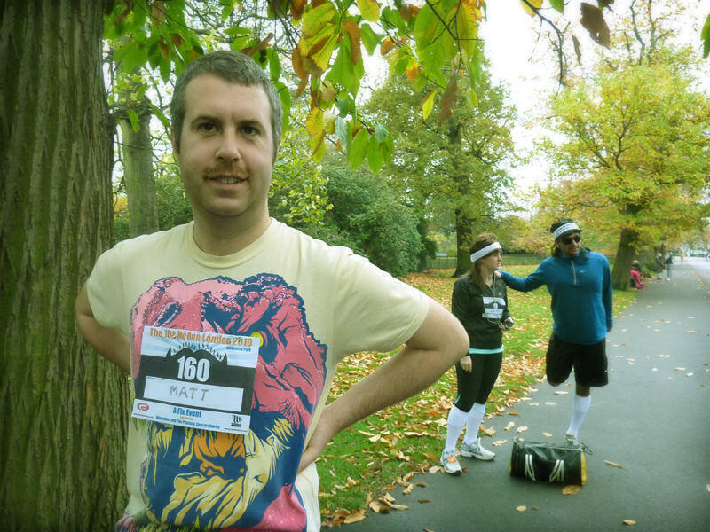
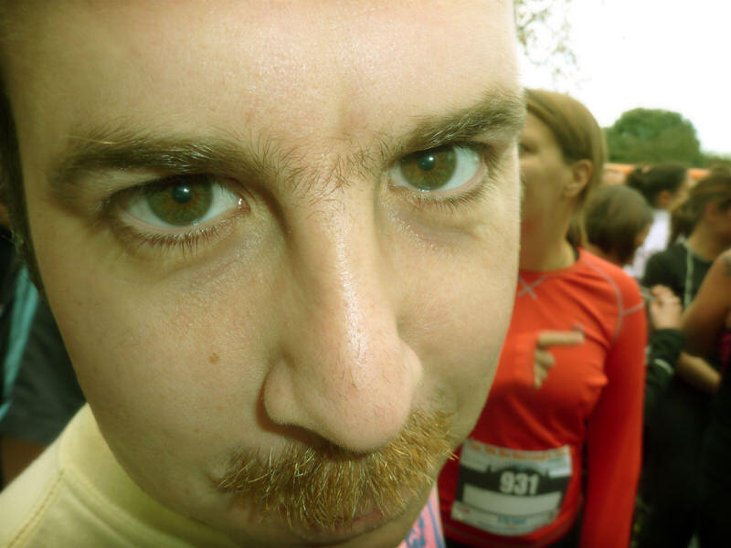
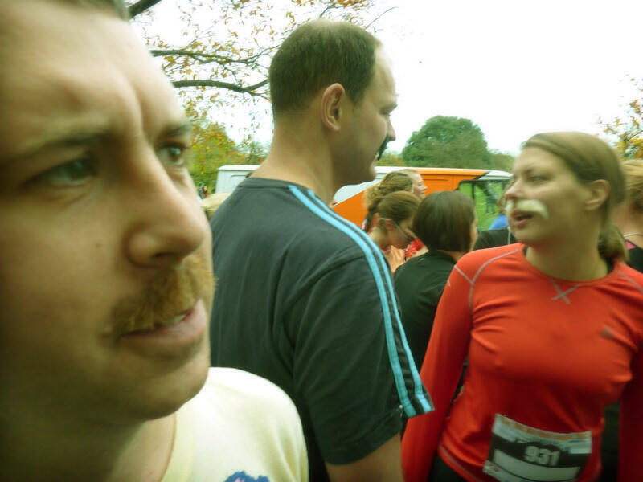
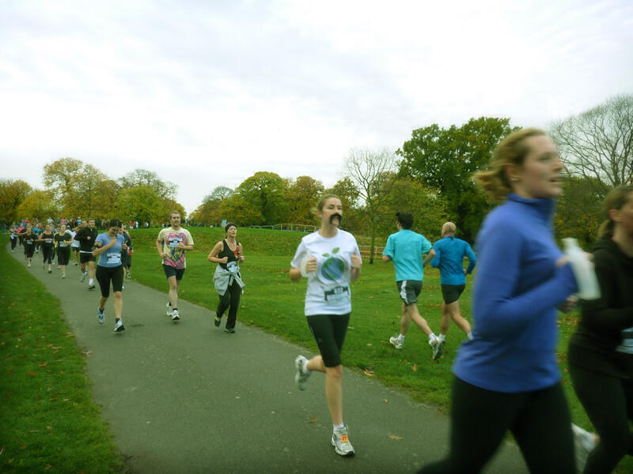
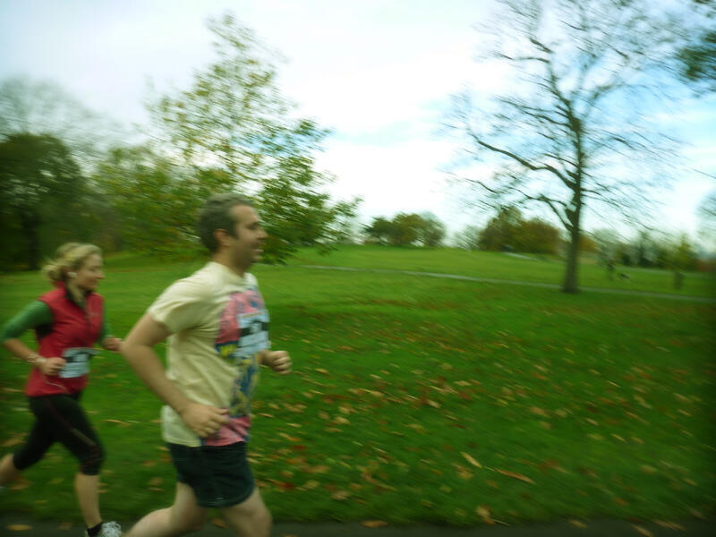
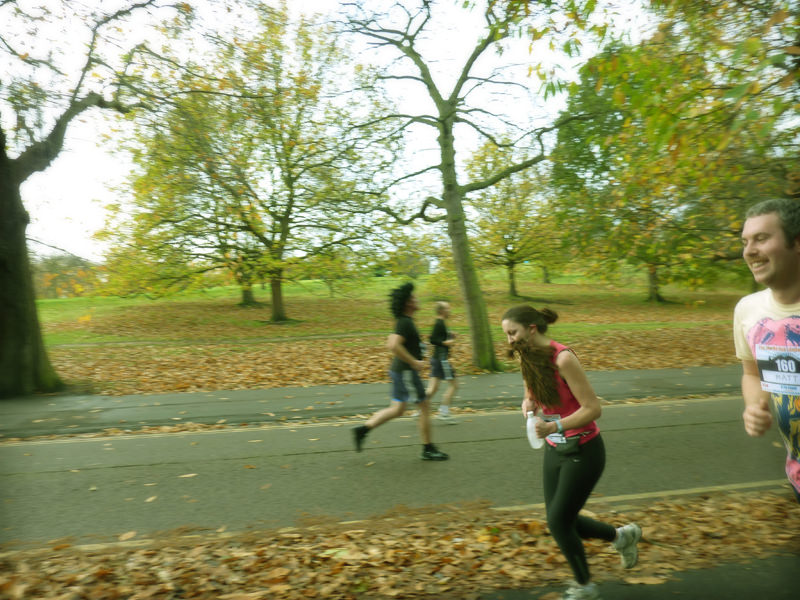
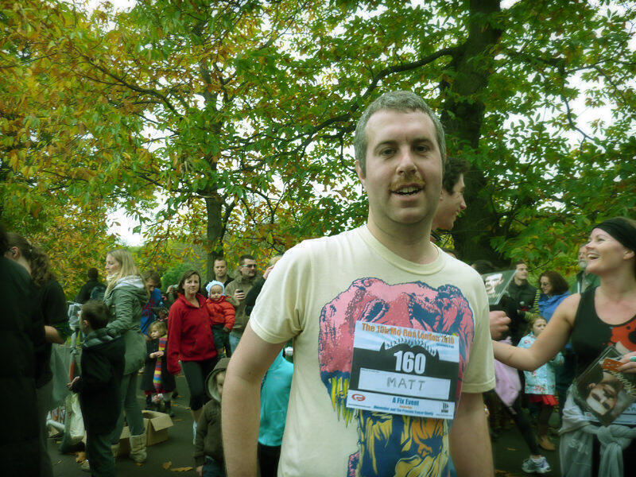
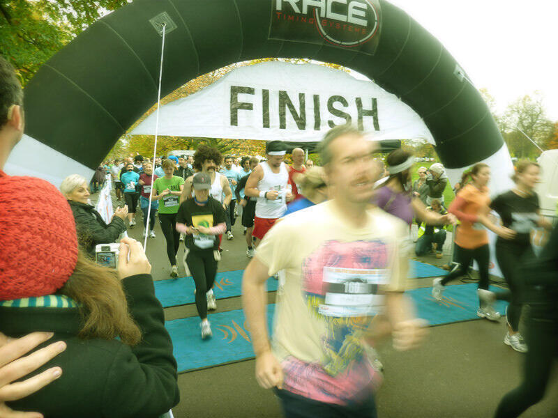
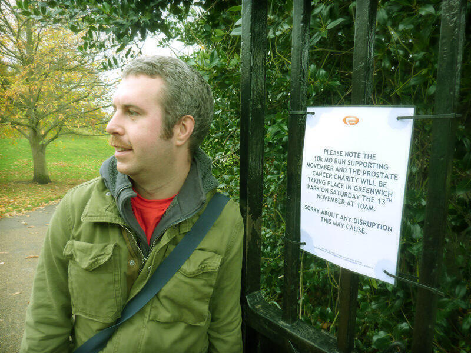

So, Saturday. Finally. The big day. Would I a) be able to get to Greenwich in time for the registration? and b) be able to make it all the way around the course without collapsing and crying?

Happily the answer to both questions was a resounding “Yes!” and I really enjoyed it. The weather was really good, especially compared to the two days before hand, and Marc came along to take some brilliant photos.

My time was 62 minutes according to the Mo’ Running website. This was 3 minutes less than the target I set myself back in August when I didn’t even have a clue what ten kilometres was like to walk, let alone run! It’s also about ten minutes faster than my previous attempts at 10K but some of those previous runs may have been over a slightly greater distance.

The course was more hilly than expected (despite a previous scouting mission!) but I found that most of the hills were at agreeable inclines that made it more comfortable to run. I’ve since been told that this can be the case if you have bad knees. I think this might be the case for me because my knees have been what have hurt the most during my training.

I found running in a group of over a thousand people to be a very fun experience and would recommend it! I did feel a bit gutted that some people in very silly costumes finished ages ahead of me - it is for this reason that I have redacted a picture of me crossing the finish line because [someone clearly dressed as Albert Einstein is relaxing against the railings obviously having long finished](http://www.facebook.com/photo.php?pid=15657264&l=d25a8ce551&id=666555246)!

Most of the way around I was comfortable, though at times I was a little incredulous at how little of the total distance I had done. It was  a fair course though because although the initial circuits were rather dull, they at least weren’t too hilly and moreover, the final 2.5 kilometres back down from the top of the long hill was pretty easy, save for the last hill!

I had raised £557.50 prior to the race from 34 sponsors, so I added another £34 myself. I originally had a target of £1000 but I am glad to have made 99% of my revised £600 target - given that this represents 60% of the original target.

As I have said already, the training has been a very worthwhile experience and I definitely intend to keep going with the training. I am still in two minds as to whether I will do another proper race but I definitely have at least two more charities that I would like to raise money for. Don’t be surprised if you see a new justgiving widget on the site in a few months time!

In the mean time, I obviously owe a great thanks to the people who ran with me: [Marc (who also took some nice photos)](http://www.marcbaguelin.eu), Sarah, Stefano and Ruth. Thanks are also due to Yoon, who got me out into Silkstream Park for a run in the first place. I’d also like to thank Emilia and AJ for advice on running. ([AJ’s tip from the Gambia](http://ajinthegambia.blogspot.com/) to rest after Tuesday’s run was particularly appreciated!) If you sponsored me then I am really grateful as despite the personal benefits to me of all the training, raising the money was really the point. Obviously it is difficult in these times for charities to raise funds and for you all to have been so generous has been genuinely staggering. Thanks!

