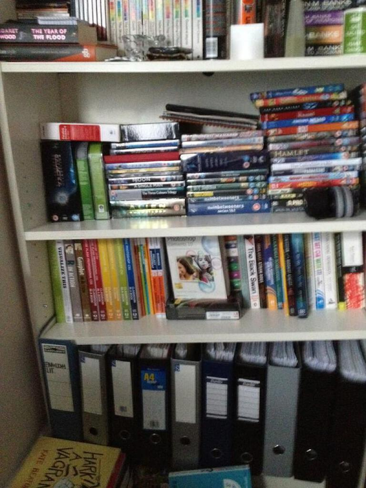

[Ages ago](j-g-ballard) I set out to write a post for each of JG Ballard’s novels. In fact it is the oldest post on this blog. Most of the novels (I don’t have the two autobiographical novels _Empire Of The Sun_ or _The Kindness Of Women_ and the late period novel _Milennium People_) are sat in a row on top of my broken bookshelf, part of the weight there that bowed outer frame of the unit and made the inner shelves collapse. Had I known that it would be a task unfinished nearly eighteen months later and destroy a piece a furniture that I did not yet own, I may have been less ambitious.

In the sequence of posts I reached [_Concrete Island_](concrete-island) back in June last year but the next in the sequence _High-Rise_ puts me off. It is the last of three rather gruelling novels that starts with [_Crash_](crash). Like those other two books I tried to read it when I was younger, but the world that Ballard wrote about in these books doesn’t really exist anymore (or rather the worlds that he writes about are no longer alternatives to the one we live in now) and this makes them difficult for me to fathom.

After _High Rise_ though, I know that things will get easier. I have already read _The Unlimited Dream Company_ and it is a great book. The novels after that one are all new to me but each strikes me as having an interesting premise, whether they all keep their more lurid elements in check remains to be seen.

The other thing that makes me reticent about holding forth on the Ballard novels again is that in writing about and researching the books I have come across a large number of people doing the same thing. They all seem to get it too. Compared to this I feel rather intimidated by the fact that I often find the books rather confusing - my mind boggles at the thought of people who can devour them and seemingly understand and memorise all the details. What I can delight in is the language used and with the problematic _High-Rise_ I may simply present some close readings of some sections of the novel. That way I can avoid reading too much of it.

The moral of this story is that it is probably better to read for personal pleasure than as an intellectual exercise. Well, duh! It seems incredibly stupid to type that now but there you go: you live and you learn.