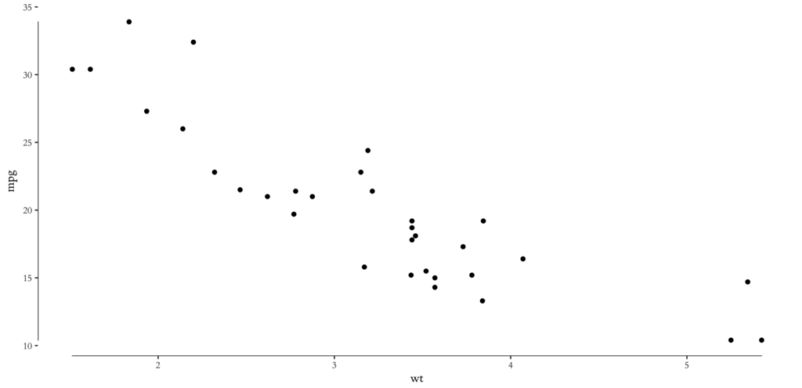

I love making plots in R with `ggplot`. However, there are always a few niggles that I forget about between plots. I wrote this post so that I have somewhere to look the next time I need to tweak a few things in my plots. I intend to come back and add updates in the future as I learn more things. If I keep coming back, I might also remember a few of these too.

## Axis labels
I'm always getting caught out by labels. How the heck do I change such and such to a larger font and so on? For most things the `theme()` function comes to my rescue. It's just a matter of remembering all the elements that can be altered. There are so many that there's no shame in forgetting a few. Thankfully [the documentation for `ggplot` is great]() and it's easy to find the relevant setting. It's worth bearing in mind that there are additional helper functions that *do* things in `ggplot`. For example, in the code:

```

ggplot(DF, aes(x=my_bars))
	+ geom_bar()
	+ theme_minimal()
	+ xlab("My x axis")
	+ ylab("My y axis")
	+ theme(
  		axis.text = element_text(size = 16),
  		axis.title = element_text(size = 16))
```

`axis.text` refers to the axis labels and `axis.title` to the axis titles. The `element_text()` tells `ggplot` to alter the text. Here we set the size to 16pt but you can also alter the font, the weight, the colour and so on. Another such helper function is `element_rect()` to which you can pass properties you want for the background rectangle. See further down this post for an example.

One more source of help is [`cookbook-r.com`](http://www.cookbook-r.com), which has lots of practical advice, particularly for all those fiddly legend alterations and custom colourings.

## Look and feel.
Quite a few themes have popped up in recent years as `ggplot` has become almost the default form of R graphics. It's not essential but I thought I'd share a few of my favourites. From the themes that come with vanilla `ggplot`/`tidyverse`, my favourite is `theme_minimal()` even if it is a little dour.

Because of this blog's current theme I am often using [the `ggthemes` package](https://github.com/jrnold/ggthemes), in particular `theme_tufte()` to match with my jekyll theme. However, I do need to use one of a couple of tricks if I want to use the figures on this blog. One way is to alter the colour of the background to match this site. The other is a transparency trick that I'll point out later on.

This week I also came across [the `hrbrthemes` package](https://hrbrmstr.github.io/hrbrthemes/), which also has a neat style using Google's ubiquitous Roboto Sans font. As an added bonus the package also includes a spellchecker that makes sure you've spelt your titles and labels correctly. Check out the examples, they look pretty smart.

Other fun theme packages worth investigating include [`gg_sci`](https://ggsci.net) (themes based on science journals and science fiction shows) and [`gg_tech`](https://github.com/ricardo-bion/ggtech) (themes based on tech companies such as Airbnb). The latter package's Twitter theme fits well with the colour scheme of the council's official slide deck so I might use it at work in future.

## Exporting transparent graphics.
I think that exporting graphs with coloured backgrounds to match this website is a reasonable workaround but the best approach is to export `png` files with transparent backgrounds. A quick search of stackoverflow [brings up the following commands](https://stackoverflow.com/questions/7455046/how-to-make-graphics-with-transparent-background-in-r-using-ggplot2#7455481):

```

p <- p +
  theme(
  	# bg of the panel
    rect = element_rect(fill = "transparent") 
  )
p

ggsave(p, filename = "tr_tst2.png",  bg = "transparent")
```

where `p` is a previously created `ggplot`. This approach sees the `theme()` function ride to the rescue again.

