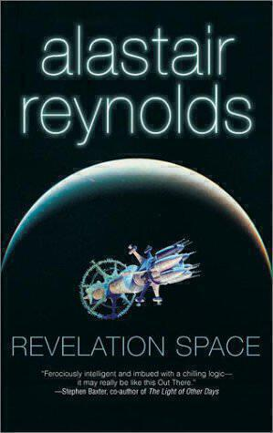

[Alistair Reynolds'](http://approachingpavonis.blogspot.co.uk) 2000 novel "Revelation Space" has long been in orbit of my science fiction "to read" list, but it wasn't until one sleepless night (post ["Command and Control"](command-and-control)) that I came across it in Ingrid's audiobooks. I was instantly drawn in as I listened to the opening scene about an archaeological dig facing evacuation ahead of an imminent 'razor storm'. 

"Revelation Space" is [hard sci-fi](http://www.sf-encyclopedia.com/entry/hard_sf) set in a universe where the speed of light cannot be exceeded. Most of the action takes place in the 26th century, with the narrative also recounting earlier events as the story progresses. Humanity has expanded to five or six systems beyond our current solar system, using huge colony ships that travel at 99.9% of the speed of light. This means that [relativistic effects](http://science.howstuffworks.com/science-vs-myth/everyday-myths/relativity10.htm) play an important role in the narrative. A lot is made of the difference between sleeping away the decades between star systems and subjectively experiencing them.

Initially the action takes place in three separate strands[^1]. One takes place on the planet Resurgam, orbiting the star [Delta Pavonis](https://www.universeguide.com/star/deltapavonis), which is where the archaeological dig that opens the novel takes place. This introduces us to the central character Dan Sylveste and an AI simulation of the consciousness of his father Calvin. Resurgam is in the process of being terraformed and is essentially a wild west colony. Dan is the colony's leader, at least he is as the novel opens...

Next we meet Ilya Volyova[^2] who is one of a triumvirate of officers controlling the 'lighthugger' *Nostalgia for Infinity*. The captain is sick with a nanobot infection called the melding plague. Not only that, her gunnery officer is deranged and trying to kill her. The descriptions of the ship are absorbing and finely imagined, much like [the ships in Iain M. Banks' culture novels](favourite-culture-ship-names). 

The final thread takes place on a planet called Yellowstone in the [Epsilon Eridani system](http://solstation.com/stars/eps-erid.htm). Yellowstone is one of the earliest post-Earth colonies, though inhospitable conditions mean that little of the planet is colonised. The way the worlds are described and the various adaptations to the geography fired my imagination. The main settlement on the planet is Chasm City[^3], which was once the height of civilisation. The entire structure of the settlement was once controlled by machines that also fell victim to the melding plague[^4]. In this milieu we meet Ana Khouri, who is a hired assassin involved in Shadowplay - a sport made by the decadent rich of Yellowstone who attempt to avoid their assassin for the set length of a contract. However, not all is what it seems.

I enjoyed "Revelation Space" and hope to read more books in the series. The world building is absorbing and imaginative, with many parallels to other great works of science fiction. The writing itself is great, full of unusual and evocative descriptions of weird and unknowable phenomena. I think listening to the audiobook made me notice the quality of the writing more and I do wish I had a physical copy that I could mine for quotes. On the other hand, some of the plotting of the story is a little woolly. At some points very obvious things happen and you're waiting for a particular section to be over, while other points could have been better explained. Perhaps this is again a function of listening to the book rather than reading it, you get more time to think about where things are going.

The vision for humanity's future presented by "Revelation Space" is interesting, building on both humanity's best and worst traits, and the novel itself is about the central question of "what else is out there?" More importantly, it preoccupies itself with the [Fermi paradox](https://en.wikipedia.org/wiki/Fermi_paradox): if there should be lots of life out there, why can't we see any? There are all sorts of possible answers to this question (which is what makes science fiction such an interesting genre) and the one put forward in this novel is certainly entertaining. The novel ends with things still happening, so I look forward to seeing how things develop in the sequels.

[^1]: All of this might seem like spoilers, but I'm only covering what's in the first two chapters or so.
[^2]: I love the way that Jon Lee, narrator of the audiobook, pronounces the name *Volyova*. I keep repeating the name aloud to myself. A large part of my enjoyment of "Revelation Space" was the excellent audiobook performance.
[^3]: The subject of the sequel that I will definitely investigate.
[^4]: So early on you can see the effects of subjective and calendar time at work.
