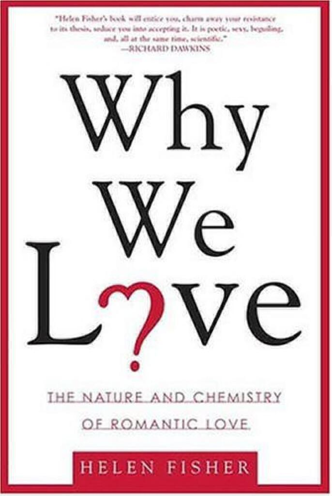

As indicated by my [reading list](articles/reading-list-mid-april-2012) posted a couple of months ago (which has since been added to [here](articles/another-reading-list)), I’ve started to try to read more about the things that I felt that I did not understand so well. Most notably perhaps is this book “on love” by Helen Fisher. Lest there is any innuendo it is not a book about technique nor does it attempt to explain love to those who have never known it, instead it assumes that we have all been there. In fact, the book attempts to explain the neurological mechanisms of love (specifically romantic love) and describes how science has helped reveal these mechanisms to us.

I have long been intrigued by such matters. As an undergraduate I lived as the sole atheist in a bunch of people who were very active in the Christian Union. In our debates, pity was often expressed toward my wholesale belief in science (with, funnily enough, very acknowledgment of my _faith_ in science) precisely because of how they saw it to be demeaning of emotional concepts like love. The story goes that if you are in love with someone and God didn’t make you, and that if instead the person who loves you only ‘loves’ you because of the chemicals that are flooding their brain, that feeling is somehow false and invalid.

This book does a pretty good job of shooting a hole right through that nonsense. I can hear some from the back who might say that I should not have let such spurious talk bother me but I did often approach the same question from a philosophical point of view: if our brains are just (peculiar) meat then why on earth do we feel sensations like love that are so outside of our common-place experience? You have been there, you know that amazing sense of security and sense of purpose that comes from love (and again, specifically romantic love). Well the answer is obvious: to trick us into the rather risky but biologically essential practice of farting out babies.

There is a great chapter of this book that concerns experiments under [fMRI](http://en.wikipedia.org/wiki/FMRI) that show which brain regions are involved when we think about the people we love, both those we have won and those we have lost. I appreciate that the brain is the organ that science knows least about but the evidence presented is very persuasive to the lay reader. This evidence is supported by a questionnaire conducted across different cultures and age groups that points to a pretty consistent human experience of romantic love, this goes some way to showing that while some social conventions can have a superficial impact on the personal experience of romantic love, there are a number of commonalities that we all share.

Answering those nagging doubts about whether emotions are real or just a ghost in a machine was not my only motivation for reading this book. I think I was also searching for validation of my own experiences and specifically why there is one particular person that I cannot seem to get out of my head. I did not find those specific answers and of course I was naïve to think that I could. Nevertheless, this is an interesting and humane book that discusses many aspects of love (both the good and the bad) in a calm and supportive way. I think if we were all to be more aware of the issues raised in this book it may help us to be more compassionate to one another.

At the same time, I have read “The Happiness Hypothesis” by Jonathan Haidt, a book that seeks to explain how ancient wisdom and modern psychology can come together and help us to be more happy. As a spoiler I shall say that this is an excellent book and I shall be writing a post about it in due course.