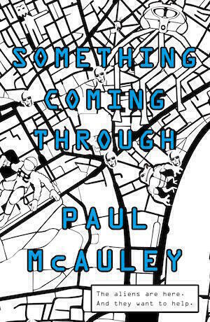

"Something Coming Through" is a science fiction novel set in the near future. A few years after a brief nuclear war known as "The Spasm", an alien race known as the Jackaroo introduce themselves to humanity. The novel is funny, thoughtful, and politically charged. I found it to be a good read.

The aliens have given humanity fifteen "gift" worlds and an automated way to access them. Think of the Docklands Light Railway but with space shuttles. These worlds contain artefacts and remnants from their previous occupants. Movement between the worlds has also changed the Earth: it suffers from incursions by invasive species brought back from the other worlds.

The action in the novel takes place in two strands. One strand starts on Earth. Chloe, an anthropologist working for an innovation company called Disruption Theory, tracks an "outbreak" of a cult caused by bizarre alien technology. Meanwhile the other strand takes place on Mangala, one of the gift worlds. A policeman named Vic investigates the murder of someone just arrived from Earth.

The enigmatic Jackaroo seem a little too cool for school. Could it be that they aren't entirely in control of events? Or that they aren't who they seem to be? Not everyone welcomes their presence and this complicates Chloe's mission. Part of the action takes place in a parliamentary hearing, with a UKIP-style politician attempts to grill a Jackaroo (the understatedly named Bob Smith) about their intentions. It feels like an unashamedly British take on sci-fi, reminiscent of the old classics by the likes of HG Wells and Arthur C. Clarke - but with nuances of more modern sci-fi by writers like William Gibson also mixed in. (Speaking of William Gibson, I really must finish "The Peripheral" one day).

Meanwhile, the sections on the alien world fuse hard-boiled police drama and hard SF, exploring the way that we would no doubt bring our earthbound dramas and foibles to any new paradise given to us. Science Fiction commonly uses the private eye. Nerds love genre mashups, but also the private eye provides an interesting viewpoint for the reader. The author can use the hypervigilance of the character to introduce readers to the strange new world. Personally I preferred the sections with Chloe, as I felt she was the more interesting and less stereotypical protagonist.

Eventually the two stories converge and the novel runs out of steam a bit when this happens. That said, I thought the lag of one story behind the other in time made for interesting shifts in perspective. A sequel already exists - called "Into Everywhere" - and a lot of "Something Coming Through" builds up the world and sets the scene. While the culmination of "Something Coming Through" gets rushed, it does feel like it sets things up nicely for the sequels.

My paperback includes the first chapter of "Into Everywhere". I thought it was great and better written than most of "Something Coming Through". It felt more assured, perhaps by establishing the world in "Something Coming Through" McAuley will write something mind-blowing for the follow-on. With some interesting characters and settings left open in the first book, it will be interesting to see where the series goes.
