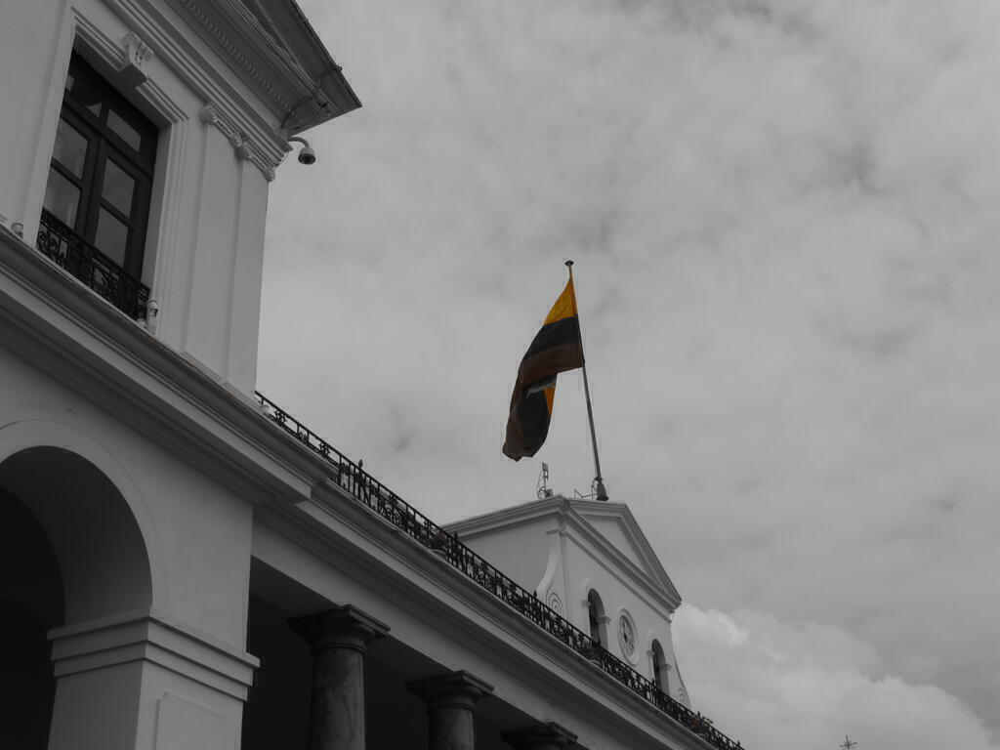
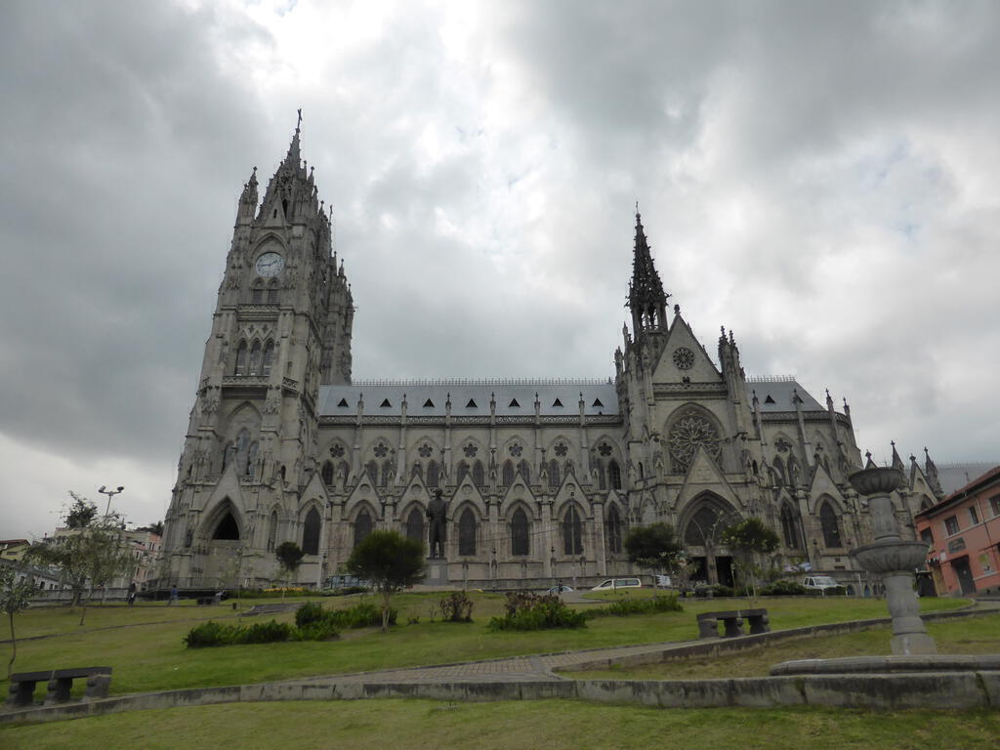
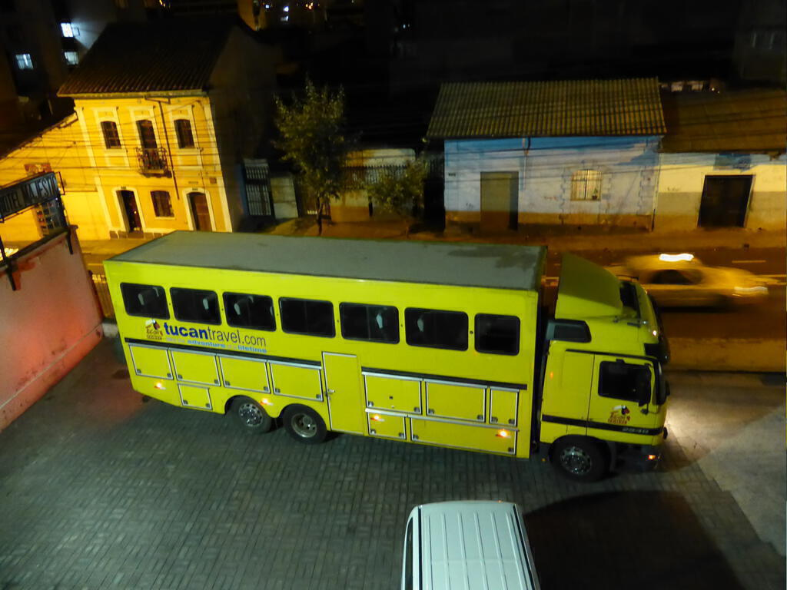

By the time this goes up, I will be at least a week in to my South American tour. I flew out to Ecuador last Thursday (the 21st) and ended up being awake for more than twenty four hours. My flight left London early and I had a three hour stopover in Madrid, then a twelve hour flight onward to Quito. My bag didn't leave Madrid though, so we were separated for about twenty four nerve-racking hours. Luckily, I'd packed a change of clothes and so I was still able to explore Quito with Lee and Miriam (fellow Tucan travellers) the next day without too much discomfort.

Quito is an interesting city crammed full of crazy drivers. From the taxi from the airport and beyond, my time in the city was mostly defined by the sound of car horns. It's mostly just the tendency to use the horn to let people know that they are there, which is a bit different to those of us are used to it being used in anger. To some extent, I considered getting beeped a sign of getting acclimatised to the city and once I'd got used to the traffic flow (i.e realising for the fifteenth time that day that the traffic goes along on the _right_...) I was ducking and weaving with the best of them.

On my first full day, I went with Lee and Miriam into the city and explored the old town. It is full of colonial architecture and painted all sorts of different colours. With no expectation of what it would be like, I enjoyed the whirl of new colours and sensations. From people selling anything and everything in the streets to the various churches that we ducked into, it was a completely new experience for me. A nice find was a museum of Pre-Colombian art with a collection that surpasses any I've seen up until now, with lots of beautiful pieces that sum up tribal life - bowls, statues of shamans, etc - not to mention a lot more sexually explicit material than you'd see at the dear old British Museum - no Victorian-era chipping off of phalluses in Ecuador!

The churches were interesting too. We went into four and the range of stylings of various aspects of the churches was very curious indeed. I don't pretend to be an expert on Catholic churches but you tend to get a massive ornamental central nave leading down to the main alter and along the sides you get individual stations of prayer to particular saints. It was the upkeep of these stations that was of greatest interest, as in some of the churches they were being filled with all manner of chintz like helium balloons, kewpie dolls and LED lights. Even in the Basilica we giggled as we saw an "LED Jesus".

Later that evening, we met our tour guide Neinke and the Tucan travel vehicle (a truck, definitely _not_ a bus!) arrived at the hotel. I haven't said a great deal about the hotel and perhaps it's better not to! I think the only reason Tucan use them is because it is close to the centre of the city while having somewhere secure to park the truck.

On my second full day (this was the first day of the tour but this only featured a meeting at around 6pm) my bag had arrived, so after I packed my rucksack, we walked up to a cable car up at the top of one of the hills around Quito. It was tough going and I certainly felt the effects of altitude as we went. Quito is at about 2400m and the volcano at the top of the cable car is at 4100m - so I think we climbed about 900m on our walk and I certainly felt the last fifty or so! The weather plays a massive role in how good a view you get from the cable car and the viewpoints at the top. We were lucky enough that - although it was rather misty - the cloud did at least come in and out so we could see the sprawl of Quito down below. It was at this point that I realised just how massive Quito is (there's only one other really large city in the country), a huge conurbation that sprawls over all the available space. (To be fair, I'd had hints during the long taxi ride two evenings earlier.) At the top there was also a little chapel, allowing more observation of how communities influence their churches in this country - this time we noticed that large pieces of artwork had also become a collage of photos inserted behind them. I certainly felt the effects of altitude at this point and I think we all did, as we ordered a taxi onward to our next destination.

This was "Mitad del Mundo", the line of lattitude that runs around the middle of the world. There are two places that you can visit in the area: one features a big monument, lots of flags, and lots of restaurants with proprietors begging you to come in; and the other is a smaller place that focusses on the native culture of the region and on the scientific experiments that can only be done at the equator. While the former is good for snaps and looks impressive in the sunshine, it is much better to venture two hundred metres up the road to the Inki Solar museum and go for one of their tours. We were a bit short on time, which was a shame as there was a lot more to see and our guide (Carlos) had a lot of interesting demonstrations. I have a video that I will put up on the site when I get back.

That evening we met everyone on the tour. There are six of us doing the whole six months, while the rest leave later on - most after three months at Rio. Some more people will  join us in Lima for the section up to Rio and perhaps even beyond. At the moment there are eighteen people on the truck. As you might expect the majority are Aussies and Brits, but there are also Belgian, Dutch, and Canadian travellers with us. It's a nice age range too, some retirees along with people of typical travelling age, which seems to be late twenties for women and late thirties for the guys. I think I am pretty much the only "virgin" tourer and from my conversations, there definitely seems to be a "travel bug" (is $R_0>1$? - we'll find out on this tour!)

To be continued...

