[Picking up where I left off](/2014/05/south-america-trip-part-9/) at Machu Picchu, we headed down into Aguas Calientes (trans. “hot waters”) by coach and by the time we got there it was torrenting down with rain. So much for exploration. We waited out the downpour in a pizza place and deliberated over whether to buy souvenier snaps from the tour guides. Ironically for a town named after hot waters, it was bitterly cold. One of those places where the sound of running water follows you wherever you go, the best thing about it was the huge trains that ran down the middle of street - big clanking hulks pulling huge passenger trains.

We took one of those trains back to Cusco, though darkness fell about 30 minutes in. Enough time to see the rain’s effect on the Urubamba river, now a raging torrent filled with peculiar eddies and whorls. I fell asleep to the sound of my mp3 player despite the piped in Peruvian music and the coach being as bright as day. We transferred back to Cuzco in a stuffy coach that smelled of feet. I can’t even remember going out to dinner once we got back: I’m not certain that I did. All I remember is washing about a week’s worth of dirt off me in the shower.

The next morning we were up and off to Puno. This involved a transfer complete with Men At Work’s “Down Under” blaring out, a stern talk about drugs from our new driver, and another trip through the delights of Juliaca.

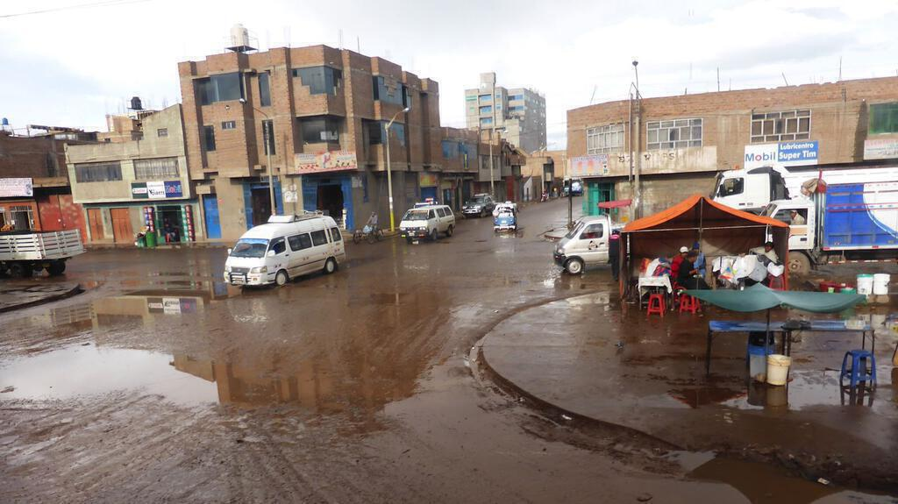

Puno doesn’t look like much, save for the fact that Lake Titicaca is so huge you’d be forgiven for thinking that it was a seaside town. Another transfer and we were in another reasonable hotel. I dropped in some laundry and we went to the markets to buy fruit for the families we were due to stay with on the Uros Islands in the middle of the lake. Despite not being that pretty, Puno is nevertheless an interesting place. Perhaps because it is “close” to the border with Bolivia, there are loads of electronics shops. There is a real mania for massive speakers. And then, on the way to the markets, a huge procession of chaps in bowler hats comes marching by. 

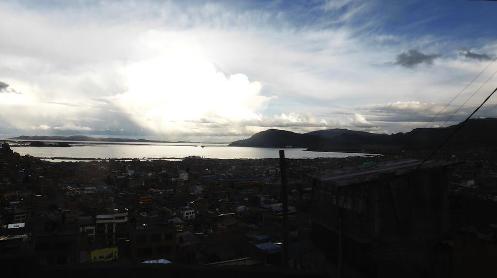

Because it is close to Lake Titicaca, Puno does at least have some nice restaurants and we settled in for a nice dinner. I headed back to the hotel early because I was tired and the next day I felt the same so I signed off the tour with the intention of resting for the day and heading out to the reed islands the following day. Two fellow travellers Maz and Luke did  the same because Maz was sick. The three of us booked a boat trip for the following day and had dinner together before we snuggled up to watch the recent Doctor Who specials on their laptop. Never underestimate the power of a day of doing nothing that culminates in watching the Doctor.

The next day I felt much better and Luke and I (unfortunately Maz was still unwell) took our trip out to the reed islands. We’d had the opportunity to go out to more islands and be back by six but had instead opted for a shorter trip that meant we would be back before lunch. As it happened this turned out to be a pretty good idea. More on that later.

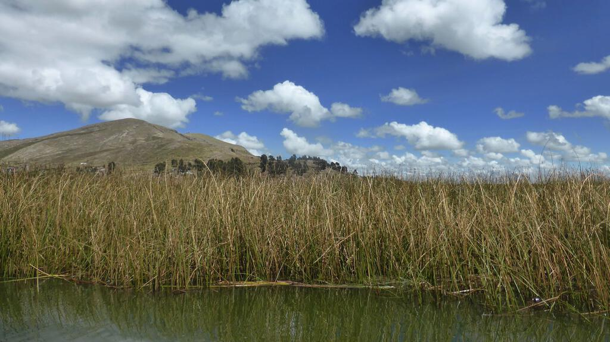

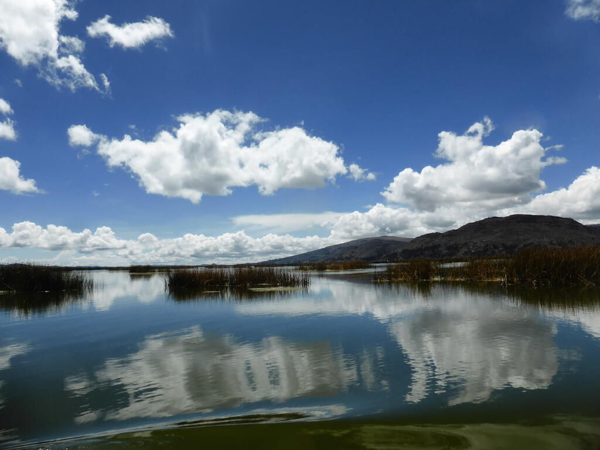

It was a fine sunny day and we headed out to the islands to meet the locals who explained the construction of the reed islands. These were not people who had always lived this way, the reed islands are very much a post-colonial invention by people seeking to escape the genocidal Spanish[^1]. Nowadays families still live on floating islands on the lake and make most of their living from tourism. The islands have to be constantly regenerated with new reeds and you can certainly smell them rotting. Nevertheless thanks to solar panels it is at least possible to watch TV! 

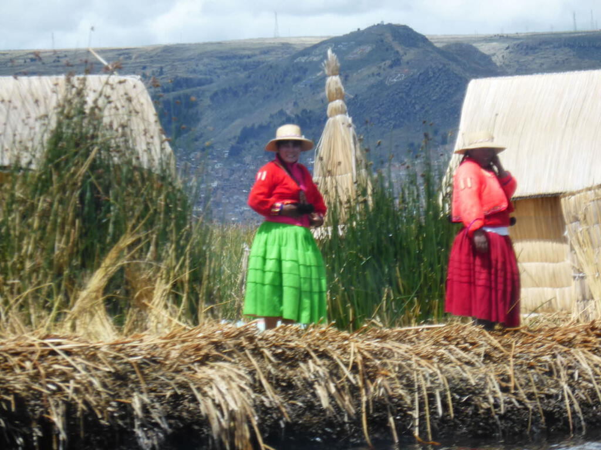

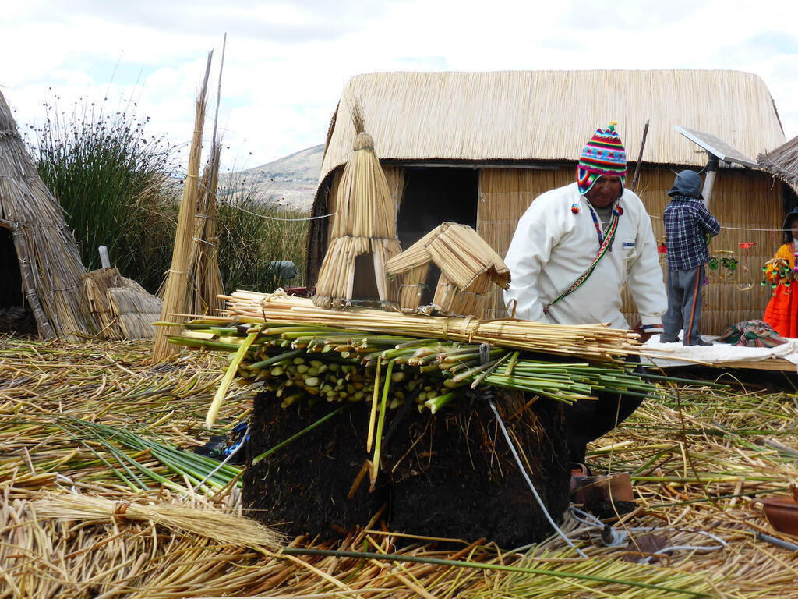

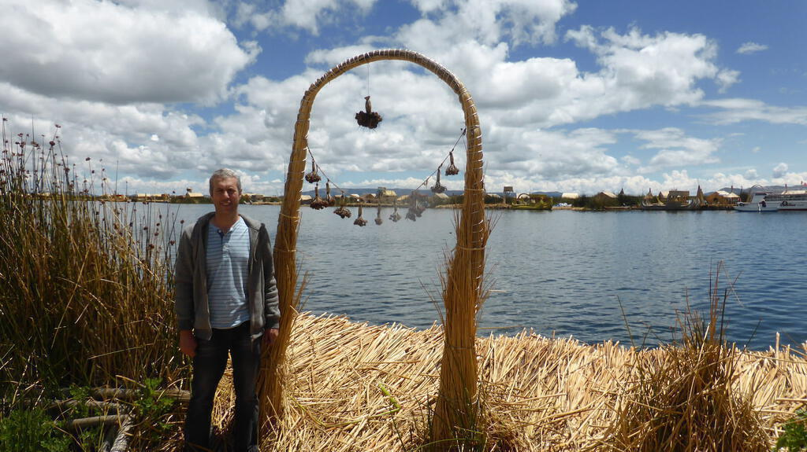

We returned to Puno with no sign that the weather was about to change. We checked in on Maz, collected laundry, bought a birthday present for Jerry, went to lunch and had pizza. All this before the remainder of the group got back from their homestay. Almost as soon as they had, a great storm came in with great buckets of hail. And several power cuts. We sat in the candlelit lobby and drank chamomile tea. The hotel was on an incline, so we could see the streets flooding into streams and then hail began floating past too. 

We were told that Puno was our last chance to eat cuy (guinea pig) as it would no longer be served once we reached Bolivia. I declined the chance - I’d arrived as people received theirs and to be honest it did just look like a greasy dead rat on a plate, so I opted for chicken milanese instead. 

The next day we headed off for La Paz via Tiwanaku. The border crossing was very easy, lots of form filling but very little drama. Between the border and La Paz, lake Titicaca seemed to stretch all the way, a vast inland sea.

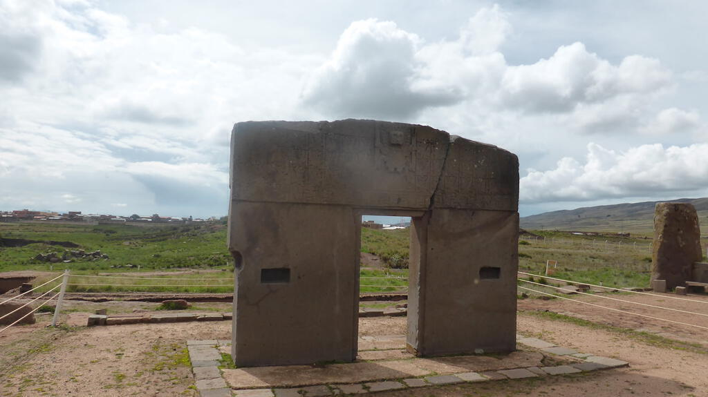

We stopped off at [Tiwanaku](http://en.wikipedia.org/wiki/Tiwanaku), a vast pre-Colombian pre-Incan archeological site that we had to tour in a hurry due to being a little behind schedule. This was another place I’d seen in the [“Lost Kingdoms of South America”](http://www.bbc.co.uk/programmes/b01pyfwc) TV show that had inspired me to take the trip in the first place. ([Here’s a clip about Tiwanaku on the BBC website.](http://www.bbc.co.uk/programmes/p013qqb8)) It was very strange and yet somehow because we were rushed, I didn’t feel like I got as much out of seeing it as I did Ingapirca or Chan Chan. One to go back to I think.

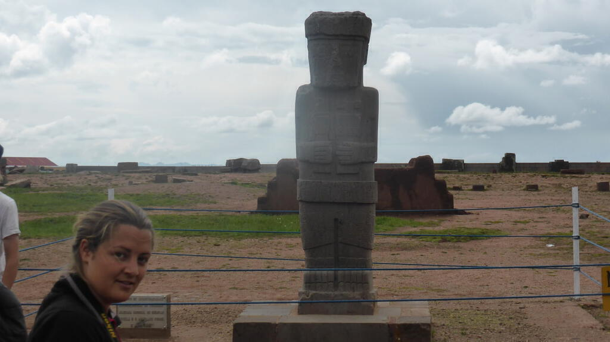

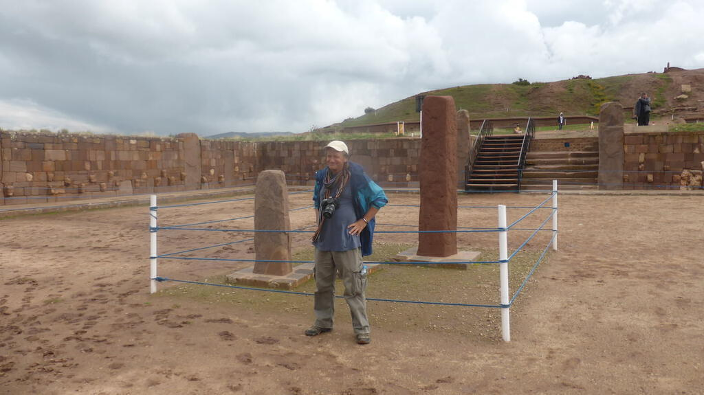

Back on the truck we arrived in La Paz shortly before dark. We saw figures hanging from the lampposts, it was rather sinister but they are in fact tokens that are set on fire at midnight on New Year’s Eve to burn away the bad things that have happened in the previous year. No more weird than Guy Fawkes dolls but rather creepy when you see them without knowing what they are. We actually got a bit lost and drove through a market teeming with people selling all manner of goods, it was great to see everyone’s reaction to the truck. I especially liked how young children got incredibly excited and would wave.

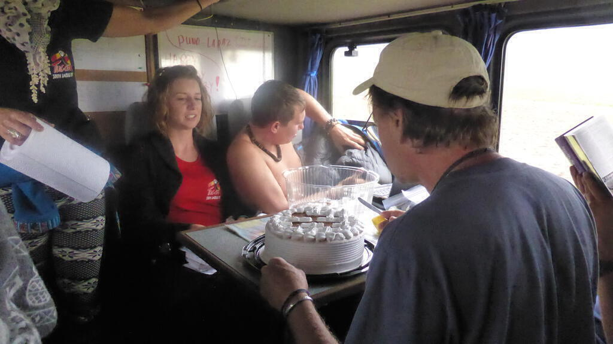

We transferred to the hotel in La Paz on what we affectionately referred to as the “death bus” (theme tune remarkably similar to batman). Our hotel room had been the site of a recent 50th birthday celebration and had been, shall we say, lightly cleaned in the interim. Nevertheless we headed out to a dutch cafe called Sol y Luna to hear a presentation about cycling down the death road. I decided that it was not for me - at least not with another four months or so to go, I didn’t really want to break any limbs until I was almost due to fly home! I had an amazing ghoulash for dinner, probably the best thing I’d eaten since Heidi’s in Cuzco. 

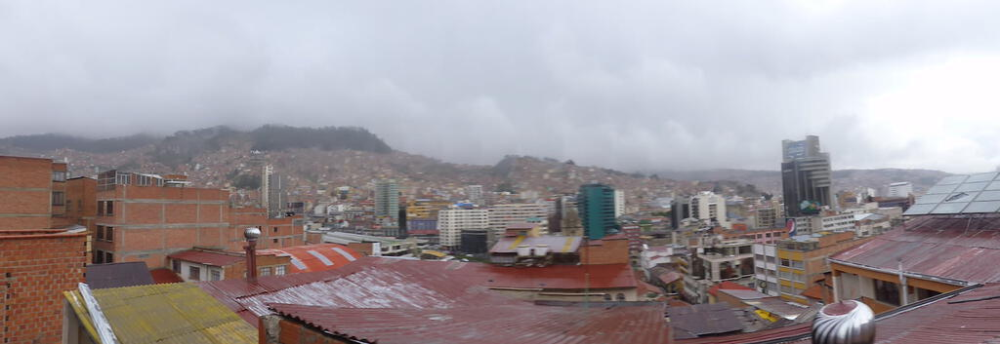

On Saturday (New Year’s Eve), I explored La Paz with several people from the truck who had not gone on the death road bike ride. This included wandering through the witches’ market with the weird dessicated animal embryos hanging in the roof (people bury them under houses to bring luck) and bizarre boxes of alleged powders and potions (the majority of which were concerned with endowing sexual prowess). 

La Paz is pretty much crammed with market stalls all along the streets. As with most South American capitals, the old jostles with the new, the rich with the poor. We had been warned that La Paz was dangerous but I saw little that worried me. I also went with Jerry to the contemporary art museum, which was fun, though the art seemed to be more surreal than contemporary. That said, there were some tempting pieces for sale and had I been on sabbatical I probably would have bought one. Again, something to do next time around.

For new year’s eve, we returned to Sol y Luna and partied with the Dutch until well past midnight. I had a good old dance (one of only a few times that I did on the whole tour, to my shame) and really enjoyed myself. I got up too late for the hotel breakfast (as did everybody else) and so we went looking for food elsewhere. It took a while to find a place that was actually open (so much so we ended up back at the same place for dinner later on in the day) and we settled in for various sandwiches and in my case a virtuous bowl of meusli and fruit yoghurt[^2].

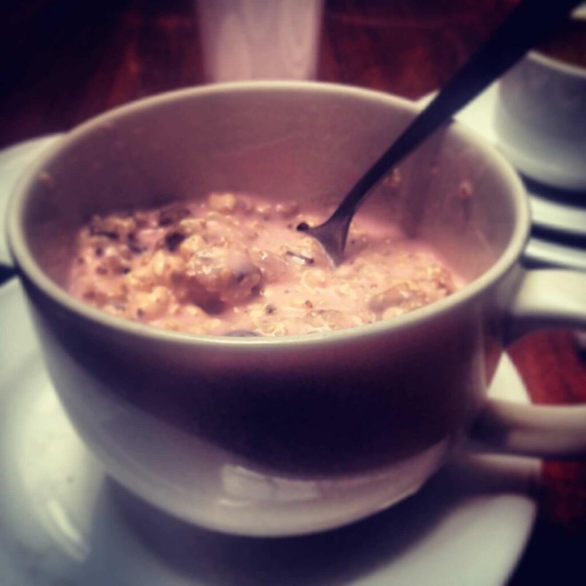

It was wonderful to be somewhere different for New Year’s Day, and with four months of the tour ahead of me I didn’t feel like I had to make any resolutions. I felt good in La Paz, like I was finally getting to grips with the adventure. Not that there was actually much adventure to be had that day: La Paz on the 1st of January was totally dead. The bustling jostling market stalls of the day before were practically empty save for a few DVD hawkers. It was even difficult trying to find somewhere to have a coffee. Not that we minded, most of the afternoon we sat in the hotel lobby and watched the Bond movie “Quantum of Solace”, which is partly set in Bolivia (though it was shot in Chile, much to local chagrin).

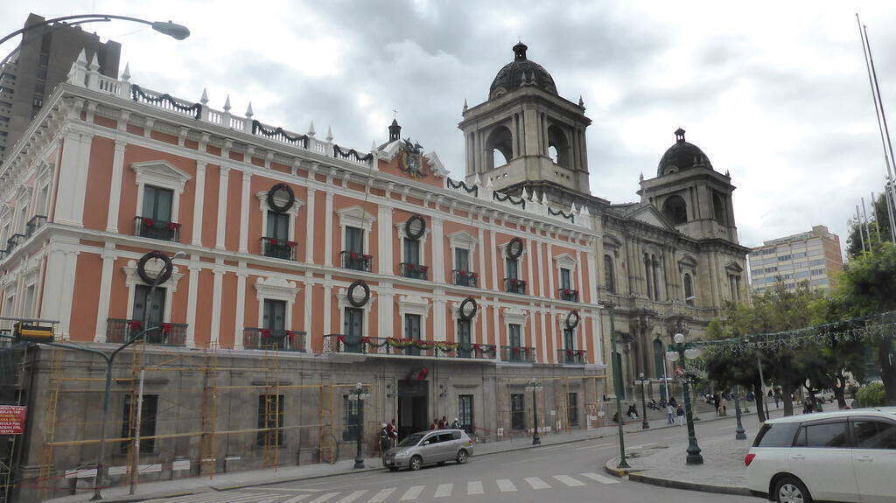

After our peregrinations and feeling the effects of the night before, we went to bed early ready for an early transfer back to the truck. The next stop on the tour would be a high point, literally: the high altitude mining town of Potosí.

[^1]:	Note that the Spanish would not overtly kill the natives but ‘recruit’ them for almost certain death in the silver mines around Potosi, more on that in part 11.

[^2]:	Not *too* virtuous, you can just about make out the enormous cup of coffee in the background!