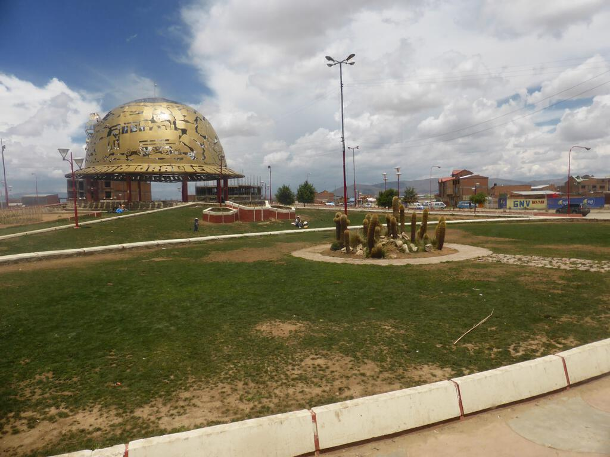
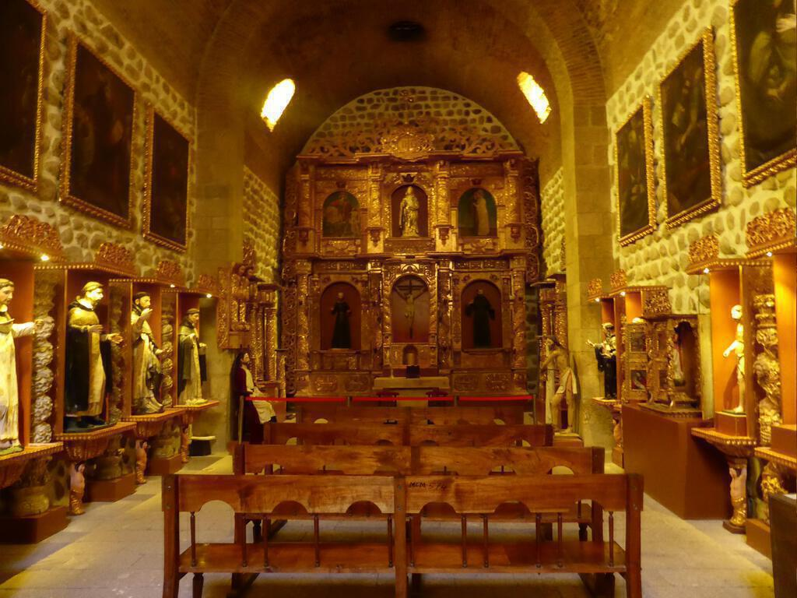
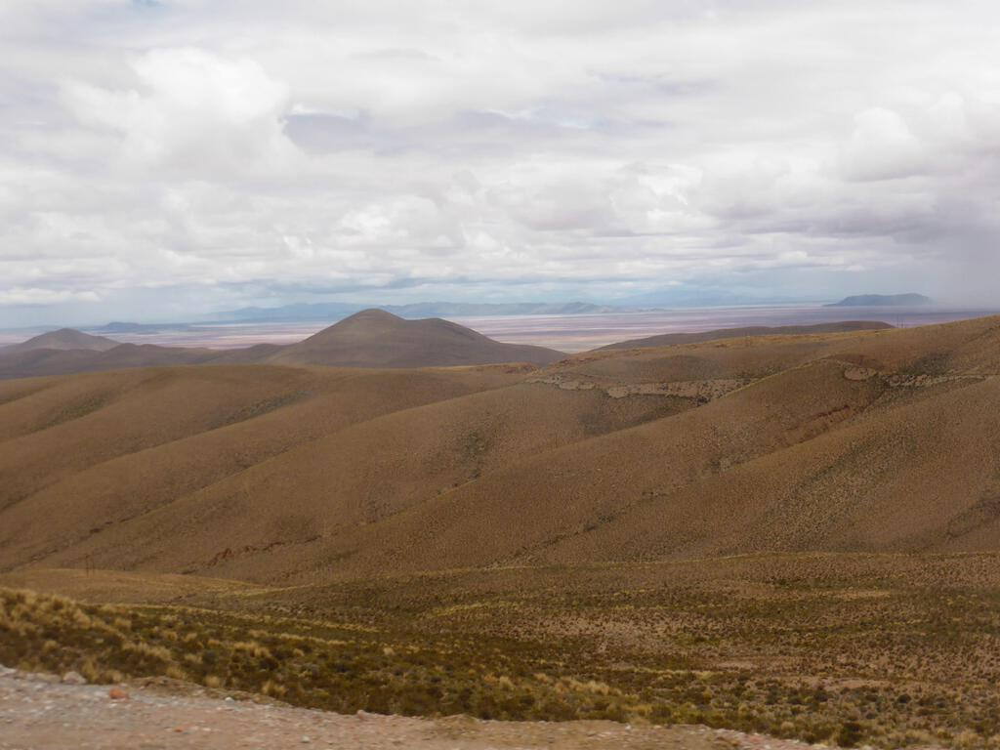
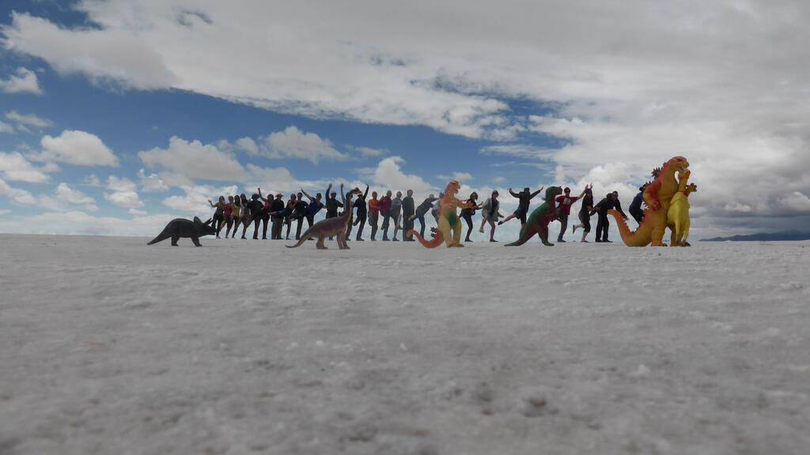

## La Paz to Potosi

We left La Paz, this time ascending the rim of steep hills around the city in a slightly less clunky "Death Bus". Perhaps it was because we were travelling uphill or because it was daylight, but it didn't seem so bad.

We set off to Potosi through strange towns with weird monuments (see the pictures) and [Oruro where great festivals happen around Ash Wednesday each year](http://www.lonelyplanet.com/bolivia/the-southwest/oruro/travel-tips-and-articles/76305) that are famous throughout the continent.

We had lunch by the side of the road just after Oruro. We had a strange fruit from La Paz for dessert: I have a picture of the outside but I can no longer remember their names. Inside, the fruit had red flesh and quite a few pips. It didn't taste particularly sweet, it was a bit tart but not too bad.

We got in to Potosi quite late. I made lots of attempts to snap the imposing countryside - including the Cerro de Potosi. This was the highest point of the tour. The advice is to avoid alcohol because it's so high up but a few of us did and it just felt as though you were drinking while very tired. The altitude didn't really affect any of us, unlike in Quito and on the Inca trail where some of us suffered a bit.

## Potosi

The hotel was one of those built around a central atrium and it rained heavily during the night, a clattering sound on the glass roof. It was a pretty place, certainly one of the better places we stayed in Bolivia.

The next day, after breakfast in a strangely greenhouse-like dining room on top of the hotel, we took a trip to the mint museum. It tells the history of the town and story of the mining operation in the hills around it. As I alluded to in my post about Lake Titicaca, the natives for hundreds of miles around were swept up into the mines and worked to death for silver. At that time almost all Spain's silver came out of the mines of one mountain - the Cerro de Potosi. The work was difficult and dangerous, and if they weren't injured then silicosis would eventually kill them. The conditions were terrible. The average life expectancy was about six months.

The sad thing is that people are still mining the mountains in the area and conditions are barely better. Later that evening we watched a heartbreaking documentary at the hotel about children struggling to make a living from the near-depleted mines. And of course it's not just Bolivia: almost everywhere that minerals are mined, children are exploited.

You can go on mine tours too. I opted not to as I already feeling a bit down (the week or two after the visit to Machu Picchu were a bit of a come-down really). A few people went and said that it was a depressing experience.

After insisting on a quick coffee and a lemon pie, we set out to find the famous flying saucer café but got halted by rain and general difficulty in finding a good walking route to get there. It was probably closed, like almost everywhere else. Potosi is a bit depressing in the rain (where isn't?) and because it was early in the new year, there weren't a great number of places to eat that were open. We ended up in the same place for both evening meals but not for the lack of trying!

## Uyuni and the salt flats

The next day we headed out for Uyuni and its salt flats. We made it in good time as the Bolivian government have invested in new roads for the area as it now hosts one of the legs of the [Dakar rally](http://www.dakar.com/index_DAKus.html). The trans-continental race was moved to South America a few years ago under the threat of terrorism and now thrives there. No longer intercontinental, it takes a different route each year through two or three different countries. The 2014 route was from Rosario to Salta (both in Argentina) to Valparaiso (in Chile). The section through Uyuni was only for bikes and quads, the participating cars and trucks had to make do with Salta (more on which in Part 12). Nevertheless the Dakar rally brand was everywhere in Uyuni, just one more bit of merchandise for the hawkers. (And apparently the reason for there being no internet, they were upgrading the cable ahead of the race... apparently)

Uyuni is a military town and the hotel was right next to a military base. The first morning there I listened to a drill taking place while I was in the shower. The hotel was also partly a pizza restaurant apparently famed for being the best pizzeria in South America (Minuteman Pizza). I'm not sure this was the case, it was pretty good but I just used it as an excuse to have pizza for dinner two nights in a row.

On our full day in Uyuni we took a trip out in jeeps to visit the salt flats and the train graveyard. We had dinosaur props and all sorts ready to emulate the wacky false perspective pictures from the salt flats that adorn the walls of the Minuteman Pizza restaurant. Unfortunately due to recent storms, the flats were a little flooded but these made for some dramatic pictures too. We found some dry areas and arsed about a bit, I include some pictures below.

In the middle of the salt flats there is a hotel made of salt. It's also the only place for miles around with toilets. I can remember going to the loo and looking through a hole in the wall (which was made of salt) to everyone milling around outside. It was rather surreal. So surreal that I took a photo! (Something that I had forgotten until I looked for pictures to accompany this post!)

In the morning the sun was shining and the sky was that deep blue that you get wherever there is a lot of white around (think of Greek Islands or Caribbean beaches) but by lunchtime another glowering storm was coming in.

After the salt flats we paid a visit to the train graveyard. By this time the rain was upon us - so instead of pictures of rusting industrial hulks set against a cerulean blue ([very popular on Flickr](https://www.flickr.com/search/?text=uyuni%20trains)), I have them all set against gun metal grey skies and rain instead.

That evening the storm really hit and the hotel had a power cut. We watched Doctor Who on dwindling laptop batteries and played cards by torchlight unable to hear much for the sound of rain and hail clattering on the roof.