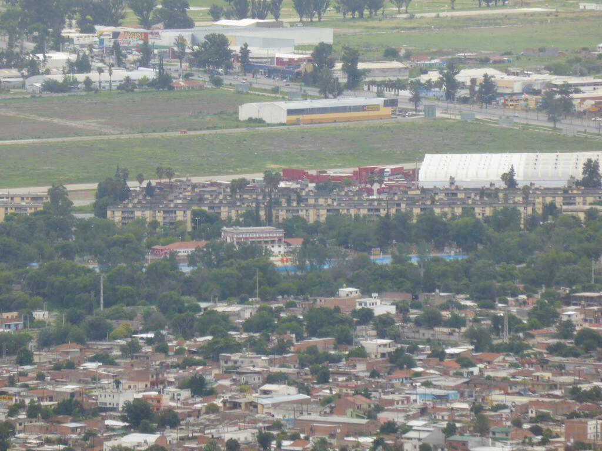
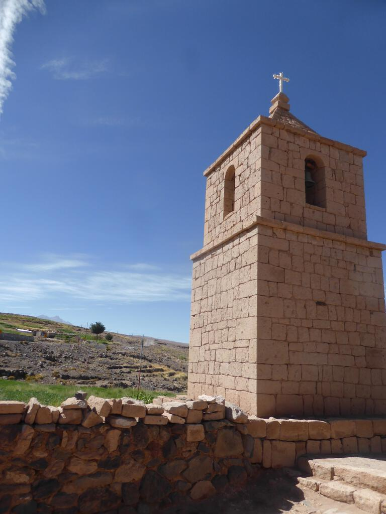

## Uyuni to Tupiza

We left Uyuni the night after the big storm, having stopped just a day or so to visit the salt flats. Our next stop was a strategic stay in Tupiza, a large town encircled with red hills. It resembled many towns that I visited in South America: low buildings arranged in a grid pattern. Not much greenery and plenty of dust billowing about. The reason for our stay was strategic, it's only a short distance to the notoriously fussy border between Bolivia and Argentina. We would leave at 5am the next morning so we would reach the border early in case of a long delay, which can happen at this border.

Because our stay was functional we ended up in dorms, with James and I bundled in with the three snoring Japanese pensioners. Perhaps it was knowing that I needed to wake up at five, perhaps it was the droning companions, but I did not sleep too well. Nevertheless we did get time to have a quick poke around Tupiza, which was nicer than a lot of other places you might use to get a good start at a border. A brass band played in the main square. The internet café was cheap. A sleepy restaurant still on holidays served us chicken and chips. Sarah bought a Spanish copy of Monopoly at a market. Friendly dogs ambled around. It was a place between places, but it was good to be there with friends.

## The Bolivia-Argentina border

Borders suck. It takes at least three hours for the Argentinians to accept that we Brits and our Aussie, Belgian and Dutch allies aren't about to commit some nefarious subterfuge. We're allowed in. The border's there to enforce Argentina's economic strength relative to Bolivia, but we see trade happening laissez-faire between both countries. We mill around in the no-man's-land between them and wonder if it was worth missing breakfast for.

## On to Salta

As we hurtle into Argentina on improved roads it is obvious that we are leaving the redness of Southern Bolivia behind us. The world around us begins to turn green. Initially there are some weird and wonderful geological patterns in the hills. Meanwhile, the houses at the sides of the roads become recognisably European, perhaps for the first time since Ecuador (bar the odd pocket like Miraflores in Lima).

We start to see roadside shrines to [Gauchito Gil](https://en.wikipedia.org/wiki/Gauchito_Gil), a man described as Argentina's Cowboy patron saint. They're small, about the size of dog kennels, but are decorated with red flags so you can see them coming a way off. Gauchito Gil was an Argentinian Robin Hood figure, which you can read about in the wikipedia article I linked to.

Halfway to Salta we stop at a service station. I marvel at the fact that the toilet flushes, something I haven't seen outside of a hotel room for about a month. I wash my hands and buy ice cream, because it's hot and there's ice cream. I laugh because it's January.

## Salta and the dodgy campsite

We arrived at the camp site late in the evening. We gawked at the enormous pool that snaked through the grounds but alas people were draining it ready for cleaning. Similar attention to the toilets would have been preferable as the showers didn't work and the squat toilets were filthy (even for squat toilets!). For its city centre location the campsite was quite quiet but the noise of the traffic was something new as we'd often camped in remoter places than this. I imagine it is a more fun and lively place when the pool is full!

I woke up the next morning with a horrible rash down my arms and legs. I decided I'd get a hotel room for the second night (we were due to stay for three) just so I could get a shower.

Despite the dodgy camp site, Salta is a wonderful place. It's probably the liveliest place we've been to since Cusco (though only because La Paz was dead on New Year's Day) and seems a place of genuine excitement and opportunity. Like Cuenca in Ecuador, it's a place you could imagine living if you had the chance. And as with Cuenca, you get the feeling that there'd be opportunities to do so that didn't simply revolve around tourism or its proximity to a border.

There are a couple of nice cathedrals, there are loads of places to eat steak and there's a cable car up to a nearby hill where you can look down on the whole city. I get ripped off by a taxi driver but that's just another reason to think I'm in a normal city.

## From Salta to San Pedro de Atacama

The journey from Salta to San Pedro de Atacama began calmly as it was Mim's birthday the night before and most of my fellow travellers stayed out all night with the aim of sleeping on the truck the following day. I should have done the same as I ended up with another itchy night in the tent. That said, I was excited to get moving again.

## The Argentina-Chile Border

The greenness of Argentina began to give way to the Atacama desert, one of the driest places on Earth. There are spots where it hasn't rained since record-keeping began, well over a hundred years. Where we crossed the border of Chile and Argentina, there wasn't much around us, just desert.

Perhaps the hostility and remoteness of the border crossing breeds hostility and remoteness into the staff who manned it. They stonewalled us throughout and we didn't really have much feedback about what was going on. Both nations were as bad as each other, the Chileans' absurd need to scan every bit of luggage for food somehow complemented by the Argentineans' outright hostility. It made for a thoroughly irritating and dull three hours. If I could remember the name of the crossing dear reader I'd state it here so you know exactly which one to avoid.

## San Pedro de Atacama

The road to San Pedro de Atacama was therefore pretty dusty and sandy. There were a few picturesque hills and mountains along the way, not to mention a minefield that exists due to continuing tensions between Chile and Bolivia over their border. (The War of The Pacific between Chile and Bolivia during the 1880s ended badly for the latter as they had to cede all their access to the ocean and ended up landlocked. [It's something that continues to rumble on between the two nations](http://www.economist.com/blogs/economist-explains/2014/01/economist-explains-21).)

More interesting are the winding loops of road that lead you up and over the Andes once more. I loved how the roads undulated and swept over the contours, leaving trails and loops behind us. I imagine they must be great fun to experience in a car too, close down to the road, taking every curve as though it were a corner of the world's most remote race circuit.

When we arrived in San Pedro de Atacama, we quickly pitched our tents in the dusty campsite and set out to get food. There was an immediate sense that San Pedro de Atacama is a major destination for travellers, it had the atmosphere of a poorly kept secret and was quite gaudy and commercial. We fetched out weird plasticky money from the cash machines and ate pizza in a cute courtyard. After beers we staggered back to the campsite in near pitch darkness. I fell asleep immediately but when the beer got me back up again later in the night, I stood in the warm night between the tent and the toilet block and stared up at the stars. I was content once more.

## Moon Valley

In between things like blogging at the internet café and sitting down to watch a film in the town square, we went on two big trips while in San Pedro de Atacama. The first was to the Moon Valley, a large area of geological interest just outside of the town. It's beautiful and I don't think I've been anywhere else like it. I'll let the photos speak for themselves.

## The Altiplano Lakes

The next day we took another excursion up to the Altiplano, a higher altitude part of the Atacama region. First we visited a local church, then we visited a lake where flamingos stood around as flamingos are wont to do. Finally we visited a number of higher altitude lakes that were beautiful and from which Vicunas stood and sipped the water.

## Next part

The next part of the trip takes in the journey to Santiago. I didn't take many photos on this part of the trip so it may be a shorter post.
