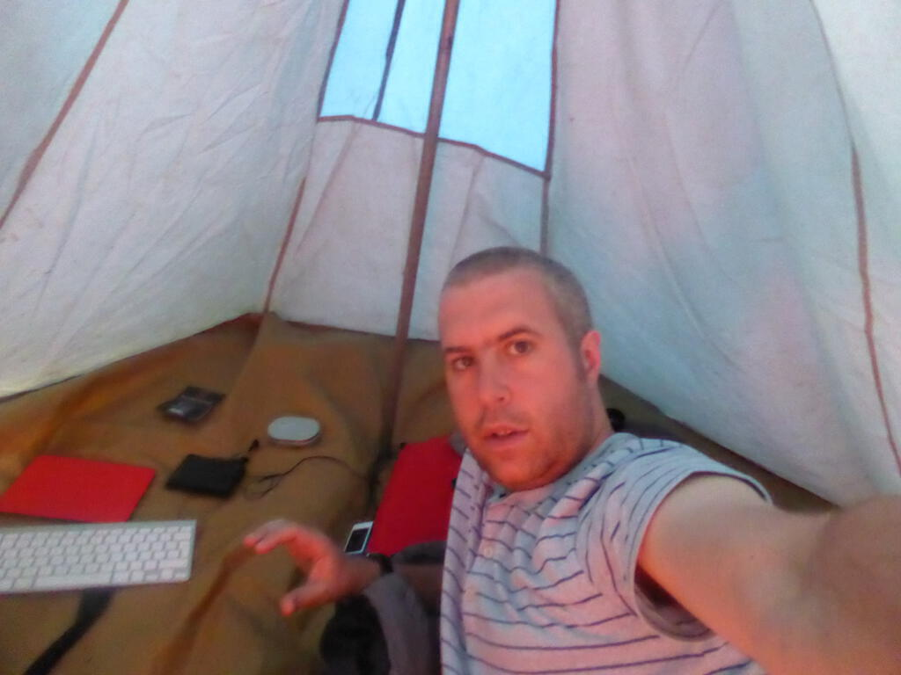

We left Misahualli for Baños via an hour in nearby Tena to get something for the truck fixed. After that the drive to Banos was pretty short - or at least it seemed that way as I alternated between dozing off, snapping the scenery and... well... dozing off some more. We arrived at a campsite about twenty minutes taxi ride from Banos and this was it, the thing I'd feared most about this trip: the camping. Fortunately, as an odd boy, I managed to secure my own tent - the gadget palace that you can see in my selfie! Getting the tent up was straightforward and all my assorted camping gear seemed to live up to requirements! It chucked it down with rain in the night, so it was good that the fly sheet did it's job too. It was great fun to lie there listening to the rain, nice and warm and dry. More importantly, I also managed to get some sleep.

On the first day, we had lunch at the campsite and then went to a nearby waterfall. Banos is a spa town (much like its English namesake) and has many waterfalls in the surrounding countryside. This one, the something del diablo, was very impressive. We had to canyon our way through some tight-ish caves for about two minutes and were rewarded with a spectacular torrent to be photographed beneath. At that point I hadn't learnt how quickly things dry in South America, so I cracked out the poncho like a wuss!

The next day we went into Baños proper and had fun and games trying to get a cash machine to give us money, before having a coffee and a really nice lunch at a café whose name escapes me now. 

Two things about Baños: it's surrounded by waterfalls and there's also an active volcano nearby. Sometimes it smokes, sometimes there's a small amount of lava, but there was no activity while we were there. Our interest was confined to noting the escape routes on the tourist map and to attempting to walk up to see it. The walk was fun but pretty tough going so we didn't get all the way up to the volcano. We did get some lovely photos of Baños though. On the way back down we encountered one of the best sights of the tour so far, a school marching band practising. I tried taking a video with my camera but I messed it up in an attempt to be covert. 

In town Lee and I got our hair cut, and then we got some supplies from the supermarket. We then bumped into our driver and helped him collect the repaired tents from the store. We all bundled into a taxi back to the campsite. 

The next day we went to another waterfall and then went back for more empanadas (a sort of deep fried pasty - I went for cheese and veggie, then we shared a chocolate and banana one). I spent the afternoon hand washing some clothes that got filthy in the amazon and trying to sort out my bags. Another night of filthy rain (during which my sister Tilli facetimed me in my tent at 2.30am!) followed before we got up at six to take down the tents and depart for Cuenca.