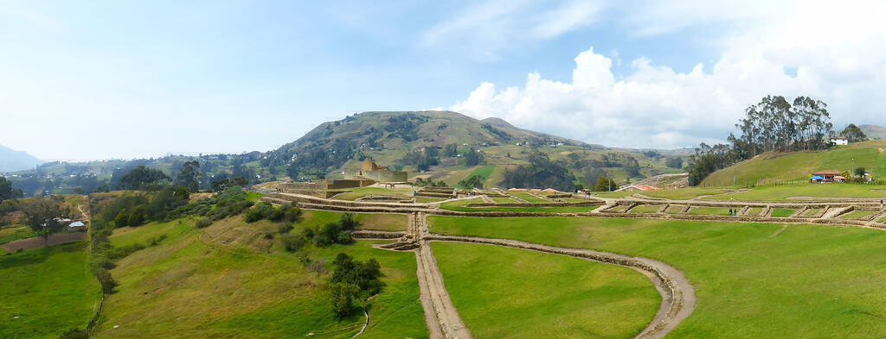
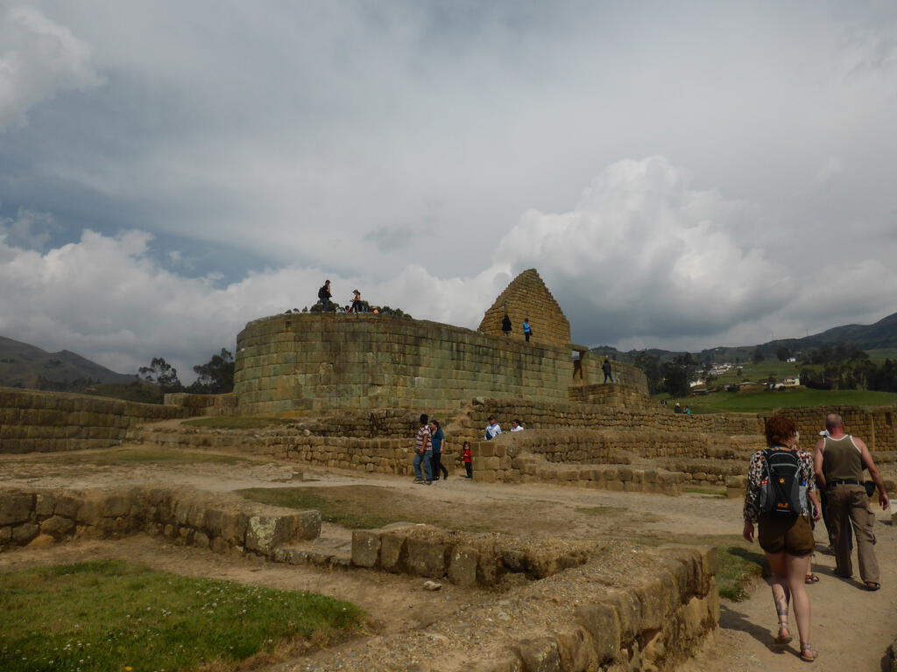
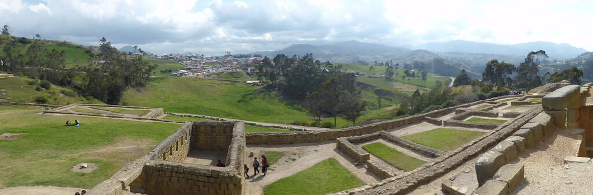
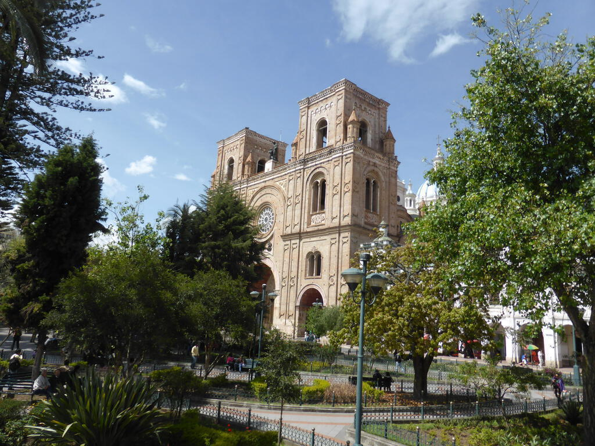
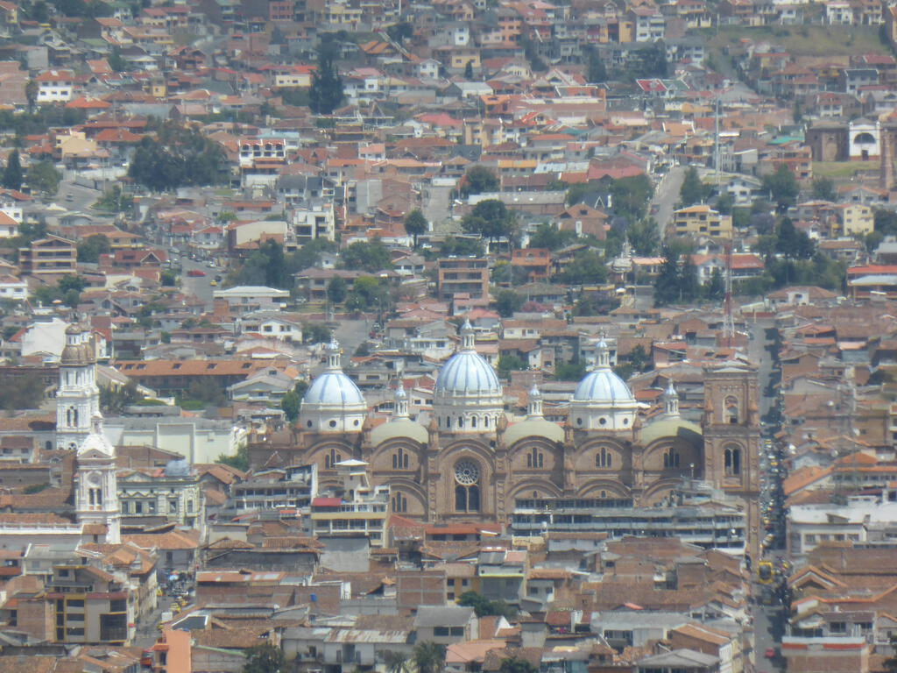
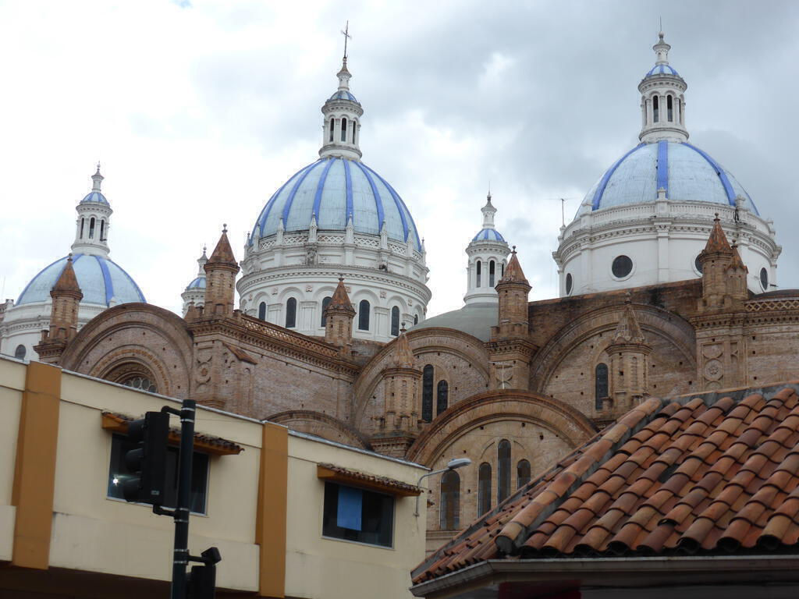
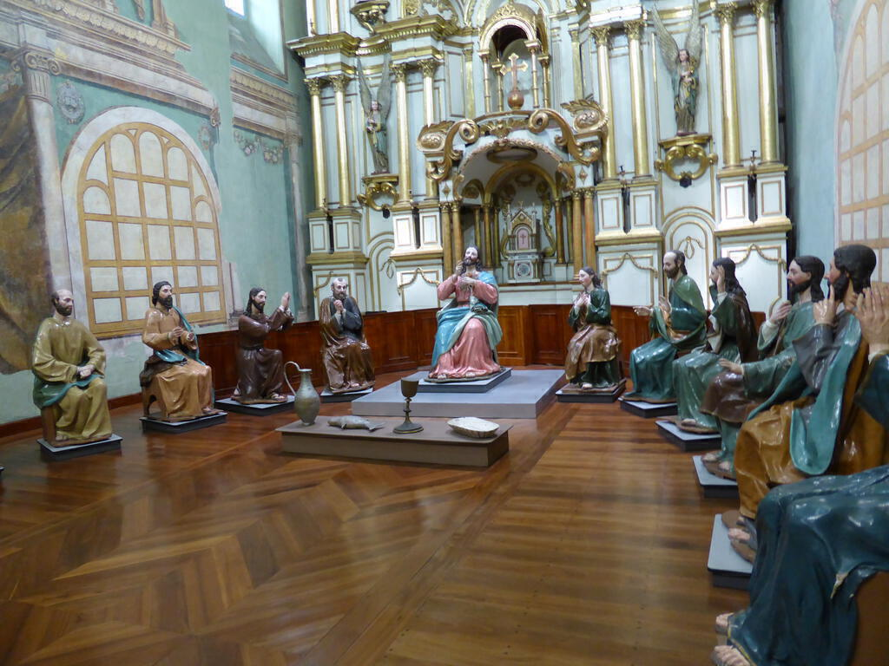
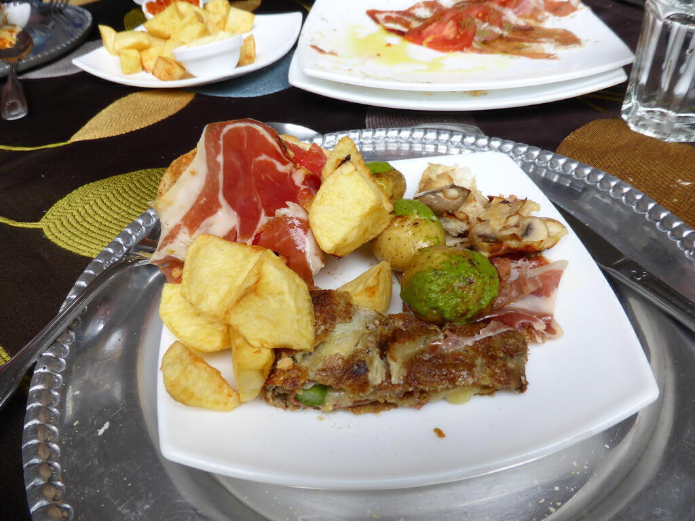

After Baños, we set off for Cuenca, which is a town in the south of Ecuador. Being a long drive, the journey was broken up with our first excursion to some inca ruins, a large complex at Ingapirca with a sun temple. It was built on an earlier site that dated back to about the 9th century and the Inca then conquered the area and built on top of it, as they tended to while their empire was expanding out from Peru to the south in the 11th and 12th centuries.

Like Roman ruins in Britain, what you end up seeing is a reconstruction that acknowledges the presence and work of the Incas (and their precursors) but is still a reconstruction nonetheless. However the Sun Temple is still original and when you imagine the rest of the site with two metre tall stone walls - which is not hard to do - it is very impressive. Had the Spanish been more enlightened conquerors, we may have even more to see today at sites like Ingapirca.

Continuing south to Cuenca, we arrived so late that there was little time for anything more than a bare bones tour before we went to dinner. Very few places were open on Sunday night, so I settled for chicken and chips from a modest Arabic place on the main drag of restaurants and cafés.

The next day was sunny and revealed Cuenca to have a beautiful colonial heart, epitomised by the newer three domed cathedral. You can visit the roof but not on Mondays. We went on the bus tour around the city and this included a trip to viewpoint that showed the massive sprawl of the city below. Sprawling out into to all available space seems to be a common feature of cities in Ecuador - perhaps I am being naive, maybe most cities in the _world_ are like this - but unlike Quito or Otavalo, Cuenca really felt like somewhere you could actually move to and live well there. Apparently it is popular with rich Americans who like the cheap property prices and shared currency.

For lunch we had some delicious tapas and after that we went shopping. I tried to find some more shorts because the warm weather was proving enjoyable (and besides I was still washing the amazon out of one pair!) but unfortunately they didn't have my size. After more frustrations with the ATM I went back to the hotel and discovered via the wifi that the bank thought I was going to the USA for six months. Good job I discovered that before I got into Peru!

In the evening it rained and Lee and I ducked into a random church for mass. I didn't really understand what was going on but I liked the music and the message seemed to be that with Christmas coming, this was a time of hope. Dinner was in minor establishment and the food was underwhelming - but watching Ecuadorean news on the TV was entertaining and as we settled our bill we had a good chat with the owner about all the pictures of footballers he had on the wall. The only English player there was Bobby Charlton... of course!

The next morning we left Cuenca early, setting out for our first land border crossing of the tour: from Ecuador to Peru.
