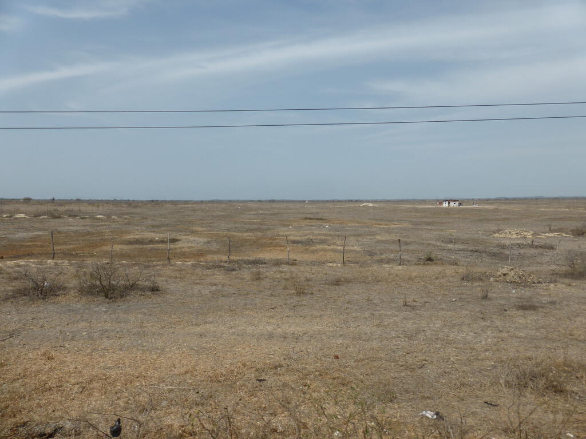

After Cuenca we set off for the Peruvian border. One of the great advantages of having a UK passport in South America is that you don't need any visas. If you're Australian or Canadian it's a different story. Nevertheless we all got over the border with very little trouble (the third ever land border crossing of my life) apart from the bits where they seem to make you wait in a queue just for the sake of making you wait in a queue.

The change in scenery after leaving Ecuador (tropical forest) and crossing over into Peru was quite stark, there was an instant switch to a desert landscape. The towns also looked instantly poorer and the on-truck tutorial on how to detect fake Peruvian currency made me wonder what on earth we were getting into.

Our first point of stay was Punta Sal, a beach resort near Mancora in northern Peru. It's situated at the point where the cold Humboldt current that comes up from Antartica meets the hotter currents coming down from the north. This meant that the sea was very pleasant while the wide stretches of sand were very pretty and very warm. (Perhaps I little too warm, I couldn't walk barefoot at midday.)

On the first day we needed new currency (Peruvian Nuevo soles - about 4.5 to a £1) so we took a taxi to Mancora to be astounded by this one horse town swarming with tuk tuks. After that I just chilled on the beach despite only having a really low pressure cold shower to get the sand off things. It was also a great opportunity to test out the sunset mode on my camera as you can see from the pictures below!

