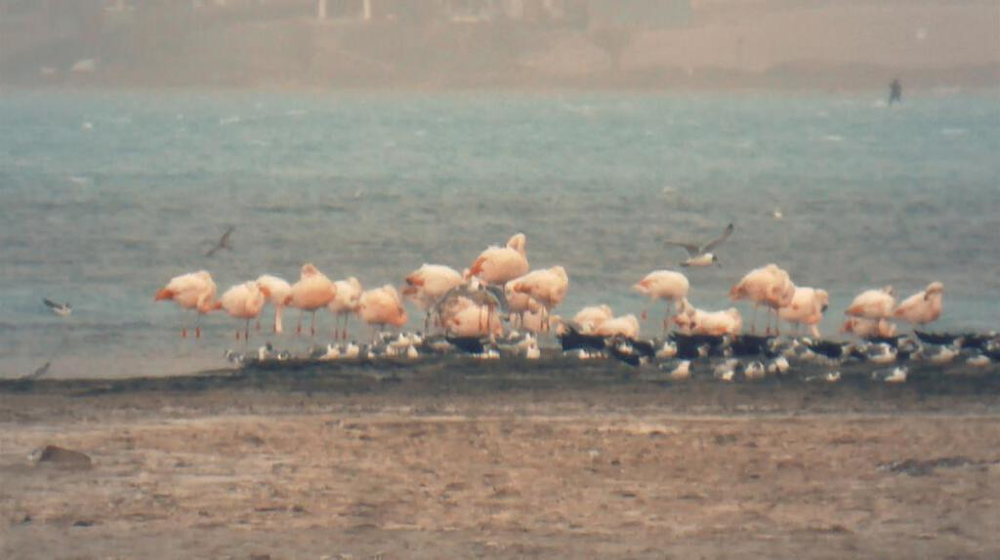
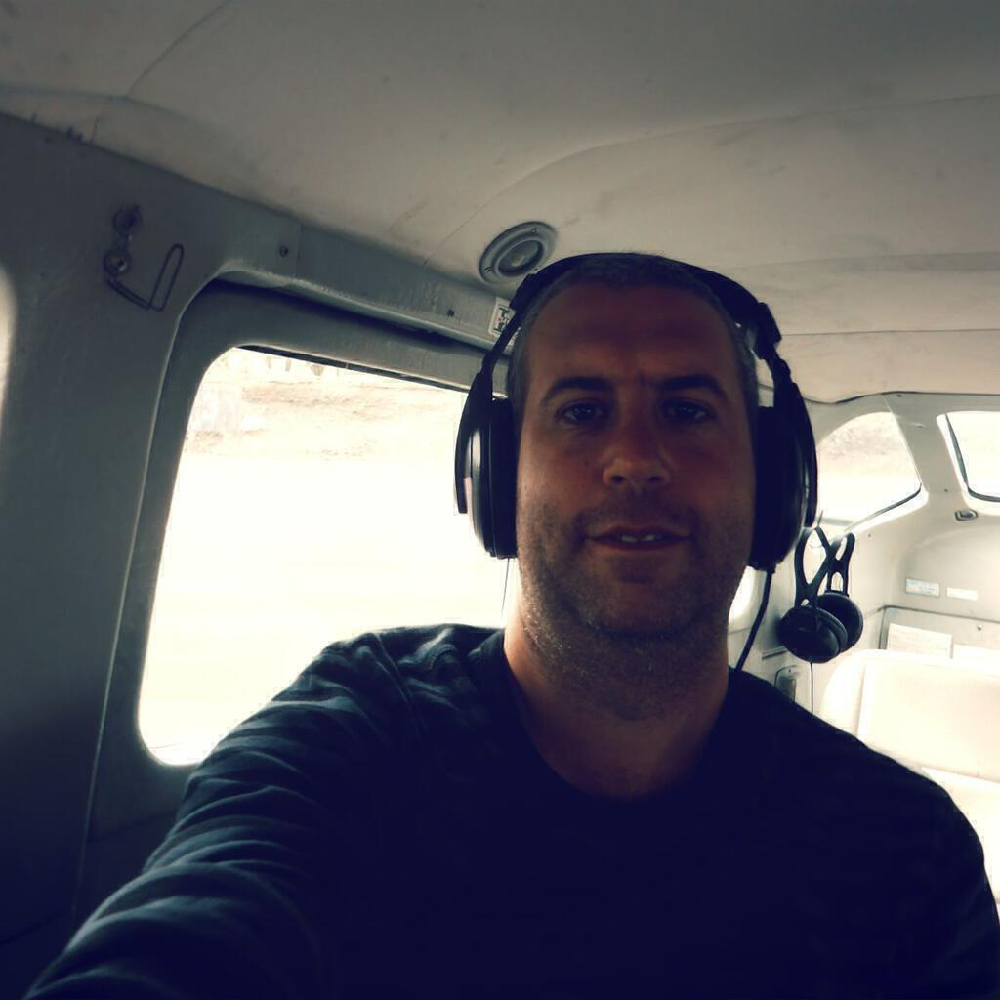

Next up was a piecemeal section of the trip that took in a varied set of sights and helped us get to know the new passengers who joined in Lima. On the first day we took a boat trip out to the Ballestas Islands, a nature reserve that is informally known as “the poor man’s galapagos”. Living there are penguins, sea birds, sea lions and seals. The speed boat out was a little wet and wild (and in fact the return trip was even wetter and wilder) so we all got soaked (twice) but the microclimate around the islands themselves was calm and warm, and we all got good value out of our cameras (if they still worked that is). We even saw a pelican get taken down by a sea-lion which was an interesting if not altogether pleasant display of nature red in tooth and claw. Also, who knew that guano was so valuable?!?

 

On pretty much any day you see penguins before lunch your afternoon is bound to be a little disappointing but a trip out into the sand dunes near to Pisco  didn’t do too badly at keeping up the entertainment factor. It was a bit tough to walk around in the dust storms - and being ferried from one point to another to then wander aimlessly was a bit underwhelming - but I got some good focus and managed to get some pictures (albeit at a rather long distance) of flamingos.

 

Pisco itself is a rather small town now (a tsunami wiped out most of the town out in 2009) and there isn’t much to see there. We entertained ourselves by looking for items for the upcoming “something you would never wear” party at Puerto Inca and three of us then chose a hotel that wasn’t our own as somewhere to have dinner. Unfortunately we were all a little tired and had to explain to our poor waitress why none of us had got more than halfway through our mains. I’d been up all night the previous night as one of my room-mates had drunk snored the whole time and so I was totally wiped.

The next morning I felt a bit unwell as we made our way to Huacachina, which was the last surviving oasis in South America (though just like all the others it is no longer an oasis and now has water piped in from elsewhere) and is basically a gringo trap designed to get tourists to go dune buggy riding. I decided to explore the town instead. It was warm, sunny, and looked very pretty, but beyond that there wasn’t much to see. I had an Inka Kola at a café, chatted to some newcomers (Maz and Luke), put a snapshot of the main pond/lake up on Facebook, and that was pretty much it apart from also managing to find my something that I would never wear for the party - pretty much the ugliest pair of swimmers I’d ever seen for about £2.

When the dune buggies returned, we headed on to Nazca. En route we stopped off  at a viewing platform (the nicely named “Torre Metallica” - presumably you can also “Ride The Lightning” and maybe there’s a door on the back marked “Enter Sandman”?) on the Trans-American Highway where you can pay a couple of Soles to see two of the famous Nazca lines from about 100 feet off the ground. Being earmarked to fly over them the next day I decided not to bother. I did manage to grab a postcard featuring all the lines though as I thought it might be useful for future reference. I sent it to my parents for safe-keeping!

The campsite was at a nice enough hotel but it was somewhat isolated from the rest of Nazca by being along a long (and boy was it long - about a mile or so at least) dirt road. But at least it had a pool. No warm showers, but I was almost used to that by this point. My only issue was now having a tent mate who got drunk and attempted to cuddle me when I got back to the tent! Well, that and needing to go to the toilet all night (and they were miles away!) - but at least that got me looking up at the stars when I finally gave in and used a bush instead. It was very dark that far away from the town and as the dogs barked in the night, I gazed up at the Milky Way for only about the fourth or fifth time in my life. Earlier in the evening we’d been to a planetarium and had the [Nazca lines" image_path=") explained to us. It was very relaxing, though the constantly following a laser pointer for an hour made me feel a bit like a cat.

Talking of cats, I gave up on trying to sleep at around 5am. It was light by then and warm enough to try to wrestle myself onto the wi-fi with my iPad - something that I didn’t actually manage to do. Instead I sat down and wrote a postcard to my parents, whilst all the time being attacked by a kitten who thought my pen was something that should be hunted. It was a nice way to while away the time until everyone was awake.

That morning we set out for Nazca airport and checked in for our flights over the lines. I was quite disturbed by the fact that they weighed us (though I guess I should be relieved that they were that meticulous) and I hadn’t dropped a single kilo since leaving home. I got put on the first flight and with some folks I get on really well with, which was nice.

The lines are really quite crazy. The geometric creations alone are pretty amazing but the ones in shapes that can only be properly appreciated from the air are truly staggering. Admittedly they are shapes that can be conceived of with reference to the surroundings (after all, you could write your name in large letters on a beach) but the fact they have persisted so long is what ensures their notoriety. Alas I did rather ignore the pilot’s instructions regarding where to point my camera (just under my wing, apparently) and so by the time we had got around all the lines I had gotten decidedly queasy.  Fortunately a few sweets back on the ground got me fighting fit and I was feeling okay by the time we left Nazca at 2pm. Given the pictures I was able to snap, I think it was worth it! Inspired by writing my postcard, I even phoned home!

On the way to Puerto Inca we stopped off at the [Chauchilla cemetery" image_path="http://en.wikipedia.org/wiki/Chauchilla_Cemetery) where mummies were discovered in 1920. Apart from the obvious macabre intrigue of these skeletons sat in pits dressed as they had been long ago (since the 9th century) preserved by sand and heat, there was little context for what was there and so it was just a strange walk in the heat with no real information gained. I learned more about the mummies from wikipedia while writing this post!

Puerto Inca is, as you might guess, an Inca port. On the hills surrounding the hotel and campsite on the main beach there are ruins of an old Inca fishing port. The Incas used a sequence of runners stood 7km apart to deliver goods up to the Inca capital of Cuzco high up in the mountains: the goods could be delivered in 24 hours, crucial to maintaining the empire.

I upgraded to a cabin because I was feeling sick. The good news was that there was hot water, the bad news was that there was no fresh water. A salty shower is an interesting experience but it was still better than my frozen attempts to get sand off myself with cold water in Punta Sal. We had a barbecue on the beach and all wore our things we would never wear. Obviously I skipped the alcohol but there were a lot of sore heads the following morning. I explored the surroundings the next afternoon and then in the evening lost heavily at Monopoly. At 9pm I was one of the last to go to bed!
