Arequipa and Cusco -- the two cities that are the subject of this post -- are probably the two cities in Peru that are most amenable to travellers (though Lima certainly has a lot to offer too). For me they should have been punctuated with a trip to [Colca canyon](http://en.wikipedia.org/wiki/Colca_Canyon), one of the deepest canyons in the world and twice as deep as the Grand Canyon. Unfortunately, I got really sick on the second day in Arequipa as my attempts at keeping my tummy bug at bay finally failed. (Even so, I didn't actually seek any proper medical help till the second day in Cusco, I was pretty boneheaded about it.)

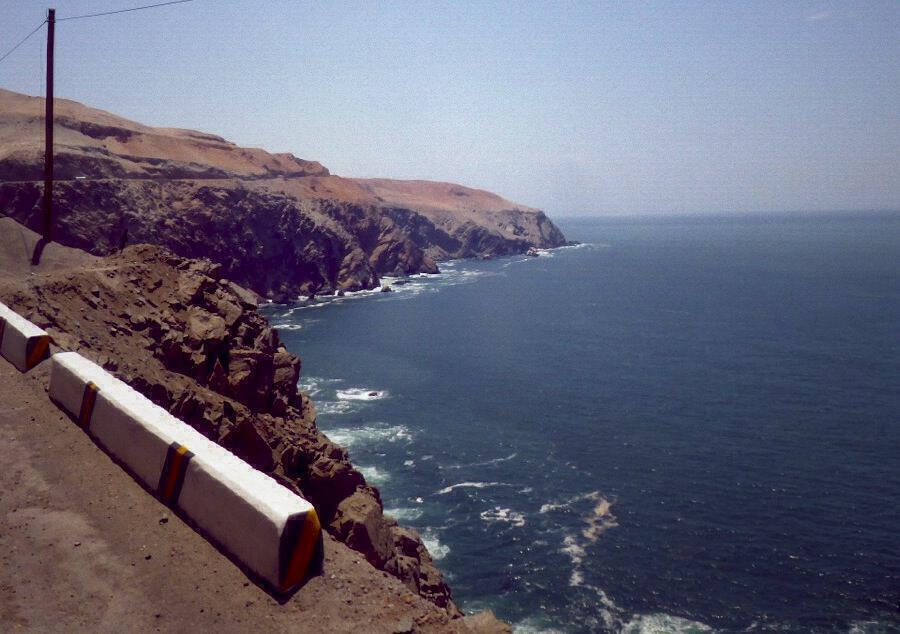

The drive from [Puerto Inca](south-america-trip-part-7) to Arequipa was long and involved — those Andes aren't going away any time soon and despite some pretty good roads, it takes a long time to get up, through, and down again. Fortunately once you've gone up, Arequipa isn't all the way down again. The views from the truck's cab were stunning. By 11am we'd said goodbye to the Pacific ocean — the last time we would see it until February.

Eventually Arequipa emerged from out of the horizon. Before this trip I tended to think of mountains as rather up and down affairs but the Andes is a range and so you have plateaus to cross as well. These are often barren featureless places populated only by scrub plants, the odd llama, and a couple of lonely stray dogs.

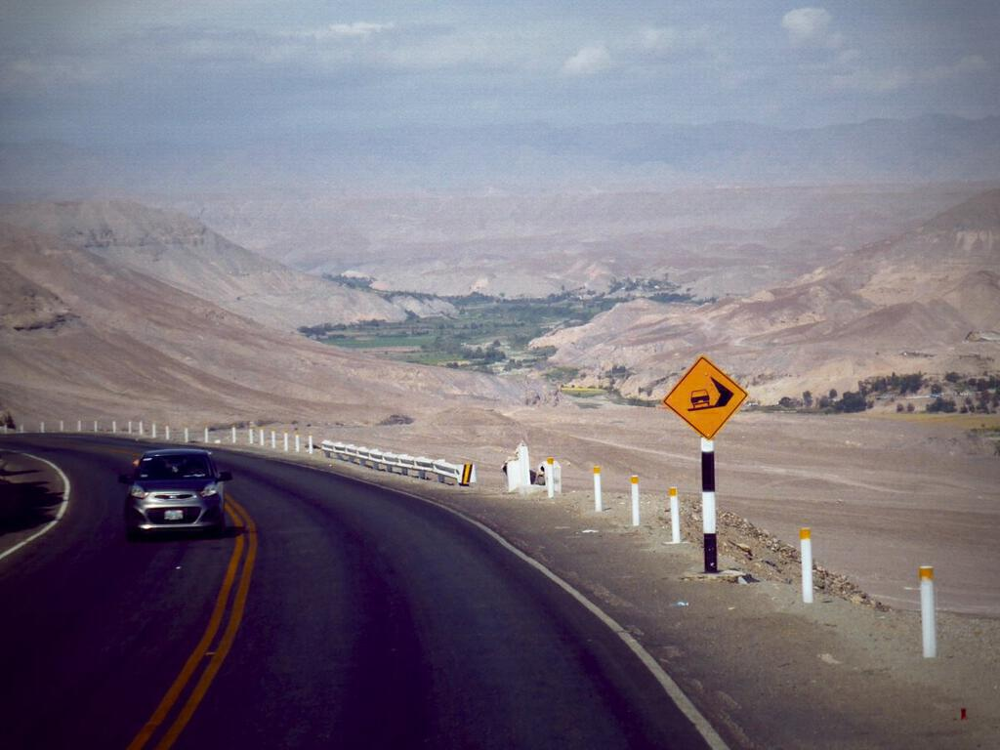

Our campsite was in the grounds of a hostel (upgrades to rooms were available) and we pitched our tent under a motorway overpass and next to a stream. This didn't actually matter (see end notes) when it actually came to sleeping though: earplugs cover a multitude of sins and tiredness does the rest. The walk in to town made me feel a bit woozy though - after all that time at sea level (see part [five](south-america-trip-part-5), [six](south-america-trip-part-6), and [seven](south-america-trip-part-7)!) my adaptation to altitude had worn off.

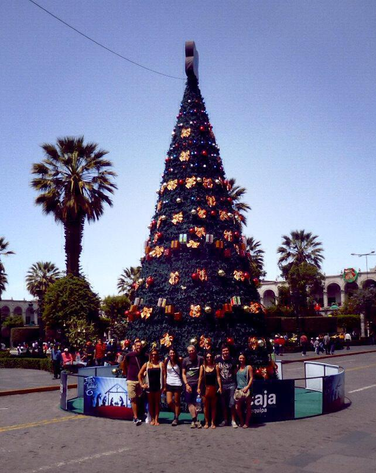

The full day that we had in Arequipa I spent mostly on a city tour. This was worth it because — like Cuenca — Arequipa is a city that has a lot of beautiful surrounding hills and mountains (plus no less than three active volcanoes) to frame it. The tour took us up to three or four viewpoints as well as to a shop that sold products made from alpaca and vicuña wool - the highlight of which[^1] was the chance to see some alpacas and vicuñas in a little zoo at the back. The vicuña cages have a spit zone around them as they aren't domesticated creatures and really don't like people that much! They can spit up to three metres! However vicuña wool is much prized and something as simple as a shawl made from vicuña wool can sell for as much as a thousand dollars[^2].

After the city tour we went to see [Juanita](http://en.wikipedia.org/wiki/Mummy_Juanita), the undisputed star of Arequipa (at least for now[^3]. Juanita is the mummy of a young girl discovered in the Andes high above Arequipa by German hikers in 1995. She was found only once a glacier had melted (which is why the hikers were the first to climb up there). Her body had actually rolled down the mountainside from where she was interred and luckily the mountaineers discovered her before too much damage was done. Now she sits in a museum in Arequipa, preserved in ice pretty much in the condition  in which she was discovered.

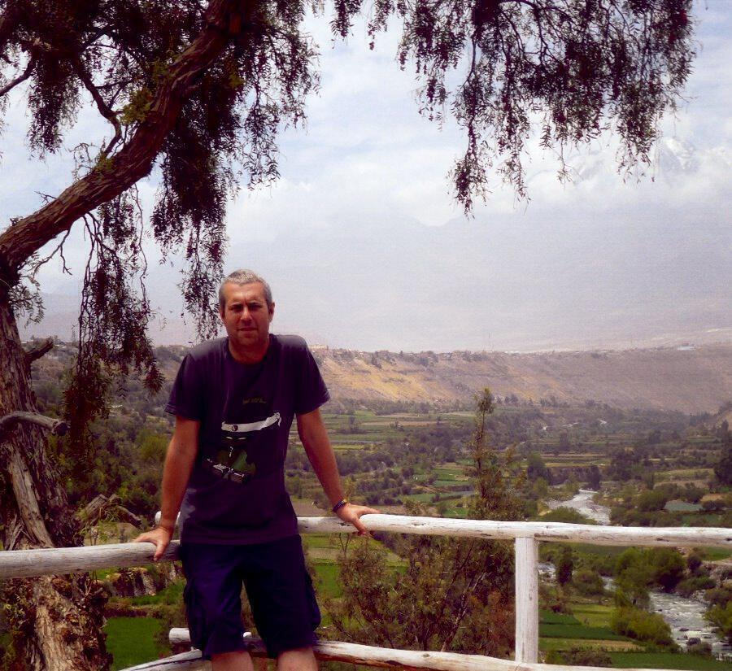

You're made to watch a melodramatic documentary and then an excellent guide shows you around an exhibition of the artefacts that were found with her (NB: Juanita is a given name, the Incas didn't write so no evidence of her true name exists). These explain (via the guide) how she was sacrificed — with a sharp blow to the back of the head while drunk on alcohol — and that she was likely to have come from a high-born family, that being chosen for sacrifice would have been a great honour. She was around fourteen years old. Two other mummies were found at the same site and are thought to have been even younger when they died, supposedly of altitude before they even reached the top (they are not displayed).

Eventually you're ushered into a cold dark room for your audience with the ice princess. It was strange because at this point it struck me that I was looking at the mummified corpse of a young girl in a freezer. The context builds up this person in the abstract but when confronted with her you lose all that for a moment, it all gets stripped away. The context matters a lot to the world at large, from it we know that (among other things): the Incas practiced child sacrifice; they made beautiful objects to honour the dead; they were able to tackle mountains that modern climbers require oxygen to cope with; her DNA tells us about who her (indirect) descendents might be today; and so on… And yet it was just so sad to see her frozen there in what looked to all the world like a supermarket freezer.

Shortly after seeing Juanita the return of my stomach bug really began to take hold and ruin my evening. We found out that we’d have to leave at 3am to head for Colca Canyon so we took down our tents with the aim of sleeping in the rose garden. Eventually I didn’t get that far and so I slept in the lobby on a sofa next to the christmas tree (despite the protests of the porter who I think just disliked my snoring). When everyone left at 3am I moved into one of the rooms that the non-campers had upgraded to and slept till 11am (as much as my stomach would allow).

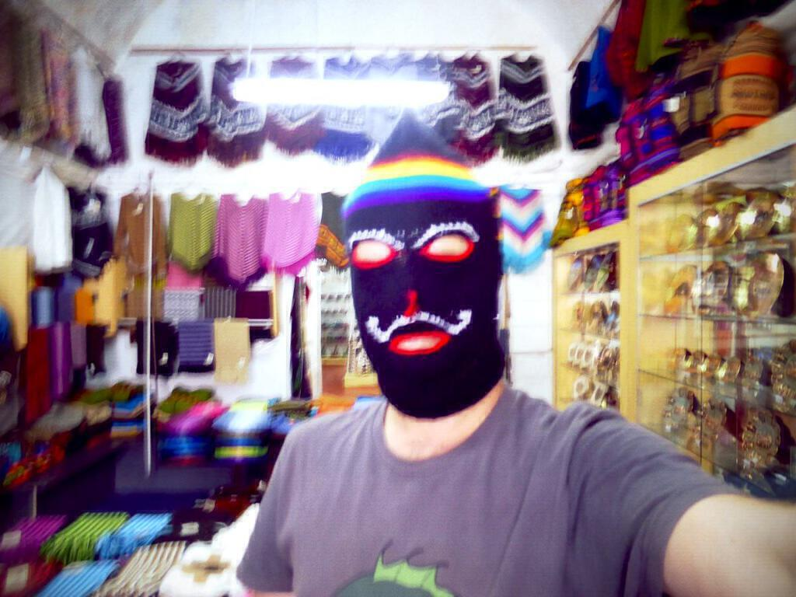

The next day I didn’t do too much. The driver Alfonso took care of me. He took me to the supermarket and instructed me to buy lots of 7up and bland crackers. After that we went to an Argentinian parilla for plain grilled chicken, white rice and boiled potatoes. It felt like a lot of food but it was welcome (I was taking tablets kept it from, shall we say, escaping…). We spent the rest of the day watching football in the room and left early the next morning at 5am. This was the first time that the sky had been clear enough to see the true extent of the volcano that looms over the city. So even though I was sick, I was still able to see something great.

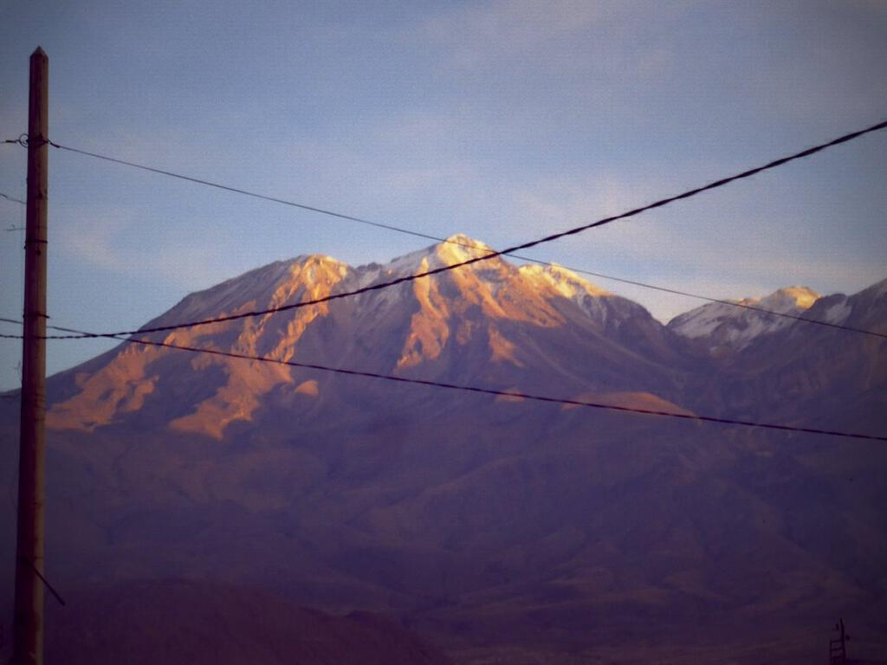

The journey up to the meeting point was beautiful too, up through the Andes once more — though there is an awful lot of litter strewn along the sides of the roads and a lot of graffiti sprayed on to the rocks. Sometimes the graffiti are political but, as everywhere, some are proclamations of love of one kind or another. It got me thinking — because I perceive spraying a rock with words to be a mainly male activity — whether all the messages of the form “te amo (insert male name)” were in fact expressions of homosexual affairs that are taboo, particularly in the poorer parts of South America[^4].

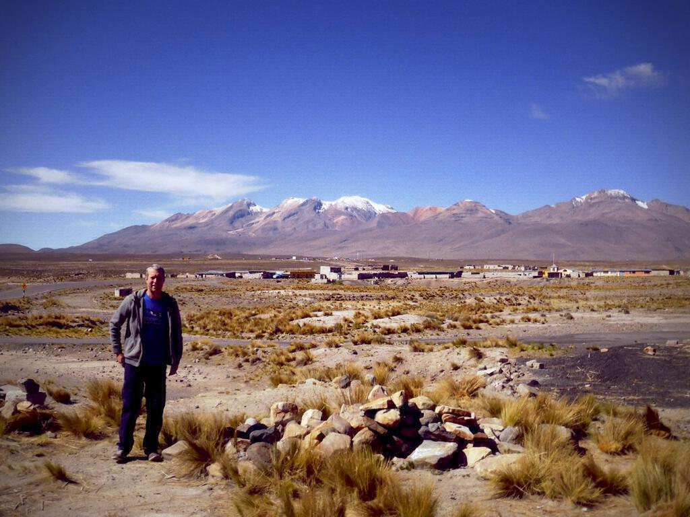

Eventually we made it to the meeting point. It was cold, but beautiful. Not as pretty as the canyon but never mind. I took some pictures and chatted with some local stray dogs, who all preferred Alfonso’s more engaging approach to communicating with them. One brought me a “gift” of half of a broken mug — the crap that finds its way halfway up the Andes! For a while I read my book (as my iPod was broken, see notes). When the group came back they all looked knackered but I felt much better simply because everyone seemed so pleased to see me again. “Yeah I’m feeling much better”, I half-lied. Well, you’ve got to fake it to make it.

The journey that followed was (for me) probably the worst of the trip so far (time of writing: February 10th) because it just dragged and I couldn’t really sleep. If you take any kind of drug that stops you from excreting, it makes your stomach feel a particular peculiar and grotty sensation. You end up in a really bad mood. We managed to get to Cusco just after dark and needed to take a transfer even then. Fortunately the hotel was great and after dinner (another modest pollo a la plancha y arroz blanco) I went back and crashed out. When I got up in the night I rattled as I shivered but the bed was nice and warm at least.

On the second day I finally saw a doctor about my stomach (about £35). I got sent to the pharmacy for antibiotics (about £15). I was scared that I wouldn’t make the Inca trail but the doctor told me I was in decent shape apart from the bowel infection. With this endorsement I was raring to go!

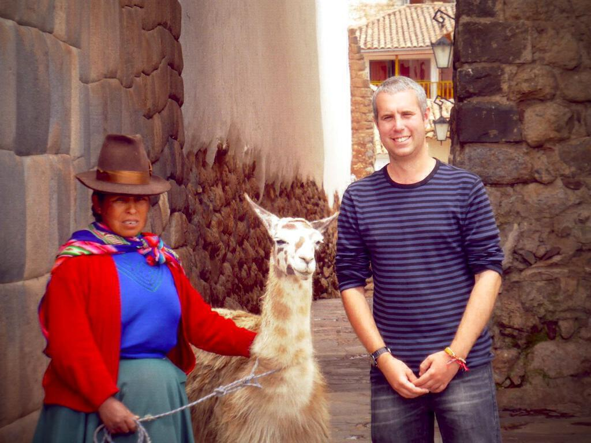

Armed with instructions on what foods to (temporarily) avoid and the antibiotics, I soon began to feel better. The days I spent in Cusco were mostly just resting up ahead of the impending Inca trail. I found a lovely alpaca hoodie that accompanied me up to Macchu Pichu (spoiler: I made it!) and down to Patagonia too. I also visited the impressive Cathedral with its magnificent collection of religious art that comes with local additions like giving Judas Pizarro’s face and a roast guinea pig being served at the last supper. I didn’t go in for it (I wasn’t up to it and couldn’t drink on the antibiotics) but in Cusco you can party in a major way as there are all manner of nightclubs and bars that will allow you to drink and dance all night. I know this from my bleary-eyed fellow Tucans!

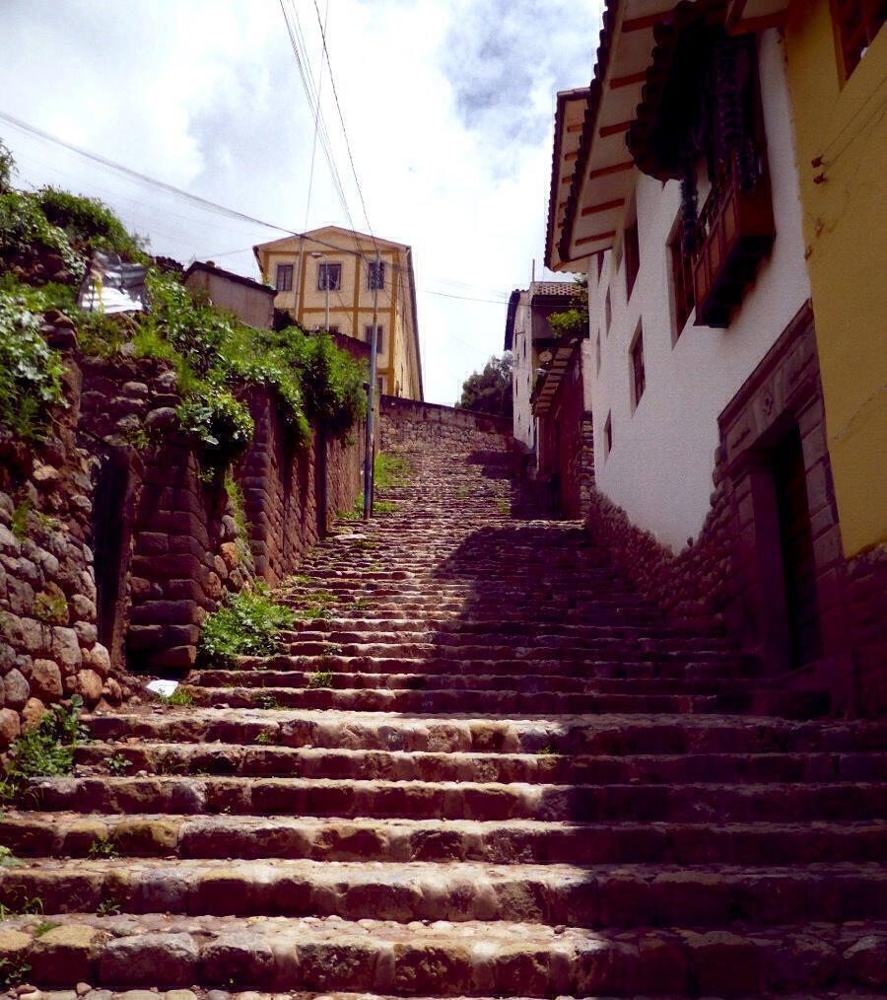On the third full day I went up to the view point and remembered on the way back that I really don’t like descending steep stone stairs (esp. not on my own), a situation not helped when five stray-seeming dogs appeared and started to bark at me! Eventually their octogenarian owner showed up (shuffling down the stairs much faster than me!) and surprised me by asking me questions in English. He told his barking dogs to be quiet and he told me their names but I’ve forgotten them now. After that I met some other Tucans on the street and went to Jack’s Cafe: if you’re ever in Cusco and are in need of regeneration of any kind, go there because you won’t regret it! It rained after lunch, so I spent the afternoon in the hotel lobby watching “The Dark Knight” as dubbed into Spanish (so I still don’t remember/understand the end of that movie!).

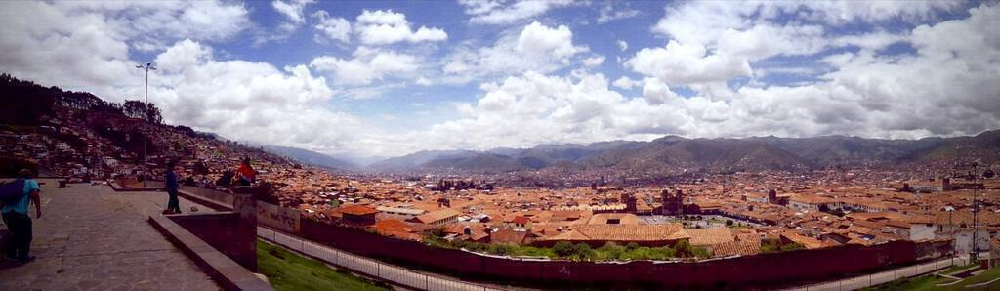

In the evening we were introduced to Santi, our guide for the Inca trail. An amiable chap (as anyone who wants to get you up the equivalent of Snowdon in one morning has to be), he explained the trail to us in a way that made it all seem very doable. As I packed that night I finally[^5] felt excited about doing it!

---

### Other notes

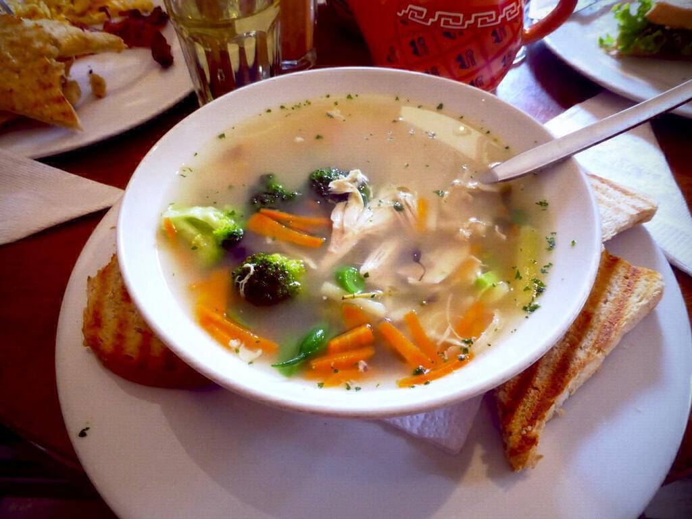

* On the way to Arequipa, I was playing music in the cab of the truck and cranked the nano up to full volume for several hours. Apparently the newer ipods have a failsafe that kicks in after a few hours at full volume and won't play the next time you use it. Who knew? I didn't and I ended up introducing a more mechanical fault to my ipod by attempting to clean out the headphone jack.
* I bought some antihistamines in Arequipa that proved to be effective at reducing the itchiness of insect bites <strong>and</strong> getting me to sleep deeply. I'd say it's fifty-fifty now what I actually take these tablets for.
* I lost my headphones and their little tin at a gas station on the way to Arequipa. Fortunately (strangely?) I had a backup tin and was able to find a nice pair of blue headphones in Arequipa to match my (now malfunctioning) ipod.
* Even the smallest attempt at speaking Spanish reaps its own reward. I didn't even haggle for my hoodie but because we'd had a nice chat she knocked off ten soles (about £2.50) anyway - either that or I'm a bigger rube than I thought.
* When I [posted about being sick](grumble-grumble), Mia, a friend of mine from sixth form, posted on facebook about a place called Heidi's. Our waiter was amazing and the food was lovely (though not quite what I should have been eating at the time). I will spread Mia's recommendation onwards: if you're in Cusco look this place up - if only to try the happiness tea! (Waiter: "It's good for the mind and the body. If you have a soul it will definitely be good for that too.")
* The "comfort" of a hotel/campsite has nothing to do with the quality of the beds or the pitches, and everything to do with the availability of hot water. (And the cleanliness of the toilets.)

---

[^1] Because by this point, I was at peak alpaca: almost past looking at woolen products altogether.
[^2] It&rsquo;s soft but not a whole lot better than baby alpaca (also expensive), the cost seems to be a result of scarcity than wholly due to quality. 
[^3] She&rsquo;s been moved around a lot since she was discovered, including an extended, and not exactly diplomatically welcome, stay in Japan. I don&rsquo;t know if I understood correctly but I think she is moving again soon.
[^4] Well I suppose you could fake people being in love with you to enhance your rep? Who is this Matt whose name ladies all over the Andes have been spraying on to the rocks? He sounds like a <strong><em>hunk</em></strong>.
[^5] In the preceding weeks as I struggled with the bowel infection, I’d begun to dread it.