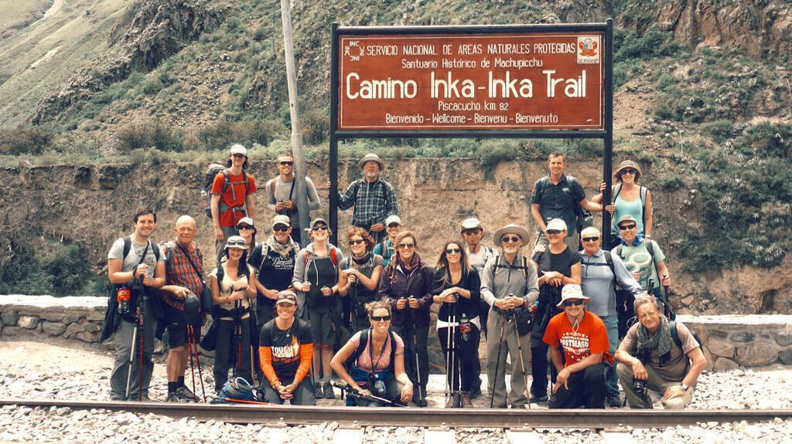
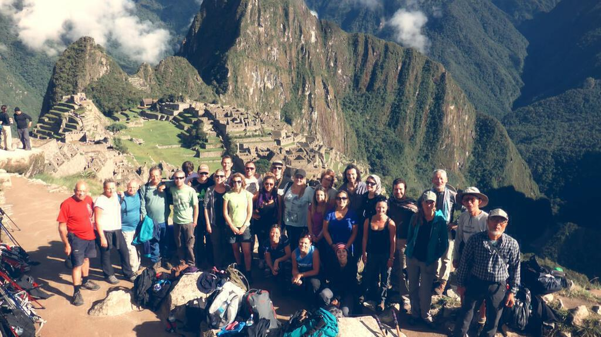
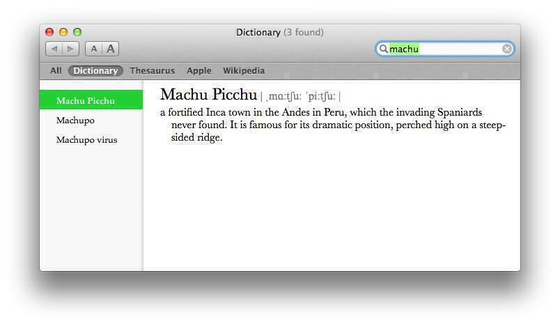

In a tour full of highlights, Christmas week of 2013 was nonetheless one of the greatest weeks of my life. I may have moaned, groaned, and got completely soaked, but it was worth it to see Machu Picchu in the sunshine.

## "The Story So Far"

- [Arriving in Quito](south-america-trip-part-1)
- [Otovalo and Misahualli](south-america-trip-part-2)
- [Banos](south-america-trip-part-3)
- [Ingapirca and Cuenca](south-america-trip-part-4)
- [Into Peru](south-america-trip-part-5)
- [The Road to Lima](south-america-trip-part-6)
- [The Nazca Lines](south-america-trip-part-7)
- [Arequipa and Cusco](south-america-trip-part-8)

## The Sacred Valley

On 22nd December, we set off from the hotel in Cusco for a trip along the Sacred Valley that lines the Urubamba river. This valley includes a great number of Inca sites of archeological interest.

We started out at another of the rescue centres that provide visitors to South America with their best glimpses of the continent's beautiful yet sadly vanishing wildlife. As before, my emotions were conflicted: on one hand I saw beautiful animals and birds, but on the other they were in cages and victims of man's horrible treatment of them.

## Písac

The first main stop was Písac (after a brief stop at a viewpoint where the main image for this post was taken) and we were taken around this breathtaking site that features many of the classic Incan agricultural terraces that enabled them to overproduce food and sustain their empire across many square miles and many different altitudes and terrains. Apparently they also experimented with different strains of their crops. The views were amazing and you couldn't help but pose in front of them. I think I took more photos with other people's cameras than with my own.

## Ollantaytambo

After a rather lacklustre all-you-can-eat lunch (unfortunately all-you-can-eat is a somewhat diminished experience when you are on antibiotics that prevent you from eating dairy and other delicious foodstuffs), we went on to Ollantaytambo a village of shops selling tourist tat that crowds below a magnificent Inca fort. Rising out on steep steps and completely dominating the hillside, I did wonder how on earth Machu Picchu could possibly compare. Apparently it took the Incas a fierce battle to quell a local tribe known as the Tambo, so they subsequently built this enormous fortification to protect their gains.

The views from the top are amazing, you can see right across the valley. An alternative to the Inca Trail (known as the Lares Trek) takes in much of the surrounding area and I think it either departs from or arrives in Ollantaytambo.

We stayed overnight in home stays at Ollantaytambo. As ever, I found the ceilings to be way too small. I bought some crap acrylic gloves and overpriced cereal bars for the journey ahead.

## The Inca Trail, day 1

The next morning, we took a cramped smelly bus from Ollantaytambo to rejoin the Urubamba river at the start of the "classic" Inca Trail. We got stamped through passport control, though we had to wait while another porter was found because some of our number had packed a little too much to take along. We played charades across the river (with both cheating and suggestion of answers prevented by the raging water) before the guides who were already on the trail side of the bridge got bored (or decided we were disturbing the wildlife or whatever) and led our friends, and only source of amusement for the time being, away.

On the matter of porters, the management of the Inca Trail, and the way that tours are run by different companies, that is a complex discussion that could easily fill up a whole extra post. Or three. I didn't see it myself (or even hear about it until later) but the porters were treated pretty badly throughout the three days, there were reports that they had to sleep in the toilets at one camp site. Given that those toilets were among the worst I'd ever encountered (I say this with foreknowledge of the Bolivian toilets, which were worse) I'm pretty horrified and from what other members of the tour have told me I feel naive for not having spotted it myself. Nevertheless being a porter definitely carries a cachet and is well paying compared to other jobs in the area. I thought they were amazing, tackling the terrain with 25kg on their backs in terrible shoes and with no poles or other aids. Seeing them jolt past you certainly keeps you motivated to keep going!

Eventually we gained an additional porter, were allowed through, and caught up with the rest of the group. We saw the biggest blackest spider ever after one of the Japanese guys started chasing it around to take pictures of it. Given the responses to my tarantula pictures, I have censored the snaps of it from this post. At lunch, we had our first taste of the food that would be our fare for the next few days. The best bit was the soup. The rest was a blur of uninspired meat and veg that I would often feel too tired to eat. Did I really expect gourmet food on the Inca trail?!

After lunch, we walked some more and encountered the Inca ruins of Patallacta. Again the site was really impressive but we couldn't explore because we were so far above it. Perhaps we would have done had we not been delayed at passport control. I did quite well on that first day buoyed by feeling better and the fact that the going was easier than I had expected but I was so exhausted by the time we got back to the campsite. That night I took some diamox (in case the fatigue was altitude related) and was haunted by it, I've never had to go to the pee so many times in my life. I barely slept.

## The Inca Trail, day 2

Of course I was delighted that I had barely slept a wink, given that the second day of the Inca Trail is the hardest, home as it is to the infamous Dead Woman's Pass. To cross it, you effectively climb the height of Snowden in four hours from a starting point that is three times as high as Snowden in the first place. A lot of the time it was raining but this was a pretty good thing as it drove us on. The climb is steep and it took loads out of me, when I reached the top I was quite overcome and let out a massive roar. A bit weird perhaps, but entirely the right thing to do at the time. When I think about how I felt, all I can think of is that roar.

After the Dead Woman's Pass, it was pretty much all down hill. I took this very slowly as I don't like going down slippery rocks. I was lucky that Angela continued to keep me company even though she could have shot on ahead. In the end she left behind to continue at her own pace while I had a nice chat with one of the porters instead.

When we got to the camp site I don't think I've ever been as tired. I somehow struggled in for late lunch and drank chamomile tea. I don't even remember heading back to the tent, just that I collapsed later and woke up for dinner later on with the rain pounding down again. After dinner we listened to Christmas songs, so tired that it was almost as though we were drunk (no alcohol on the trail, unless you're our tour leader) as we sang along to the twelve days of Christmas as it emanated from my smartphone amplified by a tin cup. Later on I would sleep from 9pm till 6am without so much as turning over, even though I'd slept for four hours earlier on.

## The Inca Trail, day 3

I'd got it into my head that the rest of the trail would be a breeze after day two. It is easier but instead of one humungous pass to climb up and over, on day three you go up and down three different times. You also get to see more tambos and towns though, not to mention tropical vegetation. The weather in the morning was lovely but it turned rainy after lunch and we all got pretty wet. Even so, it was a beautiful walk - especially the Inca tunnel. At one point I tried to phone home (it was Christmas Day after all) but the phone failed in the cold.

## The Inca Trail, day 4: Arrival at Machu Picchu

For the final day and the short walk to Machu Picchu, we had to be up at 3am in order to give the porters plenty of time to reach the train from Aguas Calientes with our gear. We had breakfast (pancakes? or did I dream them?) and noted that the rain had stopped. Meanwhile the gates to the last section of the Inca trail open at 5am, just after sunrise. It was freezing waiting but our group was the first in line, which was great. Running back for a last minute poo was the most tactically successful poo of my life though it did also mean that I've seen how big a pile of bog roll is used to wipe up after two hundred people's poos. All I could think was "don't fall over, don't fall over", which isn't easy when you're squatting.

The last section is easy. Like skipping easy. I don't know whether it was excitement or a genuine liberation through tiredness but I bounced my way through that last bit. I had a little difficulty with the nearly vertical steps just before the Sun Gate (as in I was panting after) but everything else was just fine. It was a mood that permeated through our group: it was sunny, no more tents until Salta, and finally we'd see Machu Picchu!

At the sun gate it was still pretty gloomy but the view was spectacular. I knew that I had to calm down and try to look at it all intently, take it all in, as though I had a duty to remember that moment. In reality I just beamed at it and it, the landscape, in turn just seared itself in to me. The beauty of it, the impossibility of it, the shadows of the clouds, it's wonderful.

Better yet, the sun came out as we made our way down the path to Machu Picchu itself. From there everything's a blur, a wonderful blur. It finally felt like I was away from everything and yet at the same time I was with new friends and we'd conquered this trail together, now wandering through this amazing wonder of the world. The tiredness rushed in and all the while I smelled like the test subject of a deodorant factory but that didn't matter, I felt unreservedly content and happy for the first time in the longest time.

## PS:

I looked up Machu Picchu in the dictionary of my Mac so that I would spell it consistently and correctly. I  liked the following addition to the description: "It is famous for its dramatic position, perched high on a steep-sided ridge." That it is. I will never forget it!

