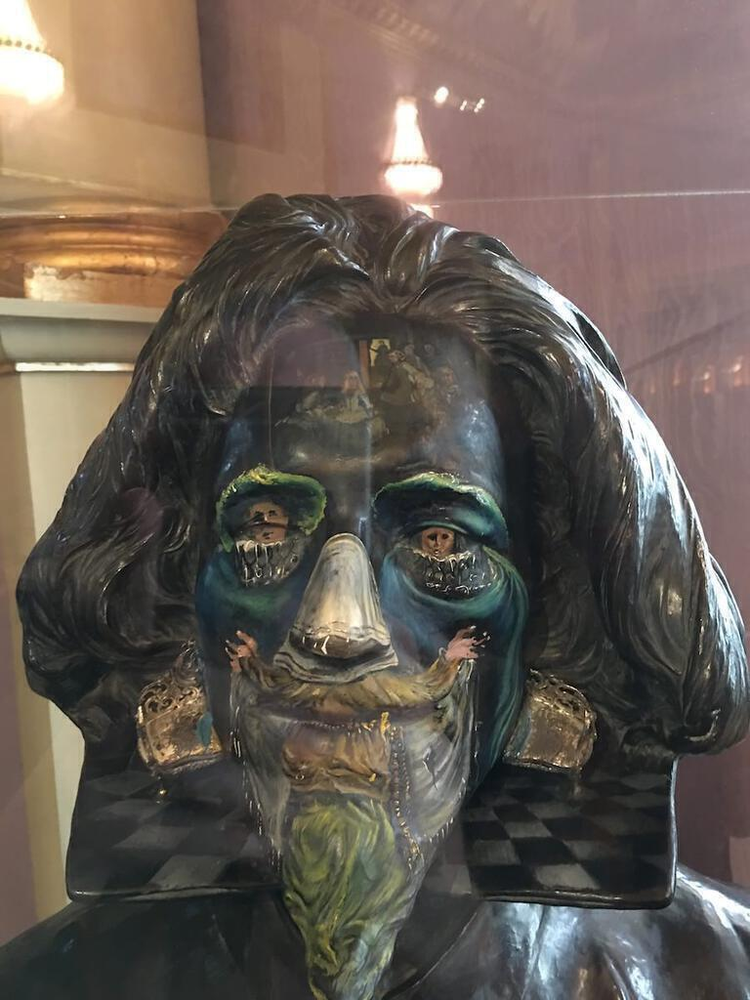
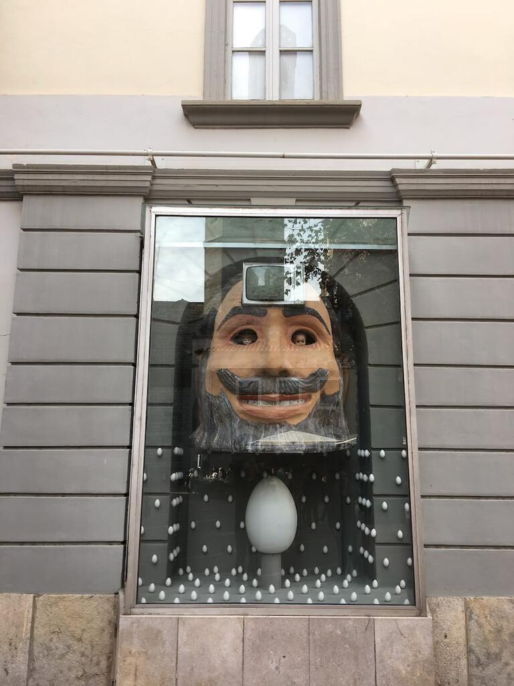
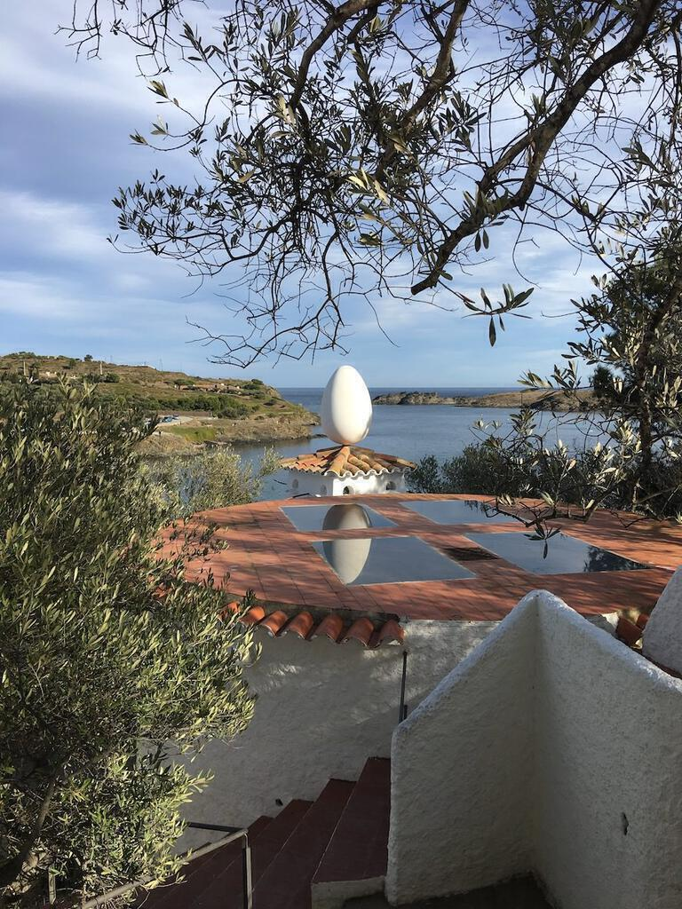
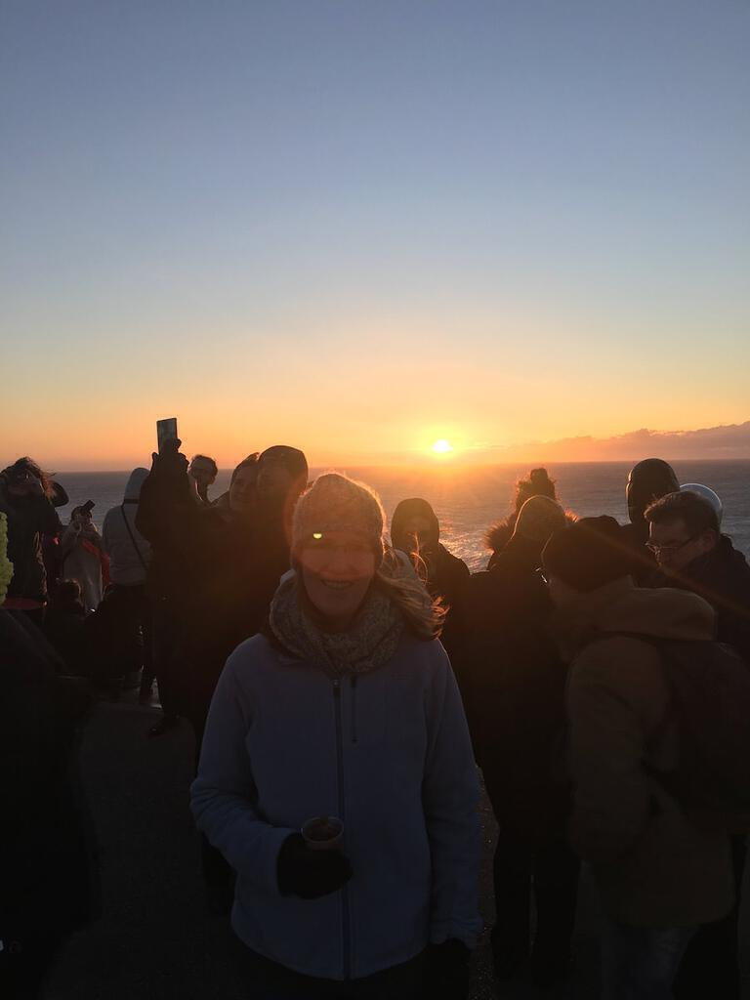

For new year Ingrid and I met up with Ingrid's friend Ros at Barcelona airport. We went from there to Cadaqués on the Costa Brava. A winding drive over steep hills leads you down to a cute bay with the typical white houses and terracotta roofs. All the window frames were painted just the right shade of blue.

<figure>

<figcaption>View of Cadaqués from the church.</figcaption>
</figure>

<figure>

<figcaption>View of Cadaqués from near to where we stayed.</figcaption>
</figure>

<figure>

<figcaption>A view of the hills you need to drive through to get in and out of Cadaqués.</figcaption>
</figure>

The surrealist artist Salvador Dalí lived and worked in the area. This meant a trip to Figueres to see his Theatre-Museum and on new year's eve a walk over the hill to Port Lligat to visit his house. Both required timed tickets. We couldn't get into the Port Lligat house on our first day because there were no tickets left. Lucky for us that New Year's Eve was so much better weather-wise!

#### A Short Note on the Dali Museums and Houses
The theatre-museum in Figueres is a great museum to wander around. It pays homage to Dali's talent and versatility. However, it suffers from having few of his major works on show. To see a dripping clock you have to wait until you get to the reproductions in the gift shop.

By comparison, the House in Port Lligat is a delight. They only allow ten people in per half hour slot. This makes for a rather brisk tour but there's a greater focus on the man himself. You get to see his studio and his echoing room. The gardens were beautiful too. 

<figure>

<figcaption>Iconic eggs and traditional bread loaves stud the exterior of the Dali Theatre-Museum.</figcaption>
</figure>

<figure>

<figcaption>Boats in the bay at Port Lligat.</figcaption>
</figure>

<figure>

<figcaption>In the gardens at Port Lligat.</figcaption>
</figure>

<figure>

<figcaption>Dali’s grafitti’d bust of Velázquez complete with Las Meninas painted on the forehead.</figcaption>
</figure>

<figure>

<figcaption>Outside the museum is a similar piece.</figcaption>
</figure>

<figure>

<figcaption>Ingrid poses with Dali’s polar bear at Dali’s house.</figcaption>
</figure>

<figure>

<figcaption>I am the eggman, they are the eggmen, I am the Walrus...</figcaption>
</figure>

<figure>

<figcaption>Egg reflections in the Port Lligat landscape.</figcaption>
</figure>

<figure>

<figcaption>Path down to Port Lligat.</figcaption>
</figure>

Cadaqués is also close to the eastern-most point of Spain, the lighthouse at Cap de Creus. On New Year's Day, we woke up early and headed there. Three policemen managed the situation, telling people where to park. We walked the last two kilometres to the lighthouse in the pre-dawn light as a cool wind whipped us awake. The sunrise did not disappoint. A band played traditional Catalan folk music. People danced. Volunteers handed out hot chocolate. As the sun rose, I contemplated the year ahead and also how similar traditional Catalan dancing is to the hokey-cokey.

We spent the rest of New Year's Day wandering around Cadaqués, walking over to an abandoned private island fused to the bay. This was covered with olive trees (as is much of the area) and was beautiful in the early afternoon light. That night we had a lovely meal in a pizzeria.

<figure>

<figcaption>Watching the sunrise at Cap de Creus.</figcaption>
</figure>

<figure>

<figcaption>Watching the sunrise at Cap de Creus.</figcaption>
</figure>

<figure>

<figcaption>Watching the sunrise at Cap de Creus.</figcaption>
</figure>

<figure>

<figcaption>Watching the sunrise at Cap de Creus.</figcaption>
</figure>

<figure>

<figcaption>Viva Catalunya!</figcaption>
</figure>

<figure>

<figcaption>Principal way to get to a lighthouse at 4am? Moped!.</figcaption>
</figure>

<figure>

<figcaption>Stunning landscape in the newly sunny new year.</figcaption>
</figure>

<figure>

<figcaption>We spent the rest of the day exploring the little islands and inlets around the edge of Cadaqués.</figcaption>
</figure>

<figure>

<figcaption>We spent the rest of the day exploring the little islands and inlets around the edge of Cadaqués.</figcaption>
</figure>

The next day we drove back to Barcelona, via a big detour to the medieval town of Besalú. When we arrived it was cold and grey so we had lunch and checked out the museum of miniatures (far better than I'd expected). The medieval bridge is the main attraction: it looked beautiful in the blue sky and sunshine.

That afternoon the motorway flew by until we got snared in Barcelona's stressful traffic. We navigated to both hotels and the underground car park. That evening we walked to the Sagrada Familia and stared up at it in the dark. It sat there all impossible, dizzyingly tumorous, like an over-ambitious entry in a sandcastle competition. We resolved to come back when it is finished. It was much larger and more complete than on my last visit in 2005.

The next day we explored the Ramblas and the old town. We covered a lot of ground, soaking up the atmosphere and ducking away from the crowds whenever they got too much to handle. I enjoyed the warm weather and the chance to see this great city once again.

<figure>

<figcaption>The medieval bridge at Besalú.</figcaption>
</figure>

<figure>

<figcaption>The medieval bridge at Besalú from further down the river.</figcaption>
</figure>

<figure>

<figcaption>On the medieval bridge at Besalú.</figcaption>
</figure>

<figure>

<figcaption>An ant on a tightrope in the Besalú miniatures museum.</figcaption>
</figure>

<figure>

<figcaption>On the medieval bridge at Besalú.</figcaption>
</figure>

<figure>

<figcaption>Exploring the streets of Barcelona near the Gothic cathedral.</figcaption>
</figure>
