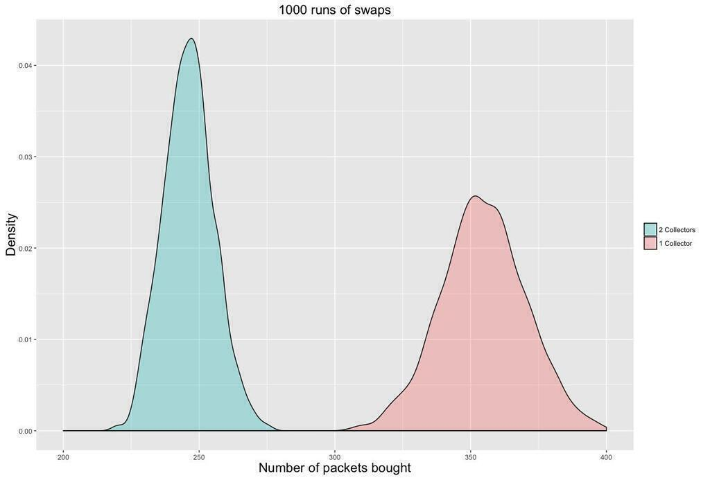
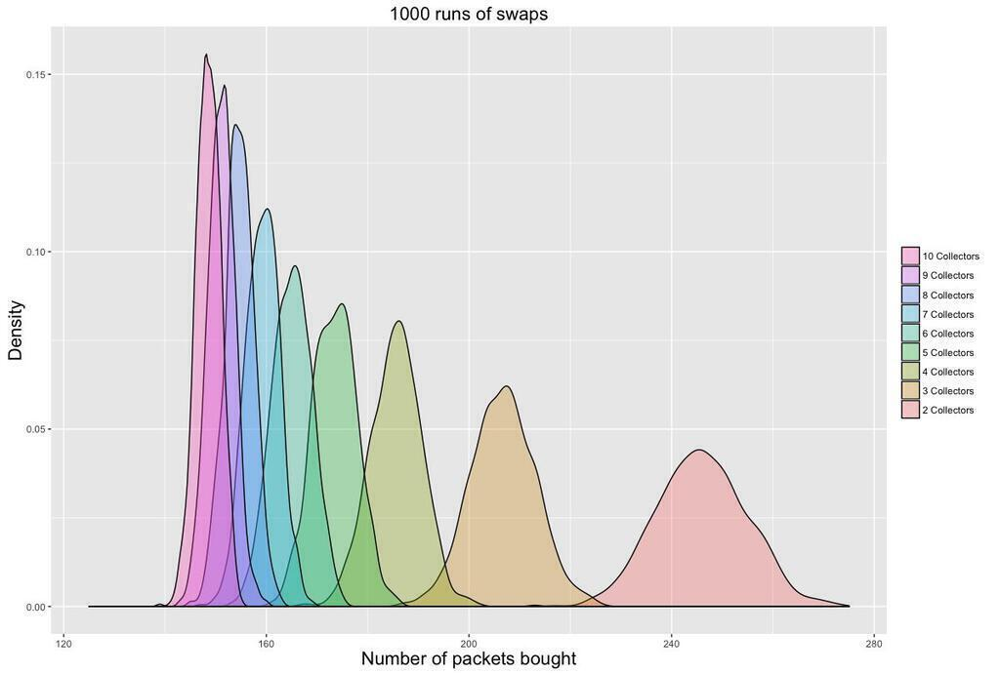
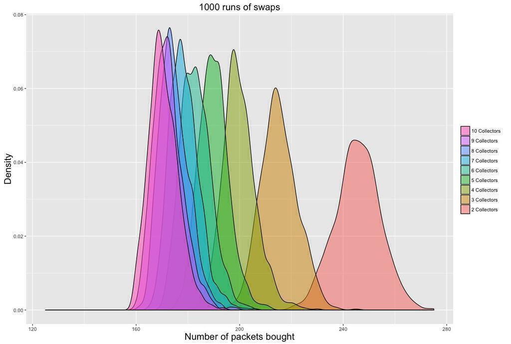
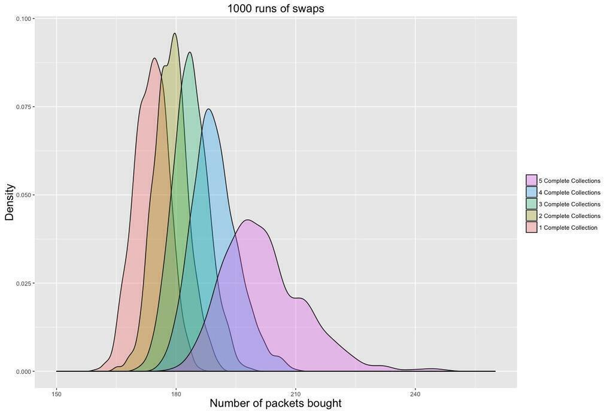

As a follow-up to my post about the [Euro 2016 Panini Stickers](/euro-2016-panini-stickers/), I've now completed the collection with [the help of an online swapping site](/swaptastic-part-1/) and by buying the last 39 stickers directly from Panini. I also managed to write a new simulator, this time with additional collectors involved.

I assume that each of N collectors will buy a packet of stickers and add any new stickers to their album. Then they attempt to swap any leftovers with the rest of their friends. The intersect function in R makes this pretty easy to code up. Every collector who finishes the album stops buying stickers.

Here's the R code for a single simulation of the swapping algorithm, with defaults for the Euro 2016 album:

```r
stickerswaps <- function(number.collectors=2, number.stickers=680,
pack.size=5, packs.purchased=1, target.collections=1, cutoff=50)
{
  pack.price<-0.5
  collections<-array(0,c(number.collectors,number.stickers))
  number.complete.collections<-0
  total.number.swapped<-0
  number.rounds<-1

  # we set a flag to once a collector has completed the album
  # later we can change this to when all but one collector has completed

  while(number.complete.collections<target.collections)
  {
    for(i in 1:number.collectors)
    {
      if(sum(collections[i,]!=0)<=number.stickers-cutoff)
      {
        new.stickers<-sample(1:number.stickers,pack.size*packs.purchased)
        collections[i,new.stickers]<-collections[i,new.stickers]+1
      }
    }

    # After acquiring new stickers, each possible pair of collectors exchanges their swaps
    for (i in 1:number.collectors-1)
    {
      potential.swappers=(i+1):number.collectors
      for (j in potential.swappers)
      {
        # each collector works out which stickers they need
        need.i<-which(collections[i,]==0)
        need.j<-which(collections[j,]==0)
        # each collector works out their swaps
        swaps.i<-which(collections[i,]>1)
        swaps.j<-which(collections[j,]>1)
        # now work out what j has for i
        exchange.jtoi<-intersect(swaps.j,need.i)
        # and what i has for j
        exchange.itoj<-intersect(swaps.i,need.j)
        # how many do we swap?
        number.swapped<-min(c(length(exchange.itoj),length(exchange.jtoi)))
        # update the collections and the total number swapped across all pairs
        if (number.swapped>0) {
          total.number.swapped<-total.number.swapped+number.swapped
          # NB this assumes collectors always swap the lowest number stickers first
          collections[i,exchange.jtoi[1:number.swapped]]<-collections[i,exchange.jtoi[1:number.swapped]]+1
          collections[j,exchange.jtoi[1:number.swapped]]<-collections[j,exchange.jtoi[1:number.swapped]]-1
          collections[j,exchange.itoj[1:number.swapped]]<-collections[j,exchange.itoj[1:number.swapped]]+1
          collections[i,exchange.itoj[1:number.swapped]]<-collections[i,exchange.itoj[1:number.swapped]]-1
        }
      }
    } # end of swaps

    # increment the number of rounds
    number.rounds<-number.rounds+1

    # calculate the number of complete collections
    number.complete.collections=sum(rowSums(collections!=0)>=(number.stickers-cutoff))
  } # end of while loop

  return(c(number.rounds*packs.purchased,total.number.swapped/number.collectors))
}
```

What is the benefit to a collector of having a friend to swap with? The figure below compares someone collecting alone to a collector with one single friend to swap with. As I mentioned last time, the single collector has to buy about 340 packets of stickers on average. Meanwhile, someone with a sticker swapping buddy has to buy about 240 packs of stickers on average - that's a hundred fewer packets of stickers on average. The value of a friend is about £50!



I then increased the number of collectors. As you can see from the figure below, the distribution creeps ever leftward and tightens up around the mean. The larger your friendship group, the closer you get to only having to buy enough packets of stickers to fill the album. This makes sense if the stickers are equally rare: you should be able to exchange your swaps with those belonging to your friends. Note that this shows the number of packets that the first collector has to buy.



Now let's look at a similar graph for the penultimate collector to finish. I chose the second-to-last collector because the last person has no one to swap with. You will see that these distributions overlap a lot more. The unluckiest player in the 10 collector scenario has to buy as many stickers as the luckiest players in the 3 collector scenario. As each collector finishes it becomes an N-1 collector scenario for the remaining collectors and this will involve buying more packets.



Finally, let's look at the distributions for how many stickers each collector has to collect when there are five of them. On average the last collector to finish has to buy about forty more packets of stickers than the first collector to finish. The final collector also has a much wider range of possible outcomes as it will depend on how close to finishing she is when her friends complete their collections.



Part 3 will look at what happens when the stickers are not equally rare.
