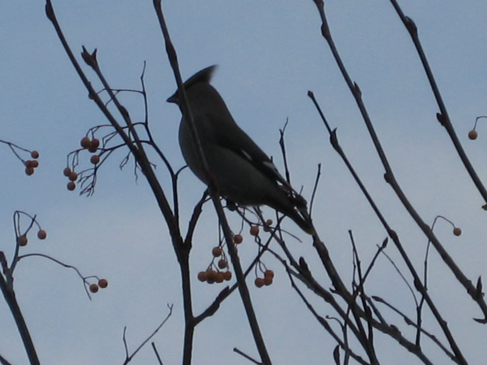
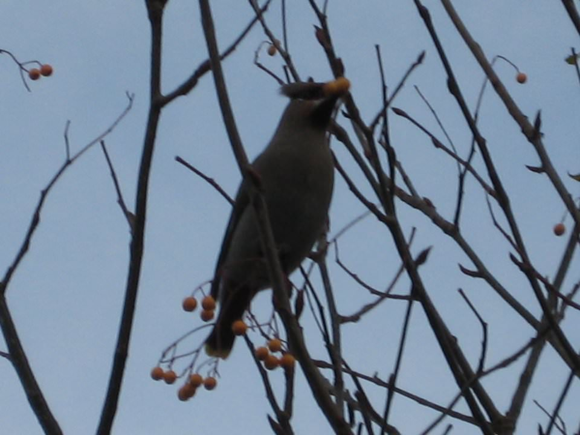
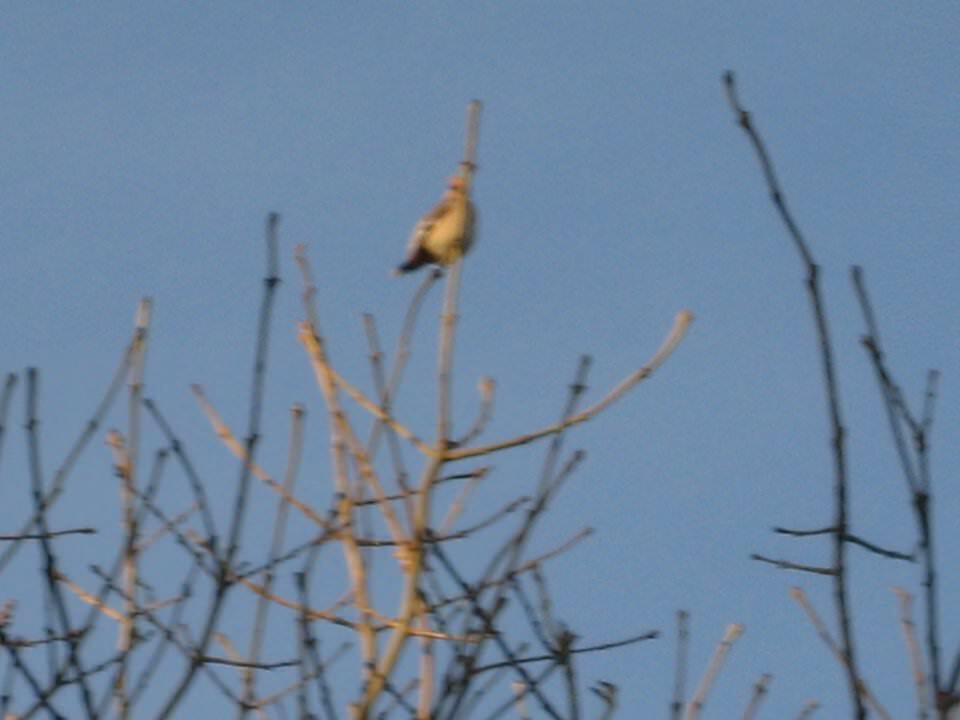

### A question of identity

Three letters for Dad in the mail today, three variations on our surname including the aquatic _Dory_ version and the lesser-spotted _Dorny_. It is perhaps best not to go back to the time he was accidentally listed in the Thompson directory as Mr. Dopey, bringing forth prank calls from all teenagers within a ten mile radius. Fortunately, Dr. Dorey doesn’t have this problem with his mail: he doesn’t get any.

### The visitor

Meanwhile, Dad has a way with an ornithological yarn. He told the tale of how a [waxwing](http://en.wikipedia.org/wiki/Waxwing) caused a commotion in the garden last week. He claims that seventy or so tits (steady now!) were all up in the same tree as the waxwing, as though it had celebrity status. Waxwings are more common in Scandinavia and tend to travel in packs. They are remarkable for their crests and the bright flash of yellow on their wing tips.

The waxwing was probably after the berries rather than adoration from the locals. Apparently they are voracious eaters, able to consume twice their mass in berries in one day. Perhaps this one was off course because of the recent bad weather.

Dad took lots of pictures and he’s let me use some here. I really like them even though you can only see the yellow wings in a couple of pictures, though that marvellous crest is prominent throughout. The pictures are a bit fuzzy because of the zoom but I think the colour of the sky, the branches and berries, together with the silhouette of the bird, certainly make them interesting.

### The Naked Prince

The beauty of being at home now is that I managed to get a lie-in. I slept like a log, probably due to the relief of getting back home without too much fuss and with presents intact. It might also have been the meditation and relaxation exercises I did before turning out the lights last night. When I woke up, I marvelled at how I had managed to wrap the headphones back around my iPod, until I realised I hadn’t listened to it at all. 

I took a long lie-in, revelling in being naked and warm under the covers.

### An Englishman’s home is his castle

No sooner had my parents put the house up for sale, they only went and sold it. Here was me thinking “I’ve heard this before they won’t sell it” and they went and got a great offer after just three days. They aren’t staying in Emsworth so this may well be the last time I am able to spend Christmas in the area. I think I will miss it terribly as there is just something uniquely calming about the place. It is hard to imagine being able to come back if not to see Mum and Dad, perhaps I should have worked harder to maintain my friendships in the area.

It will be strange to completely cut the connection to home in this way, I guess that I have never truly settled anywhere else because this bond with home remained so strong. It is also  a bond that had been strengthened recently - after all, I wrote most of my PhD thesis there in the spring of 2008.

It was a nice place to grow up. A decent sized garden that caught the sun in the afternoons. On hot days, our Labradors would lie and pant in the shade of the fence. Until about 2000, that fence would collapse in the first strong wind of Autumn. I think of the house itself as a place stuffed with books. It may be the root of my book fetish. Many of those tomes will likely go because parents are inevitably downsizing: there may not be room for the weird medical dictionary that I would obsess over while my parents were out, or the huge collection of vinyl that made me fall in love with music. Perhaps I shall be able to liberate [The Circle & The Square](uc3).

### Shorn of the winter coat

I went down to the train station and got my hair cut by the lady there. Again it might be the last time for that too. We exchanged jokes and I gave her a kiss under the mistletoe. Powerful stuff that.

I got a grade three as per usual, it reduces the colour of my hair to a silky grey once again. I forget what having full coloured hair is like now. I did not forget so easily what it was like to have my head protected by three months of growth though. On the way home I was very grateful for my woolly hoodie.

#### I’m going out, and I may be some time

I had one more present that needed to be wrapped because I had run out of brown paper. I walked over to Havant after drawing a blank in both Emsworth and Westbourne. This meant a five mile walk in the snow, which for some reason I decided to do in just my hoodie: no scarf or coat. Not to mention that my shoes have holes in the soles.

It was bloody cold but I enjoyed the march aided by _High Violet_ by The National and _Body Talk_ by Robyn. These two count among my favourite albums of the year. If I get the time, I will do one of those annoying top ten lists on new year's eve.

Wrapping Christmas presents in brown paper involves a rather strange constraint, you can only get rolls of the stuff that are half a metre wide. This made wrapping some of the gifts a bit tricky but it is worth it because they look nice in an austere, minimal way.