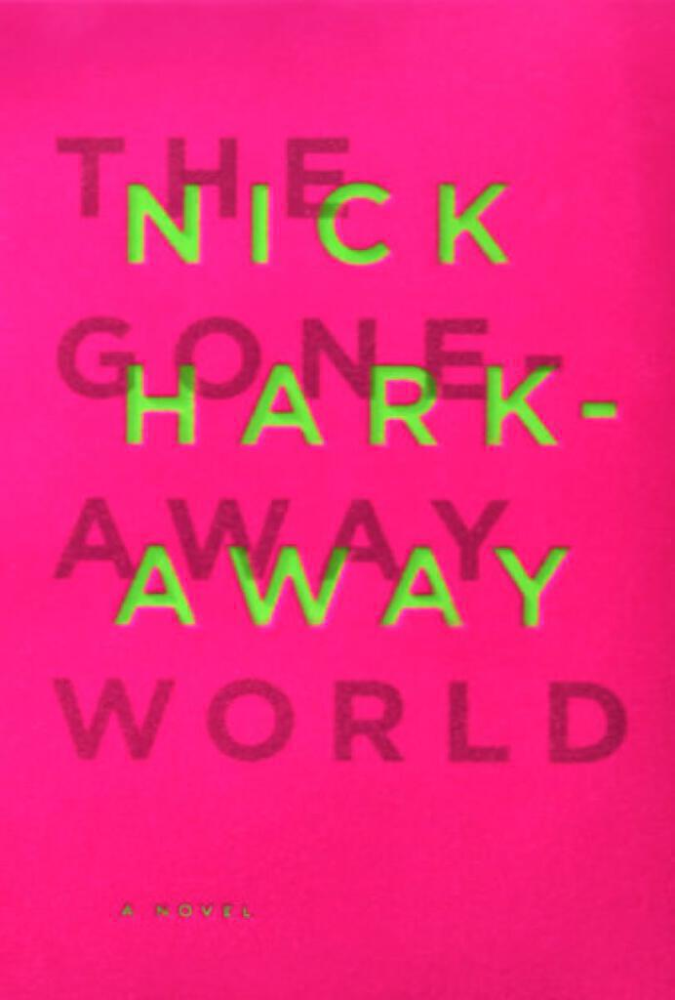

“The Gone-Away World” is a novel by Nick Harkaway. It’s about a world slightly askew to our own in which the powers-that-be have deigned to unleash a weapon that simply wipes the enemy out of existence. Unfortunately the enemies also have the same weapon and there are terrible consequences to the extent that the very fabric of reality is threatened. If you don’t already know what reification means, you will by the end.

Without giving away too many plot points, I think the central themes are about how absolute power corrupts absolutely and the weird relationships that we have with our self-image and how we perceive those around us. Throughout you get the pervading sense that “the road to hell is paved with good intentions”. No opportunity to swipe at figures of authority or bureaucracy is missed. As an example here is an excerpt from the near the beginning:

> “Dick Washburn, known forevermore as Dickwash, is a type D pencilneck: a sassy wannabe paymaster with vestigial humanity. This makes him vastly less evil than a type B pencilneck (heartless bureaucratic machine, pro-class tennis) and somewhat less evil than a type C pencilneck (chortling lackey of the dehumanising system, ambient golf), but unquestionably more evil than pencilneck types M through E (real human screaming to escape a soul-devouring professional persona, varying degrees of desperation). No one I know has ever met the type A pencilneck, in much the same way that no one ever reports their own fatal accident; a type A pencilneck would be a person so entirely consumed in which he or she is employed that they had ceased to exist as a separate entity. They would be odourless, faceless and undetectable, without ambition or restraint, and would take decisions unfettered by human concerns, make choices for the company, of the company. A type A pencilneck would be the kind of person to sign off on torture and push the nuclear button for no more pressing reason than that it was his job - or hers - and it seemed the next logical step.”

Actually, this reminds me of a line from “Gravity’s Rainbow” by Thomas Pynchon (more on this stupendous novel in the near future I promise):

> “…a million bureaucrats are diligently plotting death and some of them even know it…”

The plot itself hinges on a marvellous surprise about two-thirds of the way through the book, a brilliant little narrative manoeuvre that turns a highly enjoyable book into one that makes you go “whoa I haven’t read anything this good in ages”.

For me the best books are those where the author is in complete command of his characters and his story. I was a bit unsure after the first chapter but once it all kicks in (with a hilarious story about blowing up some ice that unfortunately is too long to quote here) it becomes a rich tale about a world slightly off-kilter from ours and a terrible war that should not have been fought. Meanwhile the author throws the timeline of the story around in a really competent and engaging way, folding the back story and the ongoing action together so that although the action goes back and forth you always know where you are, even if you don’t always know where you are going.

It took me a while to read but not for want of excitement or enjoyment. It’s a deceptively long novel and I paced myself to get the most out of it. While I didn’t find myself reading it at 3AM like I did China Miéville’s “Perdido Street Station” or Neal Stephenson’s “Anathem”, I did find myself losing hours at a stretch to this touching yet comic story. I highly recommend it and [will be looking for his new novel “Angelmaker” once it is out in paperback](http://www.amazon.co.uk/Angelmaker-Vintage-Contemporaries-Nick-Harkaway/dp/0307743624/ref=tmm_pap_title_0).

In terms of fiction I think the next one for me is “The Marriage Plot” by Jeffrey Eugenides.

---

Hero image is ["Go Humans Go Away"](https://flic.kr/p/cTo7ob) by [Thomas Hawk](https://www.flickr.com/photos/thomashawk/), [creative commons license](https://creativecommons.org/licenses/by-nc/2.0/).